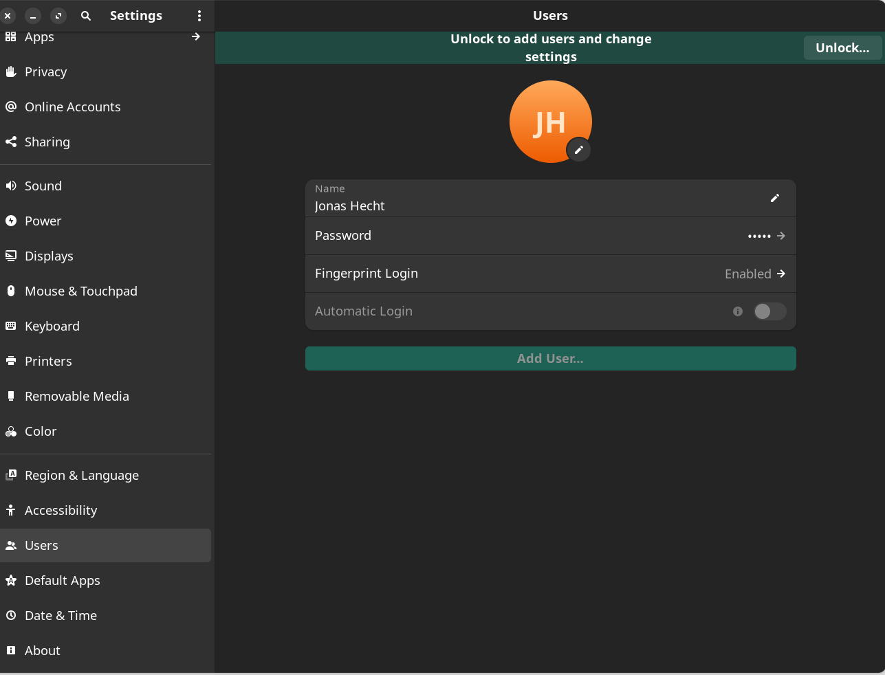

# Prepare, install & configure Manjaro Linux

This section contains steps to 

* prepare your machine for installation (UEFI, hardware-based SSD Encryption, Dual Boot Windows for Thinkpad Lenovo Vantage software (BIOS updates!) and Fingerprint configuration in UEFI OPAL SSD)
* Install Manjaro Linux
* Alternative to self-encrypting SSDs: full software-based file-system encryption with LUKS
* Enable AUR & Flatpack
* Fingerprint for Gnome & sudo
* Backup with restic/resticprofile
* Firewall configuration
* HiDPI Scaling
* Use Multitouch gestures in Gnome with Nvidia drivers and X11
* Printer setup


## Prepare your UEFI for Manjaro installation

Disable Secure Boot in your UEFI setup. If you have concerns, see this thread and especially this answer: https://forum.manjaro.org/t/is-it-possible-to-enable-secure-boot/16156/12

> Since everything is installed by a package manager from a trusted source (packages are signed and have checksums like secure boot does), malicious code is not a problem, but Windows has potentially such a problem. The drivers are not builtin the kernel, but have to be installed from other sources etc etc… **I don’t see a real benefit from using secure boot on a linux system**, but more or less having a good feeling to be secure from users point of view.

Although [you could implement Secure Boot with Linux](https://wiki.archlinux.org/title/Unified_Extensible_Firmware_Interface/Secure_Boot), it isn't 


## HDD Encryption

If you're working for a company chances are that you have will have to use encryption with your harddrive.

You can either use a self-encrypting SSD or encryt the whole file system (or folders). The Arch docs have direct us into the first solution if possible, since the latter can become quite complex (although supported by Manjaro installer).

https://wiki.archlinux.org/title/Data-at-rest_encryption

> A very strong disk encryption setup (e.g. full system encryption with authenticity checking and no plaintext boot partition) is required to stand a chance against professional attackers who are able to tamper with your system before you use it. [...] The best remedy might be [hardware-based full-disk encryption](https://wiki.archlinux.org/title/Self-encrypting_drives) and Trusted Computing. (aka Self-encrypting SSDs) 


### Self-encrypting SSD (TCG OPAL 2) support (incl. Hardware acceleration)

https://wiki.archlinux.org/title/Self-encrypting_drives


#### Thinkpad Fingerprint Reader: You need Windows first

Thinkpad with Fingerprint reader and OPAL protection: It is possible to enable a BIOS supervisor and nvme password, that you will be able to additionally secure with your fingerprints.

https://www.reddit.com/r/thinkpad/comments/a212wx/comment/eaui7eb/?utm_source=share&utm_medium=web3x&utm_name=web3xcss&utm_term=1&utm_content=share_button

> The drive is always encrypted by default. But there is no password, and as such the data is available to everyone that has physical access to the drive. Once a password is set in the bios (hd password) you will need to type it every time you do a clean boot (not at restart). You cannot access the data now unless the password is used. Even if you take the drive to another computer unless you have the password you cannot access the data. [...] I find it quite convenient, all you need is a swipe of your finger at boot. 

To register your fingerprints, you sadly need to have a Windows install before the Linux installation in order to be able to use your fingerprint to unlock you device:

> Because the password is required before the OS boots it is completely OS independent. Saves any configuration required to boot from encrypted drives in Linux etc. And yes you get fingerprint to unlock it. Just remember fingerprint registration requires windows so before you format and install linux, use windows to register your fingerprints, the format. 


#### Dual Boot with Windows for Thinkpad Fingerprint Reader

If you want to register your fingerprints, install Windows first - before Manjaro. It will make your life much easier!

> Remember to have somebody with a Windows PC available who can create a Windows 11 bootable USB stick for you using Microsoft's [Media Creation Toolkit](https://www.microsoft.com/de-de/software-download/windows11) - every other solution (starting with downloading the Windows ISO) to create a Windows USB stick failed for me! Safe yourself some hours wasted in live!

https://pcsupport.lenovo.com/us/en/products/laptops-and-netbooks/thinkbook-series/thinkbook-14-iml/videos/nvid500012-setting-up-fingerprint-reader-on-your-lenovo-pc

If you installed Windows, then you can configure the fingerprints simply in the Windows security settings - and they will be written to the UEFI / Embedded Controller (EC) firmware and will now be available to unlock your SSD. Cool eh!

> The Lenovo Vantage Software for Windows is also the only way to update your UEFI: It's the best to do that right now! :)

Now you need to install Manjaro in a dual boot fashion. Which is easy because, the installer will do everything for you:


# Install Manjaro Linux

> WARNING: If you have a Thinkpad & want to use Fingerprint Reader to unlock your Self-Encrypting SSD, you need to install Windows first! See  `Dual Boot with Windows for Thinkpad Fingerprint Reader`

Mostly nowadays that should be the UEFI guide that's interesting for you https://wiki.manjaro.org/index.php/UEFI_-_Install_Guide

Download the matching ISO here https://manjaro.org/download/

Format the `.iso` file into a USB stick. If you're on a Mac e.g. use https://etcher.balena.io.

If you're on Linux or Windows have a look at https://wiki.manjaro.org/index.php/Burn_an_ISO_File#Writing_to_a_USB_Stick_in_Linux

There's also an easy to use gui tool from Suse: https://github.com/openSUSE/imagewriter

If you already have a Linux with Gnome running, you can use the `Disks` utility: Start `Disks`, select your USB stick, click on the two gears icons and select `Restore Partition Image`. Now find your downloaded e.g. `manjaro-gnome-23.1.3-240113-linux66.iso` from your file system and hit `Restore Image`:


## dual-boot only: Show GRUB menu for a shorter period

If you went the dual boot way with Windows, you will find that the GRUB boot menu will now pop up every time you boot the laptop. This might be not what you wanted, because you want Manjaro to start fast. Sadly with dual-boot [you can't completely eliminate the GRUB menu shows up](https://forum.manjaro.org/t/hide-grub-when-booting/97796/4):

> If you have multiple OS in GRUB it will not be hidden, it will not accept 0 second timeout. [...] If Manjaro is the first boot option in your BIOS then it will load GRUB, and as you have multiple OS and GRUB is configured to detect other OS, it WILL show the menu.

But, we can [reduce the 5 sec standard time the menu shows up](https://forum.manjaro.org/t/hide-grub-when-booting/97796/4):

> To make 2s timeout, find GRUB_TIMEOUT in your `/etc/default/grub` and change its value to 2

This would be what you want:

```shell
$ cat /etc/default/grub
# GRUB boot loader configuration

GRUB_DEFAULT=saved
GRUB_TIMEOUT=2
GRUB_DISTRIBUTOR="Manjaro"
...
```

Now reload your GRUB config via

```shell
sudo update-grub
```


### Alternative to Self-Encrypting SSDs: Encryt whole file system with LUKS

https://wiki.archlinux.org/title/Dm-crypt/Encrypting_an_entire_system

https://wiki.archlinux.org/title/Data-at-rest_encryption

Manjaro supports full disk encryption right from the OS setup based on LUKS (the defacto Linux standard for hdd encryption). The [best way seems to be a fresh install with HDD encryption](https://forum.manjaro.org/t/disk-encryption/139464/2), since many parts need to be altered. Here's also a good discussion about it:

https://forum.manjaro.org/t/manjaro-with-full-disk-encryption-how-fast-how-stable/136855/17

verdict:
* Use Manjaro over Arch (since the installer has the encryption process baked in)
* Use a SSD with Manjaro/Arch to have nearly no performance issues due to encryption

In the Manjaro installer, the LUKS encryption is easily setup. Simply check `Encrypt system` and set a password:


This leverages dm-crypt's `LUKS on a partition` scenario https://wiki.archlinux.org/title/Dm-crypt/Encrypting_an_entire_system#LUKS_on_a_partition.


#### Change or add LUKS password(s)

https://www.tuxedocomputers.com/en/Infos/Help-Support/Instructions/Change-LUKS-encryption-password.tuxedo

```shell
# Show which partitions are available (here nvme0n1p6 and nvme0n1p4(efi partition))
lsblk -f 

# change LUKS password
sudo cryptsetup luksChangeKey /dev/nvme0n1p2

# add LUKS password
sudo cryptsetup luksAddKey /dev/nvme0n1p2
```

#### Speeding up LUKS decryption in GRUB

Bootup will be quite a bit delayed (few seconds, depending on CPU speed), because GRUB doesn't use multiple processors and needs to decrypt the partition container. If you want to speed this up, you can either manually encrypt things and leave out the boot partition (long process, not recommended). Or lower the LUKS iteration cycles for the boot partion: https://unix.stackexchange.com/questions/497746/how-to-change-luks-encryption-difficulty-on-manjaro-full-disk-encrypt

https://wiki.archlinux.org/title/GRUB/Tips_and_tricks#Manual_configuration_of_core_image_for_early_boot

If you're a bit frustrated for waiting to long at boot time, this can be due to a high cost parameters of the key derivation function. Dump all current LUKS keys first:

```shell
cryptsetup luksDump /dev/nvme0n1p2
```

Now choose the key slot you want to change. We need to provide it as `-S x` parameter, where `x` is your key's slot.

If your password provides enough entropy to counter common attacks by itself, you can lower the parameters:

```shell
cryptsetup luksChangeKey --iter-time 1000 /dev/nvme0n1p2 -S 0
```

If you use `luksDeleteKey` or `luksKillSlot` for whatever reason (I wanted to delete my not that high entropy password after creating a new key), there might be a nasty window popping up - only after a restart of your machine stating:

> "The password you use to log in to your computer no longer matches that of your login keyring."

This is due to an outdated Gnome keyring, which is no big deal but may scare you a bit (like me - since non of the current passwords work, but the old `luksKillSlot` deleted does!). Luckily [it's easy to solve](https://askubuntu.com/a/65294/451114):

```shell
rm ~/.local/share/keyrings/login.keyring
```

Then logout and re-login again. Done :)


# Manjaro Package Management: Enable AUR & flathub Repositories in Manjaro package management

Simply activate in Add/Remove Programs, since it's already installed - as the docs state https://flatpak.org/setup/Manjaro

> Flatpak & AUR/pacman are installed by default on Manjaro 20 or higher.

> To enable their support, navigate to the Software Manager (Add/Remove Programs)

> Click on the triple line menu [or dots depending on the Desktop Environment] on the right, in the drop down menu select "Preferences"

> Navigate to the "AUR" and "Flatpak" tabs and slide the support toggle (it is also possible to enable checking for updates, which is recommended).

Flatpack is super useful to install many Desktop applications like MS Teams, Zoom, Slack etc, but also has it's drawback.


# Fingerprint Readers to unlock GNOME login & sudo CLI commands

The whole internet tells us: fingerprint readers don't work in Linux. But that's not true anymore. At least I had luck with my Thinkpad P1 Gen 6:

## Thinkpads

Theres a thorough guide here: https://wiki.archlinux.org/title/fprint

In my case with the Thinkpad P1 Gen 6 running Manjaro with GNOME, everything went super easy. I just stumbled upon the setting for fingerprints in the normal system settings at `Settings/Users`:



There's an option `Fingerprint Login`, where you can register all of your fingers (you have to choose the precise finger in the dropdown):


Now you should be able to login to your desktop using your finger! Really nice :) 


If that doesn't work OOTB, maybe have a look at https://blog.rubenwardy.com/2022/11/16/thinkpad-x1-fingerprint-auth/


# Backup Manjaro package list and reinstall on other machine

List packages explicitely installed: https://forum.manjaro.org/t/how-to-list-explicitly-installed-packages-using-pamac/56172/13 using `list -e` and also `-q` to omit everything except the package names:

```shell
pamac list -e -q
```

Now pipe that into a file like this:

```shell
pamac list -e -q > ~/pkglist.txt
```

> But be aware of other OS or hardware dependant packages that are contained in this list also. It is a good idea to go over it and delete packages that are not wanted to be explicitely installed by yourself (e.g. starting with `manjaro` or `gnome` or `mesa` & `amd`, if you have a nvidia card running)


Finally feed package list to pamac on other machine: https://forum.manjaro.org/t/installing-packages-from-saved-lists/125072:

```shell
pamac install $(cat ~/pkglist.txt)
```

If you're interested, here's my [`pkglist.txt`](pkglist.txt)


# Backup

It's also a good idea to start with the goary details like backups right before you use your rig productively. I had some recommendations for https://github.com/restic/restic, but wanted to give the GNOME backup called `Deja Dup` https://apps.gnome.org/DejaDup/ a chance. Since I also want to explore the merrits of Linux not only for me, but also for other users, that might not be that used to a command line.

The first thing in Backups is to configure the exclusions, which files you don't want to backup - folders like `~/.cache`, `~/.vagrant`, `~/VirtualBox VMs` etc.

I also have some `.iso` files in my `Downloads` dir, which I opted to exclude, since they really take long to encrypt and just grab a whole lot of time!

```shell
/home/jonashackt/Downloads/iso

/home/jonashackt/.config/Code/Cache
/home/jonashackt/.config/Code/CachedData/
/home/jonashackt/.config/Code/logs/

/home/jonashackt/.cache
/home/jonashackt/.config/Code - OSS/CachedData/
/home/jonashackt/.config/libreoffice/4/cache/
/home/jonashackt/.npm/
/home/jonashackt/.pyenv/
/home/jonashackt/.local/share/virtualenv/
/home/jonashackt/.ansible/test/venv/
/home/jonashackt/go/pkg/mod/

/home/jonashackt/.var/app/io.freetubeapp.FreeTube/
/home/jonashackt/.var/app/com.google.Chrome/config/google-chrome/Default/Service Worker/CacheStorage/
/home/jonashackt/.var/app/com.microsoft.Edge/config/microsoft-edge/Default/Service Worker/CacheStorage
/home/jonashackt/.var/app/com.github.IsmaelMartinez.teams_for_linux/config/teams-for-linux/Partitions/teams-4-linux/Cache/

/home/jonashackt/.config/Slack/Service Worker/CacheStorage/
/home/jonashackt/.var/app/com.slack.Slack/config/Slack/Cache/
/home/jonashackt/.var/app/com.slack.Slack/config/Slack/Service Worker/CacheStorage/
/home/jonashackt/.config/Slack/Cache/

/home/jonashackt/.kube/cache/
/home/jonashackt/.local/pipx/venvs/
/home/jonashackt/snap/miro/3/.config/miro/Cache
/home/jonashackt/.vagrant.d
/home/jonashackt/VirtualBox VMs
```

But in Deja Dups UI one cannot configure file patterns to exclude (see https://askubuntu.com/questions/690990/can-i-ignore-files-by-pattern-in-deja-dup-backup), only full paths.

Or in [`dconf-editor`](https://apps.gnome.org/DconfEditor/) (`pamac install dconf-editor`), locate org -> gnome -> deja-dup -> exclude-list and edit:

```shell
['$TRASH', '/home/jonashackt/Downloads/iso', '/home/jonashackt/.config/Code - OSS/CachedData/', '/home/jonashackt/.config/libreoffice/4/cache/', '/home/jonashackt/.vagrant.d', '/home/jonashackt/.cache', '/home/jonashackt/VirtualBox VMs', '/home/jonashackt/.npm/', '/home/jonashackt/.pyenv/', '/home/jonashackt/.local/share/virtualenv/', '/home/jonashackt/.ansible/test/venv/', '/home/jonashackt/go/pkg/mod/', '/home/jonashackt/.var/app/io.freetubeapp.FreeTube/', '/home/jonashackt/.var/app/com.google.Chrome/config/google-chrome/Default/Service Worker/CacheStorage/', '/home/jonashackt/.var/app/com.github.IsmaelMartinez.teams_for_linux/config/teams-for-linux/Partitions/teams-4-linux/Cache/', '/home/jonashackt/.var/app/com.microsoft.Edge/config/microsoft-edge/Default/Service Worker/CacheStorage', '/home/jonashackt/.config/Slack/Service Worker/CacheStorage/', '/home/jonashackt/.var/app/com.slack.Slack/config/Slack/Service Worker/CacheStorage/', '/home/jonashackt/.var/app/com.slack.Slack/config/Slack/Cache/', '/home/jonashackt/.config/Slack/Cache/', '/home/jonashackt/.kube/cache/', '/home/jonashackt/.local/pipx/venvs/', '/home/jonashackt/snap/miro/3/.config/miro/Cache']
```

Also worth a try: https://medium.com/@shimo164/ignore-node-modules-directories-in-deja-dup-433997fd2461 But that means creating `.deja-dup-ignore` files everywhere.


Ok, Deja Dup just can't finish the scanning on my system in any way - don't know why, it simply hangs.

---> IT WAS THE SANDISK SUPPLIED USB-C to USB-A ADAPTER! DAMN... restic also froze!


#### Backup with restic and resticprofile

Restic might be a faster and more robust solution than other backup tools: https://www.datamate.org/linux-server-backup-mit-restic-und-duplicity/

It handles backups more like git repositories and doesn't hold changed files multiple times. Every object is divided into small blocks and just occurs once in the backup. If something changes, only those differences will be transfered. Thus filechanges do not result in duplication and massively reduces the needed disk space for backups. 

restic eliminates nearly all fallacies of duplicity (and thus Gnome Backup / Deja Dup). A restore is extremely fast, since there's no need to put together files from different difftars. Additionally it has no effect on the overall backup status, if single data blocks are currupt.

In my experiences restict also needs far less CPU resources then duplicity/Deja Dup: And that's kind a killer criteria also, since 2 hours of backup is a lot of CPU time...

* restic: https://github.com/restic/restic docs: https://restic.readthedocs.io/en/stable/010_introduction.html
* resticprofile: https://github.com/creativeprojects/resticprofile docs: https://creativeprojects.github.io/resticprofile/index.html

> Getting started: https://creativeprojects.github.io/resticprofile/configuration/getting_started/index.html


```shell
pamac install restic resticprofile-bin
```

With resticprofile we get a nice YAML config file, where we can configure restic to do our backups!

> Be sure to have a YAML extension installed in your VSCode https://marketplace.visualstudio.com/items?itemName=redhat.vscode-yaml


Let's create our restic(profile) configuration. Start by creating a folder in your home directory:

```shell
mkdir /home/jonashackt/restic
cd /home/jonashackt/restic
```

First we want to define, which files we don't want to backup. Thus let's create a `excludes.txt`:

```shell
# general
.cache
.config/libreoffice/4/cache

# IDEs
.config/Code/Cache
.config/Code/CachedData
.config/Code/logs
.config/Code - OSS/CachedData

# dev packages
.npm
.pyenv
.local/share/virtualenv
.local/pipx/venvs
.ansible/test/venv
go/pkg/mod
node_modules

# Apps
.var/app/io.freetubeapp.FreeTube
snap/miro/3/.config/miro/Cache
.var/app/com.github.IsmaelMartinez.teams_for_linux/config/teams-for-linux/Partitions/teams-4-linux/Cache

### Browsers
.var/app/**/Cache*
.var/app/com.google.Chrome/config/google-chrome/Default/Service Worker/CacheStorage
.var/app/com.microsoft.Edge/config/microsoft-edge/Default/Service Worker/CacheStorage
.mozilla/firefox/**/cache/

### Slack
.config/Slack/Cache
.config/Slack/Service Worker/CacheStorage
.var/app/com.slack.Slack/config/Slack/Cache
.var/app/com.slack.Slack/config/Slack/Service Worker/CacheStorage

# VMs
.kube/cache
#.vagrant.d
#VirtualBox VMs
```

You can check your filepatterns here: https://www.digitalocean.com/community/tools/glob

Now create a file named `profiles.yaml` inside your new folder (you can also [use different configuration formats like toml, hcl, json](https://creativeprojects.github.io/resticprofile/configuration/getting_started/index.html)):

```yaml
# yaml-language-server: $schema=https://creativeprojects.github.io/resticprofile/jsonschema/config-1.json

version: "1"

default:
   repository: "local:/run/media/jonashackt/Extreme SSD/linuxbackup"
   password-file: "password.txt"

   backup:
      exclude-file: "excludes.txt"
      exclude-caches: true
      verbose: true
      source:
      - "/home/jonashackt"
```

The restic [repository is the place, where your backups are saved](https://restic.readthedocs.io/en/stable/030_preparing_a_new_repo.html)).

> "The repository can be stored locally, or on some remote server or service."

`default:repository` configures the repository kind and path

So in my case, where I want to use a *locally* attached external SSD drive mounted at `/run/media/jonashackt/Extreme SSD/linuxbackup`, this is `"local:/run/media/jonashackt/Extreme SSD/linuxbackup"`.

Also create a `password.txt`. resticprofile can do that for you, if you want:

```shell
resticprofile generate --random-key > password.txt
```

Now we need to initialize a new restic repository vis `resticprofile init`:

```shell
$ resticprofile init

2024/02/04 14:15:07 using configuration file: profiles.yaml
2024/02/04 14:15:07 profile 'default': starting 'init'
created restic repository b1a22de480 at local:/run/media/jonashackt/Extreme SSD/linuxbackup

Please note that knowledge of your password is required to access
the repository. Losing your password means that your data is
irrecoverably lost.
2024/02/04 14:16:05 profile 'default': finished 'init'
```

Before really running the backup we can testdrive it:

```shell
resticprofile backup --dry-run
```

And finally let the backup run:

```shell
$ resticprofile backup

2024/02/04 14:58:30 using configuration file: profiles.yaml
2024/02/04 14:58:30 profile 'default': starting 'backup'
open repository
repository b1a22de4 opened (version 2, compression level auto)
lock repository
no parent snapshot found, will read all files
load index files

start scan on [/home/jonashackt]
start backup on [/home/jonashackt]
scan finished in 1.522s: 102434 files, 354.759 GiB

Files:       102435 new,     0 changed,     0 unmodified
Dirs:        13654 new,     0 changed,     0 unmodified
Data Blobs:  385365 new
Tree Blobs:  12494 new
Added to the repository: 324.617 GiB (284.612 GiB stored)

processed 102435 files, 354.759 GiB in 2:12:27
snapshot 3122d6d5 saved
2024/02/04 17:10:58 profile 'default': finished 'backup'
```

After the command has finished, you can have a look at the snapshots created:

```shell
$ restic -r "/run/media/jonashackt/Extreme SSD/linuxbackup" snapshots

enter password for repository: 
repository b1a22de4 opened (version 2, compression level auto)
ID        Time                 Host        Tags        Paths
-----------------------------------------------------------------------
3122d6d5  2024-02-04 14:58:30  pikelinux               /home/jonashackt
-----------------------------------------------------------------------
1 snapshots
```

Now how does a restore work? https://restic.readthedocs.io/en/stable/050_restore.html

If you want to restore it to another machine, detach your SSD and attach it to the other machine. Now head to the root `/` and run the following:

```shell
restic -r "/run/media/jonashackt/Extreme SSD/linuxbackup" restore latest --target .
```

Don't insert the `--target` path with `/home/jonashackt` again, since that would create the restored backup in `/home/jonashackt/home/jonashackt`.


# Firewall 

https://wiki.manjaro.org/index.php/Firewalls

The firewall package `ufw` should already be installed. If not: `pamac install ufw`

To check it's status run:

```shell
ufw status
```

If that's looking like ufw isn't enabled, you should activate the service (it was on my Manjaro install) and enable ufw (it wasn't on my Manjaro install):

```shell
sudo systemctl enable ufw.service 

sudo ufw enable 
```


# High Resolution Display (HiDPI) scaling

https://wiki.archlinux.org/title/HiDPI

As per default you only have 100% steps to scale your display. But there's an experimental feature called fractional scaling in Gnome, which you can activate:

https://www.dedoimedo.com/computers/gnome-hd-scaling.html

I didn't really like it, since it kind of "blurrs" the screen. My solution: In-program zoom and Font scaling:

With my 2560 x 1600 I use a combination of Browser scaling (Firefox default zoom), IDE scaling (VS Code `Strg +`) and higher Font scaling factor (`1.25`) in the GNOME Tweaks menu (you can reach that via `Manjaro Hello`).


## Use Multitouch gestures in Gnome with Nvidia drivers and X11

https://forum.manjaro.org/t/how-to-enable-wayland-touch-gestures-on-x11/141723

https://extensions.gnome.org/extension/4033/x11-gestures/

https://github.com/JoseExposito/gnome-shell-extension-x11gestures


Also for more finegrained settings, search for `Touche` settings in your Activities:


# Other

#### Change keyboard layout of (LUKS) full disk encryption login

> That's the documentation of an encounter I had with the GRUB bootloader using an LUKS encrypted `/boot` partition, which the Manjaro installer automatically creates, when using `Encrypt disk` in it. Using some "special" characters from the German keymap, the US keymap in GRUB stage 1 doesn't work as expected...  Please think of this paragraph of not complete and just use it as inspiration :) It took me hours and hours...


I experienced an issue using the simple Manjaro installer option to enable disk encryption:

I changed the keyboard layout from `us` to german `de` in the Manjaro installer. Both my passwords for Manjaro login and for the disk encryption contain special characters like `€`, `@` and the like. Now booting up and trying to enter the system just installed, I faced an error while trying to decrypt the disk. I couldn't pass the HDD encryption login :(

After several attempts it came to my mind that there might be a mismatch of the keyboard layout provided in the Manjaro installer and used in the encryption login. And yes, that's the issue here (also in other distros):

https://forum.manjaro.org/t/keyboard-layout-for-boot-encryption-password/115990 

https://unix.stackexchange.com/questions/342353/problem-keyboard-layout-in-boot-with-luks 

https://askubuntu.com/questions/1500505/change-keyboard-layout-for-full-disk-encryption-login

https://discussion.fedoraproject.org/t/keyboard-layout-is-always-english-when-unlocking-encrypted-drives-on-silverblue-kinoite-sericea/81095


https://bbs.archlinux.org/viewtopic.php?id=240739


https://wiki.archlinux.org/title/Dm-crypt/System_configuration#mkinitcpio

> Provides support for non-US keymaps for typing encryption passwords; it must come before the encrypt hook, otherwise you will need to enter your encryption password using the default US keymap. Set your keymap in /etc/vconsole.conf, see [Keyboard configuration in console#Persistent configuration](https://wiki.archlinux.org/title/Linux_console/Keyboard_configuration#Persistent_configuration). 

https://wiki.archlinux.org/title/Linux_console/Keyboard_configuration#Persistent_configuration

> A persistent keymap can be set in /etc/vconsole.conf, which is read by systemd on start-up. The KEYMAP variable is used for specifying the keymap. If the variable is empty or not set, the us keymap is used as default value


There might be a problem with Grub in Stage 1! Yes, GRUB has multiple stages: 1 & 2. Only in 2 the above hints seem to work. But there's help:


The issue might be that we're looking for a solution in the wrong GRUB stage (2). 


Wow, this was a deep dive I didn't thought I would have needed. I dig into the stages of booting a computer again, which I hadn't visited in a while! So roughly the firmware ((U)EFI, formerly "BIOS") looks for a boot manager located in the Master Boot Record (MBR) on the first disk. On a Linux system featuring the GRUB bootloader it also looks for the startup file `grubx64.efi` on the EFI partition (the small 300MB partition using FAT32). The EFI partition is mounted to `/boot/efi`.

GRUB then loads `boot.img`, `core.img`, `/boot/grub/grub.cfg` and needed `mod` files (drivers). With that a UI can be displayed, a keyboard beeing evaluated and an OS started.

Nowing that, we can have [a look into the dm-crypt docs](https://wiki.archlinux.org/title/Dm-crypt/Specialties#Securing_the_unencrypted_boot_partition):

> The `/boot` partition and the Master Boot Record are the two areas of the disk that are not encrypted

But there's a special feature in GRUB, where [the bootloader GRUB has the ability to unlock a LUKS encrypted `/boot` partition](https://wiki.archlinux.org/title/Dm-crypt/Specialties#Securing_the_unencrypted_boot_partition).

Thus we can have a encrypted `/boot` partition and the Manjaro installer uses exactly that feature! 

And here we have our issue mentioned in the Note in https://wiki.archlinux.org/title/GRUB#Encrypted_/boot:

> If you use a special keymap, a default GRUB installation will not know it. This is relevant for how to enter the passphrase to unlock the LUKS blockdevice. See /Tips and tricks#Manual configuration of core image for early boot.

There's also a hint: See [/Tips and tricks#Manual configuration of core image for early boot](https://wiki.archlinux.org/title/GRUB/Tips_and_tricks#Manual_configuration_of_core_image_for_early_boot):

> If you require a special keymap or other complex steps that GRUB is not able to configure automatically in order to make /boot available to the GRUB environment, you can generate a core image yourself. On UEFI systems, the core image is the grubx64.efi file that is loaded by the firmware on boot. Building your own core image will allow you to embed any modules required for very early boot, as well as a configuration script to bootstrap GRUB. 

**There we are!** 

Following the docs let's generate our own core image (aka `core.img` mentioned above in the boot steps)! 

Start by having a look into `/boot/grub/grub.cfg`:

```shell
$ sudo cat /boot/grub/grub.cfg

menuentry 'Manjaro Linux' --class manjaro --class gnu-linux --class gnu --class os $menuentry_id_option 'agnulinux-simple-bdcf1234-abcd-ef12-34ab-cdef1234abcdef' {
	savedefault
	load_video
	set gfxpayload=keep
	insmod gzio
	insmod part_gpt
	insmod cryptodisk
	insmod luks
	insmod gcry_rijndael
	insmod gcry_rijndael
	insmod gcry_sha256
	insmod ext2
	cryptomount -u 1234abcdef1234abcdef1234abcdef
	set root='cryptouuid/1234abcdef1234abcdef1234abcdef'
	if [ x$feature_platform_search_hint = xy ]; then
	  search --no-floppy --fs-uuid --set=root --hint='cryptouuid/1234abcdef1234abcdef1234abcdef'  bdcf1234-abcd-ef12-34ab-cdef1234abcdef
	else
	  search --no-floppy --fs-uuid --set=root bdcf1234-abcd-ef12-34ab-cdef1234abcdef
	fi
	linux	/boot/vmlinuz-6.6-x86_64 root=UUID=bdcf1234-abcd-ef12-34ab-cdef1234abcdef rw  quiet cryptdevice=UUID=bdcf1234-abcd-ef12-34ab-cdef1234abcdef:luks-bdcf1234-abcd-ef12-34ab-cdef1234abcdef root=/dev/mapper/luks-bdcf1234-abcd-ef12-34ab-cdef1234abcdef splash apparmor=1 security=apparmor udev.log_priority=3
	initrd	/boot/intel-ucode.img /boot/initramfs-6.6-x86_64.img
}
```

Look out for every `insmod` usage like `part_gpt`, `part_msdos`, `efi_gop` etc.

Also search for the first `menuentry 'Manjaro Linux'` entry. Copy the whole menuentry into an editor (incl. `insmod gzio`, `insmod luks` etc). They all will need to be included in the core image, otherwise the system won't be able to decrypt your LUKS partition and thus render stuck in the GRUB boot. 

Now we need to create a tarball `memdisk.tar` containing our keymap:

```shell
sudo grub-kbdcomp -o de.gkb de
sudo tar cf memdisk.tar de.gkb
```

With this we can create a configuration `early-grub.cfg` file to be used in the GRUB core image. It leverages the same format as the regular `/boot/grub/grub.cfg`, but needs only a few lines to find the main config file on the `boot` partition. Create the `early-grub.cfg` in an editor:

```shell
set root=(memdisk)
set prefix=($root)/

terminal_input at_keyboard
keymap /de.gkb

cryptomount -u 1234abcdef1234abcdef1234abcdef
set root='cryptouuid/1234abcdef1234abcdef1234abcdef'
set prefix=($root)/grub

configfile grub.cfg
```

Change the line `keymap /de.gkb` to match your specific keymap. Also exchange the lines `cryptomount -u 1234abcde...` and `set root='cryptouuid/1234a...` with the values copied into the editor from the Manjaro menuentry.

Finally we can generate the `core.img` listing all of the modules from our Manjaro menuentry, along with any modules used in the `early-grub.cfg`. So from the latter we need `memdisk`, `tar`, `at_keyboard`, `keylayout` and `configfile`. From [the debian docs](https://cryptsetup-team.pages.debian.net/cryptsetup/encrypted-boot.html#using-a-custom-keyboard-layout):

> Don’t use grub-install here, as we need to pass an early configuration and a ramdisk. Instead, use grub-mkimage(1) with suitable image file name, format, and module list.

Let's craft the `grub-mkimage` command:

```shell
sudo grub-mkimage -c early-grub.cfg -o "/boot/efi/EFI/Manjaro/grubx64.efi" -O x86_64-efi -d /usr/lib/grub/x86_64-efi/ -m memdisk.tar part_gpt part_msdos efi_gop efi_uga crypto cryptodisk luks gcry_rijndael gcry_sha256 diskfilter gzio ext2 fat memdisk tar at_keyboard usb_keyboard uhci ehci ahci keylayouts configfile
```

Here https://cryptsetup-team.pages.debian.net/cryptsetup/encrypted-boot.html#using-a-custom-keyboard-layout they have a hint

> (Replace with ahci with a suitable module if the drive holding /boot isn’t a SATA drive supporting AHCI. Also, replace ext2 with a file system driver suitable for /boot if the file system isn’t ext2, ext3 or ext4.)

and they are using `uhci ehci ahci` and since our efi mounted at `/boot/efi` is using FAT32, we should add `fat` also (according to [this so answer](https://stackoverflow.com/questions/45490299/grub-cant-recognize-fat32-filesystem-on-an-isohybrid-image/45515768#45515768)).


I accidentilly hit the `UEFI OS` instead of the `manjaro` partition in the boot menu - and WOOOW: my machine started again!

So why not simply change boot order using `efibootmgr`:


```shell
# Show boot order 
efibootmgr

# Change boot order 
efibootmgr -o 0001,0000,0002
```

But this would only be the fallback bootloader, see https://unix.stackexchange.com/questions/565615/efi-boot-bootx64-efi-vs-efi-ubuntu-grubx64-efi-vs-boot-grub-x86-64-efi-gru/571173#571173


Finally our new keymap is working as expected and it is possible to decrypt the encrypted LUKS partition.


```shell
sudo grub-mkstandalone -d /usr/lib/grub/x86_64-efi/ -O x86_64-efi --compress="xz" --modules="part_gpt part_msdos crypto cryptodisk luks disk diskfilter lvm" --fonts="unicode" -o "/boot/efi/EFI/Manjaro/grubx64.efi" "boot/grub/grub.cfg=/tmp/grub.cfg" "boot/grub/de.gkb=/tmp/de.gkb"
```


Now a strange `grub>` command prompt pops up.

https://forum.manjaro.org/t/a-strange-grub-prompt-at-boot/126330


I managed to [repair this by re-installing grub using a Linux live distro (Manjaro USB)](https://wiki.manjaro.org/index.php/GRUB/Restore_the_GRUB_Bootloader#EFI_System) and `manjaro-chroot -a`, decrypting and mounting the LUKS partitions beforehand:

```shell
# Show which partitions are available (here nvme0n1p6 and nvme0n1p4(efi partition))
lsblk -f 

# decrypt and mount LUKS encrypted partitions
su
cryptsetup luksOpen /dev/nvme0n1p2  nvme0n1p6_crypt 
mount /dev/mapper/nvme0n1p2_crypt  /mnt
mount /dev/nvme0n1p1  /mnt/boot/efi
manjaro-chroot /mnt

# Ignore cannot find a GRUB drive for /dev/sda1 errors, this is only your USB live distro
sudo manjaro-chroot -a
grub-probe: error: cannot find a GRUB drive for /dev/sda1.  Check your device.map.

# Reinstall grub
grub-install --target=x86_64-efi --efi-directory=/boot/efi --bootloader-id=manjaro --recheck 

# Update grub configuration
grub-mkconfig -o /boot/grub/grub.cfg 
```


```shell
efibootmgr -c -L "Manjaro" -d /dev/nvme0n1p1 -l '\EFI\manjaro\grubx64.efi'
```


> The following **DIDN'T** work for me and rendered my system hanging in GRUB command line on bootup: `grub> ...`

https://superuser.com/questions/974833/change-the-keyboard-layout-of-grub-in-stage-1

Here we will create a german layout for GRUB:

Change line `GRUB_TERMINAL_INPUT=console` in `/etc/default/grub` to:

```shell
# to
GRUB_TERMINAL_INPUT=at_keyboard
```

Add the following lines to `/etc/grub.d/40_custom`:

```shell
insmod keylayouts
keymap /boot/grub/de.gkb
```

Run the following to add a german GRUB layout

```shell
sudo grub-kbdcomp -o /tmp/de.gkb de
```

Finally we need to add the german GRUB layout to `grub-mkstandalone`. Beware to tailor the `-o "/boot/efi/EFI/Manjaro/grubx64.efi"` to your distribution (instead of `Manjaro` it might be `linux` or others):

```shell
sudo grub-mkstandalone -d /usr/lib/grub/x86_64-efi/ -O x86_64-efi --compress="xz" --modules="part_gpt part_msdos crypto cryptodisk luks disk diskfilter lvm" --fonts="unicode" -o "/boot/efi/EFI/Manjaro/grubx64.efi" "boot/grub/grub.cfg=/tmp/grub.cfg" "boot/grub/de.gkb=/tmp/de.gkb"
```

Now bootup and try to use your new GRUB key layout :)


