# 02 Productivity Software on Linux

This section contains how-to-install & configure software I use (or need to use for work):

* Docker
* Microsoft Teams, Zoom, Slack, Miro
* SIP Telefone app for Linux
* Google Drive Desktop Sync & Dropbox
* Remarkable
* Remote Desktop
* VSCode & Tiling Terminal
* Printer Setup
* Balsamic Mockups on Linux with Bottles
* Sync Obsidian between machines with Syncthing


## Docker

Is there a way to install and use Docker on Linux? Yes I know: Linux containers were invented ON Linux. So why do we need Docker at all?

But having the ease of use of my beloved command line tooling would be great to make the switch as easy as possible.

There seems to be kind of an semi official Docker release from the creators (see https://docs.docker.com/desktop/install/archlinux/). But the problem is, the installation is [based on a binary you need to update manually](https://docs.docker.com/engine/install/binaries/#install-daemon-and-client-binaries-on-linux) - wow, in 2023?! 

But luckily we can simply use the power of the [Arch User Repository (AUR)](https://wiki.archlinux.org/title/docker#Installation) - and install Docker via the following commands:

```
pamac install docker
systemctl start docker.service
```

To permantently start the docker service on every restart, run the following:

```shell
sudo systemctl enable myservice
```

That should be everything to fire up our first Docker container on Linux:

`sudo docker run -it --rm archlinux bash -c "echo hello world"`

Since we also want to be able to run our `docker` command without `sudo` (and we NEED to run it without sudo for the `MacOs on Linux` part), we need to do [the following steps according to the Arch package wiki](https://wiki.archlinux.org/title/docker#Installation): 

> If you want to be able to run the docker CLI command as a non-root user, add your user to the docker user group, re-login, and restart docker.service. 

(but there's also a warning: `Warning: Anyone added to the docker group is root equivalent because they can use the docker run --privileged command to start containers with root privileges.`)

So here we go:

```
sudo usermod -aG docker "${USER}"
```

Log out and log back in so that your group membership is re-evaluated - or even restart your machine to make the changes take effect. Maybe also `newgrp docker` should be enough.

Restart the Docker service via:

```
systemctl restart docker
```

Now we should be able to run docker without sudo:

```
docker run -it --rm archlinux bash -c "echo hello world"
```


## Spotlight like search

I tried https://github.com/cerebroapp/cerebro, which is quite nice - but didn't work all the time for me (it sometimes simply didn't pop up).

So I switched over to the GNOME `Activities` using the `Windows` key and then typing what I was searching for. Works flawlessly!


## Microsoft Teams

Microsoft announced to discontinue the Linux client in favour of a Progressive Web App (PWA), which is integrated in Microsoft Edge for Linux:

https://techcommunity.microsoft.com/t5/microsoft-teams-blog/microsoft-teams-progressive-web-app-now-available-on-linux/ba-p/3669846

But installing Microsoft Edge on Linux (although available) doesn't feel right to me. Alternativeley one can use the (also flatpack managed) unofficial `Teams for Linux` client (which is hosted on GitHub https://github.com/IsmaelMartinez/teams-for-linux and powered by Electron).


__Both solutions (Microsoft Edge + PWA and unofficial Teams for Linux) didn't work for me the way I thought they would.__ The unofficial client didn't startup when clicking on the Teams links. And joining a meeting using the ID and password from the app itself also started my default Browser Firefox, which is said to be not a good basis for Teams.

> In the end I settled just with using Chrome (installed via Flatpack) and using the url copied from my Google calender in Firefox.

But there was one thing that didn't work: Screensharing!


### Screensharing in Microsoft Teams running in Chrome installed via Flatpack

Flatpack isolates apps from the main OS. I simply forgot that, as I tried to use screen sharing with Microsoft Teams from within Chrome.

But [the problem is well known](https://techcommunity.microsoft.com/t5/microsoft-teams/unable-to-share-screen-on-ms-teams-in-google-chrome-109-0-5414/m-p/3717629) - and there's a solution: https://wiki.archlinux.org/title/XDG_Desktop_Portal:

> "Portals were designed for use with applications sandboxed through Flatpak, but any application can use portals to provide uniform access to features independent of desktops and toolkits. This is commonly used, for example, to allow screen sharing on Wayland via PipeWire"

So let's install `xdg-desktop-portal xdg-desktop-portal-gnome` via pamac! On my Manjaro machine they were already installed :)

Interestingly the `xdg-desktop-portal-gnome` [also needs additional `xdg-desktop-portal-gtk`](https://bbs.archlinux.org/viewtopic.php?pid=2086805#p2086805), which Manjaro also had installed already.

Also I needed to configure two Chrome flags:

```shell
--> chrome://flags/#ozone-platform-hint = Auto
--> chrome://flags/#enable-webrtc-pipewire-capturer = Enabled
```


Sadly my screensharing still didn't work! Looking into the service `xdg-desktop-portal-gnome`, I found lot's of `Failed to associate portal window with parent window` errors:

```shell
$ systemctl --user status xdg-desktop-portal-gnome
● xdg-desktop-portal-gnome.service - Portal service (GNOME implementation)
     Loaded: loaded (/usr/lib/systemd/user/xdg-desktop-portal-gnome.service; static)
     Active: active (running) since Wed 2023-11-15 10:10:53 CET; 1h 21min ago
   Main PID: 3064 (xdg-desktop-por)
      Tasks: 18 (limit: 38392)
     Memory: 78.5M
        CPU: 1.517s
     CGroup: /user.slice/user-1000.slice/user@1000.service/app.slice/xdg-desktop-portal-gnome.service
             └─3064 /usr/lib/xdg-desktop-portal-gnome

Nov 15 10:10:53 pikelinux systemd[2077]: Starting Portal service (GNOME implementation)...
Nov 15 10:10:53 pikelinux systemd[2077]: Started Portal service (GNOME implementation).
Nov 15 10:32:10 pikelinux xdg-desktop-por[3064]: Failed to associate portal window with parent window 
Nov 15 10:32:15 pikelinux xdg-desktop-por[3064]: Failed to associate portal window with parent window 
Nov 15 11:18:35 pikelinux xdg-desktop-por[3064]: Failed to associate portal window with parent window 
Nov 15 11:18:41 pikelinux xdg-desktop-por[3064]: Failed to associate portal window with parent window 
Nov 15 11:32:00 pikelinux xdg-desktop-por[3064]: Failed to associate portal window with parent window 
Nov 15 11:32:10 pikelinux xdg-desktop-por[3064]: Failed to associate portal window with parent window 
```


But luckily there's a great post here https://askubuntu.com/a/1398720/451114

And what was missing on my machine was `pipewire-media-session`! And yes, searching for and installing the package states that it's deprecated. 

```shell
>>> pipewire-media-session is deprecated and will soon be removed from the
    repositories. Please use 'wireplumber' instead.
```

But the community doesn't really seem to be quite fixed on that `wireplumber` is always the best option: https://forum.endeavouros.com/t/pipewire-pipewire-media-session-vs-wireplumber/20705 Also the replacement of pipewire-media-session [has been undone already](https://archlinux.org/news/undone-replacement-of-pipewire-media-session-with-wireplumber/). So I gave it a try:

```shell
pamac install pipewire-media-session
systemctl --user enable pipewire-media-session
systemctl --user start pipewire-media-session
```

Now `systemctl --user status pipewire-media-session` and `systemctl --user status xdg-desktop-portal-gnome` should be green and running without fault:

```shell
$ systemctl --user status pipewire-media-session
● pipewire-media-session.service - PipeWire Media Session Manager
     Loaded: loaded (/usr/lib/systemd/user/pipewire-media-session.service; enabled; preset: enabled)
     Active: active (running) since Wed 2023-11-15 11:48:50 CET; 2s ago
   Main PID: 14990 (pipewire-media-)
      Tasks: 3 (limit: 38392)
     Memory: 1.8M
        CPU: 9ms
     CGroup: /user.slice/user-1000.slice/user@1000.service/session.slice/pipewire-media-session.service
             └─14990 /usr/bin/pipewire-media-session

Nov 15 11:48:50 pikelinux systemd[2077]: Started PipeWire Media Session Manager.


$ systemctl --user status xdg-desktop-portal-gnome
● xdg-desktop-portal-gnome.service - Portal service (GNOME implementation)
     Loaded: loaded (/usr/lib/systemd/user/xdg-desktop-portal-gnome.service; static)
     Active: active (running) since Wed 2023-11-15 11:49:04 CET; 20s ago
   Main PID: 15030 (xdg-desktop-por)
      Tasks: 5 (limit: 38392)
     Memory: 28.5M
        CPU: 348ms
     CGroup: /user.slice/user-1000.slice/user@1000.service/app.slice/xdg-desktop-portal-gnome.service
             └─15030 /usr/lib/xdg-desktop-portal-gnome

Nov 15 11:49:04 pikelinux systemd[2077]: Starting Portal service (GNOME implementation)...
Nov 15 11:49:04 pikelinux systemd[2077]: Started Portal service (GNOME implementation).
```

Now in Microsoft Teams again I granted the screensharing access to my whole screen:

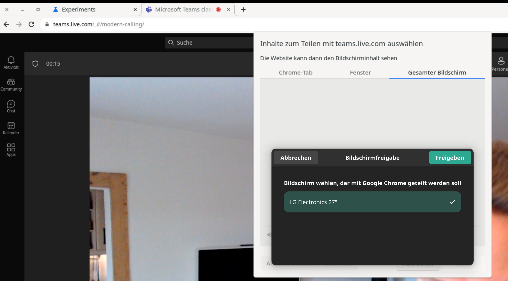

Finally Screensharing in Teams worked:

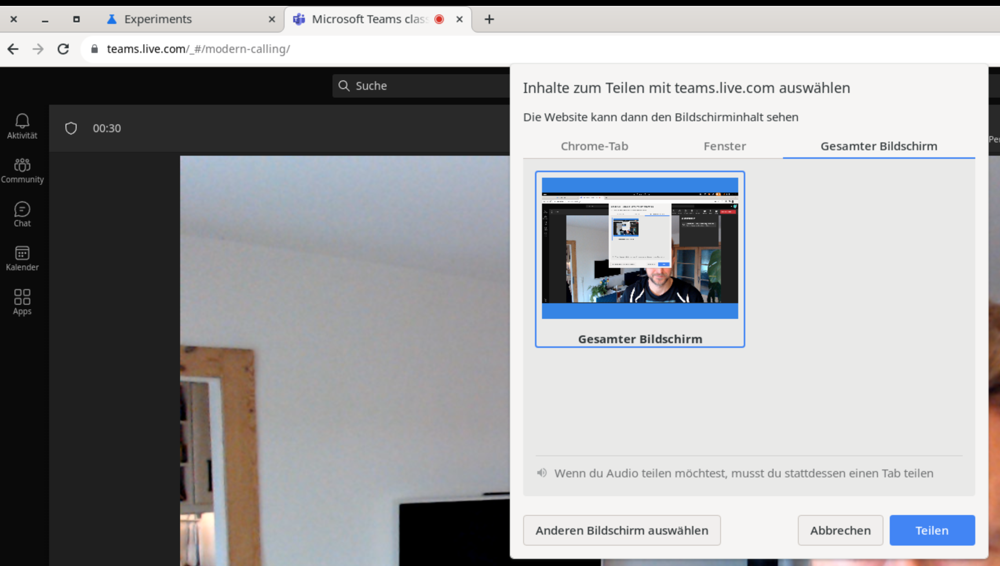


## Zoom

If you want Screensharing to work, don't use the Flatpack package, use the Arch one https://aur.archlinux.org/packages/zoom

Install it via Manjaros package manager (gui or command line).

There are great tips at https://wiki.archlinux.org/title/Zoom_Meetings


### Issue: login data & SSO not saved after restart (of system or Zoom app only)

It's annoying to have to login into SSO every time I use Zoom or restarted my system. 

The simple solution is to delete/rename the `~/.zoom` directory (see https://www.reddit.com/r/Zoom/comments/10vfbtk/comment/j8gxunn/)!

Now the settings will be successfully saved in `/home/jonashackt/.config/zoomus.conf` (which doesn't work, when the `~/.zoom` directory persists)


## Slack

Flatpack is here to help again: https://flathub.org/apps/com.slack.Slack

But if you want working drag and drop, you might want to use the Arch package https://aur.archlinux.org/packages/slack-desktop


## Miro

There's a snap available here https://snapcraft.io/install/miro/manjaro

To be able to use Snapcraft on Manjaro we need to install it first - again either via gui or command line:

```
sudo pacman -S snapd
```

Also enable the systemd unit that manages the main snap communication socket:

```
sudo systemctl enable --now snapd.socket
```

Restart your system to ensure snap’s paths are updated correctly. 

Now install Miro via snap:

```
sudo snap install miro
```


## SIP Telefone app for Linux

If you're like me you want to be callable even when you're mobile phone is on airplane mode. The easiest solution is a SIP phone client software, where you just configure your SIP credentials and can use your laptop or desktop machine to have phone calls.

There's huge list of SIP clients around, but already on my Android phone there are only a few that really work.

While writing this docs I found out about linphone https://www.linphone.org/technical-corner/linphone, which has clients for nearly every OS. And it's also OpenSource, developed on GitLab.com https://gitlab.linphone.org/BC/public/linphone-desktop

I installed the AUR AppImage package https://aur.archlinux.org/packages/linphone-desktop-appimage (the other https://aur.archlinux.org/packages/linphone-desktop didn't work on my machine).

My first tests worked like a charm!


## Google Drive Desktop file sync

On my Mac I had a Desktop App to sync my Drive files into my file manager. Sadly there's no Google Drive Desktop for Linux https://support.google.com/drive/answer/10838124

There's a great post on baeldung about this topic: https://www.baeldung.com/linux/google-drive-guide (see also https://askubuntu.com/questions/1390151/google-drive-in-ubuntu-with-full-local-copy)

But we have some alternatives. First thing I checked was `gnome-online-accounts` (see [the docs](https://help.gnome.org/users/gnome-help/stable/accounts-which-application.html.en)). This package is already pre-installed on Manjaro. Simply head over to `preference / online accounts` and log in to your Google account. Now the Gnome file manager should have a new entry, where you can access your Google Drive files: 

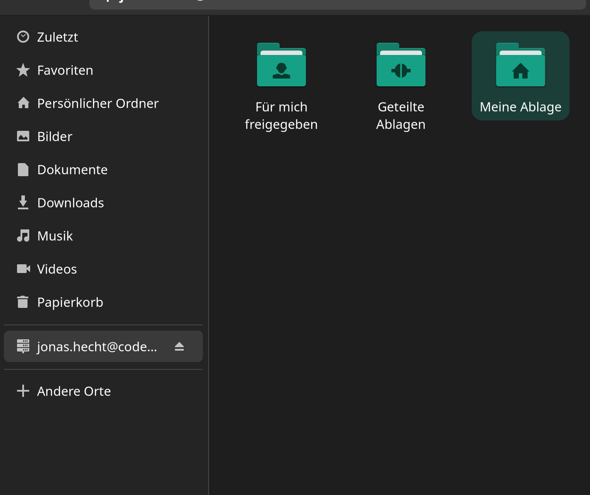

But [they aren't stored locally sadly](https://gitlab.gnome.org/GNOME/nautilus/-/issues/784), so they will be downloaded every time you access them. And as the baeldung post states, the file names are completely obscured on the command line. E.g. if you have a file called `bla` in the file manager, it's named like `11lfzX-8dH_eWtf2JWa3caRtodOnlXDbN` on the command line and you even need to access it in a weird way like `cd '/run/user/1000/gvfs/google-drive:host=gmail.com,user=myemail'`.


If you need locally stored files with Google Drive, IMHO there's no perfect solution. Maybe https://www.insynchq.com is worth a try, but also costs some 30 bucks...


## Dropbox Linux client

There's a official Dropbox Linux client https://help.dropbox.com/de-de/installs/linux-commands and also a AUR package https://aur.archlinux.org/packages/dropbox

Compared to Drive the integration is superb. Start the app via the application menu and after the login you will find a Dropbox icon right at the top of your Gnome Desktop - just as you are used to on a Mac:

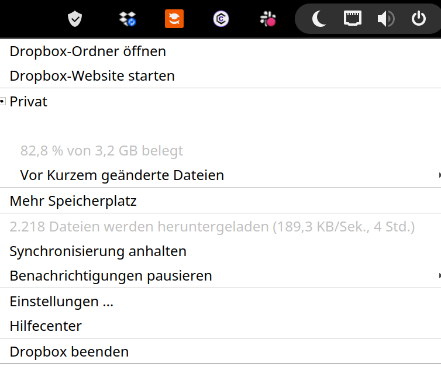

Also you can drag the folder `Dropbox` in your profile directory into the left menu bar of the Gnome file manager. And voila: you have the same integration as on a Mac!

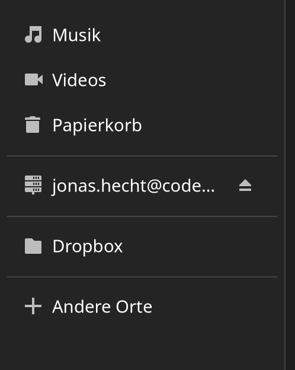


## Remarkable Linux client

https://github.com/reHackable/awesome-reMarkable

I use the eBook-Reader like notepad Remarkable and on a Mac and on iPhone/Android there are quite good clients to use the cloud sync. There's no current AUR package sadly, but snap is here to help:

https://snapcraft.io/remarkable-desktop and specifically for Manjaro https://snapcraft.io/install/remarkable-desktop/manjaro

But sadly, this Windows app packaged as a wine app didn't work on my machine. It started once, but after an update didn't start anymore.


Other strategies to get to your documents using Linux:

If you only want to get single documents and download them to your desktop, there's a simple web interface you can enable inside your Remarkable tablet's settings. Just head over to `Settings / Storage` and enable `USB web interface`. My remarkable is now accessible via http://10.11.99.1/ and I can download single documents easily.

We can even create a Gnome Dock Icon to link to the Remarkable web interface: https://askubuntu.com/questions/1045723/how-to-add-website-url-shortcut-to-ubuntu-dock-on-ubuntu-18-04 ([here's an icon](https://www.reddit.com/r/RemarkableTablet/comments/m063iu/i_was_tired_of_the_macos_app_icon_so_i_redesigned/) if you'd like). This is my `Remarkable.desktop` file:

```shell
[Desktop Entry]
Comment=Open Remarkable web interface
Terminal=false
Name=Remarkable web interface
Exec=firefox http://10.11.99.1
Type=Application
Icon=/home/jonashackt/Downloads/remarkable-logo.png
NoDisplay=false
```

Now look for the App in your Activities view (Windows key) and pin the Remarkable App to your Dock:

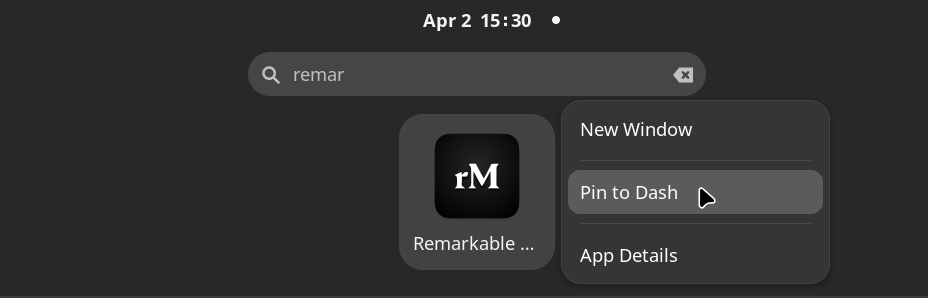


## Remote Desktop on Manjaro

I had the issue, that the kids were playing on the Wii in the basement where my Manjaro PC is located (waiting for my new Laptop ever since). So I grabbed a Laptop from my Mother's husband (also on Manjaro) and wanted to connect via Remote Desktop to my machine.

According to https://www.howtogeek.com/429190/how-to-set-up-remote-desktop-on-ubuntu VNC isn't a secure protocol anymore (see also https://en.wikipedia.org/wiki/Virtual_Network_Computing#Security) and VNC is interfering with Wayland, which is the default on modern Linux desktops right now:

> In fact, the VNC back end for the GNOME remote desktop functionality has been turned off by default in GNOME, and Ubuntu have followed suit. Restoring it requires building various components from source with the appropriate build flags reinstated.

And 

> The preferred method, and one natively supported by GNOME and Ubuntu, is to use the remote desktop protocol instead of VNC.

But nevertheless don't use plain RDP over the internet without VPN etc.!

There are 2 distince methods how to use Remote Desktop in Gnome:


1. Desktop Sharing:

    Enables remote users to view and potentially control the desktop of a local user who is already logged in.
    The remote user connects to the existing session, and their actions (like mouse movements) are visible on the shared screen.
    It's a screen-sharing session, meaning the remote user is effectively observing and potentially interacting with the local user's session


2. Remote Login:

    Allows a remote user to log in to their own user account on the machine, even if no one is logged in locally.
    Creates a new, independent session, as if the user were logging in directly at the machine's physical keyboard.
    This feature is useful for situations where you need to access your computer remotely, even if it's been restarted or locked. 
    --> If you use the same user for local login and interaction with Remote Login, the local user session will be logged out!


### 1. Desktop/user session sharing

This is super cool: So just enter the system settings menu, click on `Sharing` and activate `Remote Desktop` and `Remote Control` on the machine you want to connect to.


### 2. Remote Login using a separate user

First on the machine you want to connect to (e.g. your homeserver (as described here https://github.com/jonashackt/homeserver)), go to the Gnome Settings, then `System`/`Users` and click on `Add User`. Now create a new distinct user for the Remote login. If you want to do administrative stuff, you should give the user the `Administrative` type and set the password right now.

Now setup Remote Login in Settings `System/Remote Desktop`  in the tab `Remote Login` using the button behind `Remote Login`. Also under `Login Details` set the username and password of the newly created user. 

### RDP Client

Now on the client machine you need an RDP client. There are many around, like remmina https://software.manjaro.org/package/remmina#! or Thincast https://thincast.com/en . I tried Thincast and used my basement machines local network IP and the credentials from the Gnome Sharing menu. And it worked like a charm:

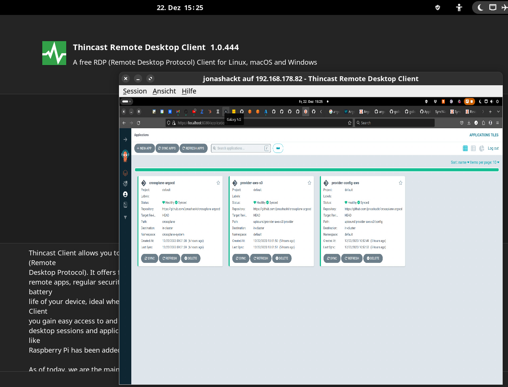

In Thincast the option `View / Smart Sizing` comes in very helpful, if the screens of Client and Server do have different resolutions.

Depending on the RDP methods you used with the 2. method your local user session should not be logged out :)


# Development software

## VSCode

There are plenty of ways to install VSCode to Linux / Manjaro. First I tried the flathub package, but then I realised that a Flatpack packaged app is really separated from the rest of the system. Since it runs in a container. So no other development tools or frameworks will work inside the VSCode container, we would have to install it all into it... 

Although I love the idea of container packaged software, I don't really wanted to live it that kind of hard fashioned with my development setup. Sure, development containers would also work. But I wanted kind of a more traditional installation. And luckily there's the AUR package https://aur.archlinux.org/packages/visual-studio-code-bin . Beware of the `-bin` in the name of the package, the other one installs the `Code - OSS` app instead. [See the differences here](https://github.com/microsoft/vscode/wiki/Differences-between-the-repository-and-Visual-Studio-Code).


## Taming the terminal

https://forum.manjaro.org/t/bash-with-autocomplete-and-fancy-flags/112108

https://github.com/romkatv/powerlevel10k

* Unable to cancel a command on Gnome terminal? Have a look at https://unix.stackexchange.com/a/33017/140406 and delete every `Strg+C` keyboard shortcut in the Gnome terminal settings!


### Install Tiling Terminal Tilix

If you want a more advanced Tiling Terminal, have a look at Tilix:

https://gnunn1.github.io/tilix-web/

```shell
sudo pamac install tilix
```


### Fix zsh: corrupt history file /home/jonashackt/.zhistory

https://gggauravgandhi.medium.com/fix-for-zsh-corrupt-history-file-home-zsh-history-with-restore-history-to-new-file-f817a289d4aa

If everytime you open your shell the following pops up: `zsh: corrupt history file /home/jonashackt/.zhistory` then do:

```shell
cd ~
mv .zhistory .zhistory_old
strings .zhistory_old > .zhistory
fc -R .zhistory 
```


# Misc

## Small tweaks

* Switching back to last tab on Firefox: https://superuser.com/questions/290704/switching-back-to-last-tab-on-firefox

* Night mode: https://www.reddit.com/r/ManjaroLinux/comments/ogf1iy/turn_on_night_mode/

* Show Hidden `.` files in home dir: `Strg - H`


## Zoom text in gedit

https://askubuntu.com/questions/108967/how-to-zoom-in-and-out-of-text-in-gedit

```shell
sudo pamac install gedit-plugins
```

Now there's a new gedit plugin available called `Text size`:

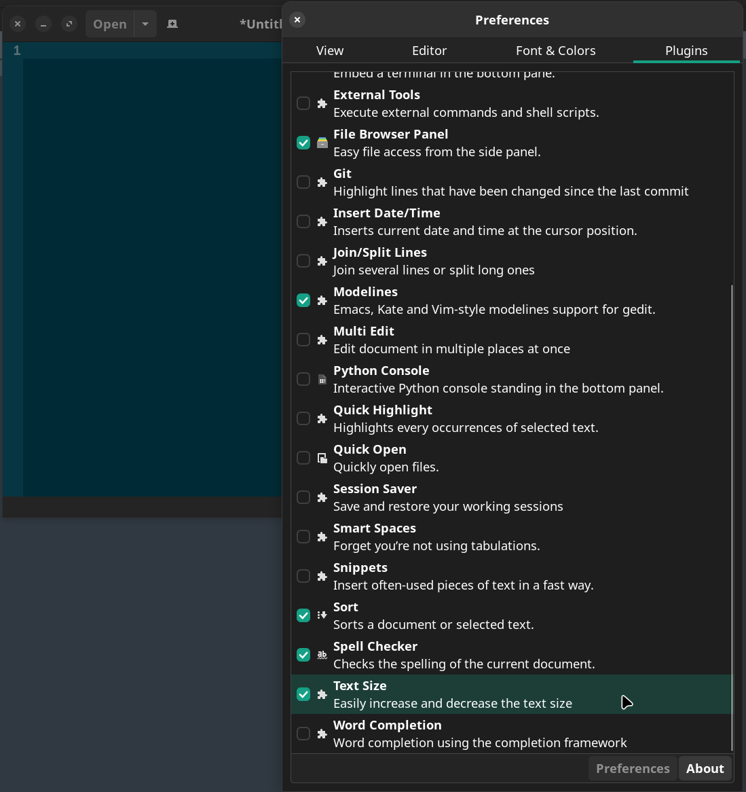


## Print multiple jpgs to PDF

The easy "Vorschau" app on MacOS had this feature, but I can't find it in gthumb. But it's there somehow https://gnulinux.ch/bilder-drucken with the great [ImageMagick](https://en.wikipedia.org/wiki/ImageMagick).

Execute the following on your console:

```shell
convert *.jpg multiples.pdf
```

Now you can even print all sites on one pdf.


## Write into and sign PDFs

According to https://askubuntu.com/questions/1330708/fill-sign-pdf-on-ubuntu the best seems to be Xournal++ (there is also an older Xournal)

https://xournalpp.github.io/

The correct Arch/Manjaro package is named `xournalpp`:

```shell
sudo pamac install xournalpp
```

I also often read about LibreOffice Draw (like in here https://askubuntu.com/a/786795/451114), where you can

* open the pdf
* then "export as pdf"
* set "jpeg compression quality" to 50% and "image resolution" to 150 dpi


## Configure LibreOffice tabbed style (like MS Office)

Install LibreOffice (see https://wiki.archlinux.org/title/LibreOffice) via the Arch package [`libreoffice-fresh`](https://archlinux.org/packages/?name=libreoffice-fresh):

```shell
pamac install libreoffice-fresh
```

LibreOffice looks way better than OpenOffice. But if you want to have it even slicker with the Tabbed User Interface style, then have a look here: https://itsfoss.com/libreoffice-ribbon-interface/:

Go to `View/User Interface...` and select `Tabbed`.

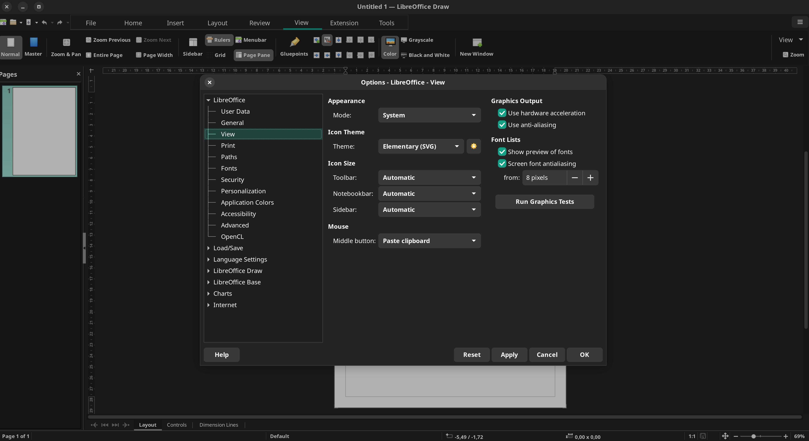

Choose another Icon theme, if the dark (black and white) icons aren't what you're looking for https://askubuntu.com/questions/979032/libreoffice-icons-hard-to-see-with-dark-themes


## Printer setup

Here I learned to __ALWAYS__ search for an AUR package first!

I have an old Canon MX870 printer, which has ultra low cost and separate printer cartridges. So I went to the Canon Driver page and it was simply empty. No Linux drivers at all. A google search got me to [driverscollection.com](https://de.driverscollection.com/?file_cid=4527114398460c3f541c53ebcfb), but there were only `.deb` (Ubuntu, Debian) and `.rpm` (Fedora, SUSE) packages. The build from source also didn't work, since file were missing... (I already searched for "How to Install .DEB files in Arch Based Distros" - [don't do that!](https://forum.manjaro.org/t/how-to-install-deb/34452/3)).

But than I simply searched for `canon mx870 linux driver arch` - and there really was an AUR package for my printer! Horay!

Now installing `canon-pixma-mx870-complete` gave me some errors - but I managed to solve them. The first error indicated, that I didn't have `autoconf` installed. So I installed it with `pamac`. The second error got me to the missing `automake`, which I also installed. Then I had a strange error with the [lib32-libusb-compat package](https://archlinux.org/packages/core/x86_64/libusb/), which is needed by the `canon-pixma-mx870-complete` package: 

```
syntax error near unexpected token `LIBUSB,'
```

Luckily [this thread](https://bbs.archlinux.org/viewtopic.php?id=251492) and also the [`lib32-libusb-compat` AUR package site](https://aur.archlinux.org/packages/lib32-libusb-compat) got me to the problem: I needed to install [`base-devel` AUR package](https://archlinux.org/packages/core/any/base-devel/) first!

Now running `pamac install lib32-libusb-compat canon-pixma-mx870-complete` ran like a charm!

The scanner now worked using the app `Document Scanner`.


But there was no printer configured out-of-the-box. Although the driver (`PPD` files) seem to be present correctly.

In the normal settings dialog had a `add printer` button, but my Canon network printer wasn't found there and I couldn't add it though:

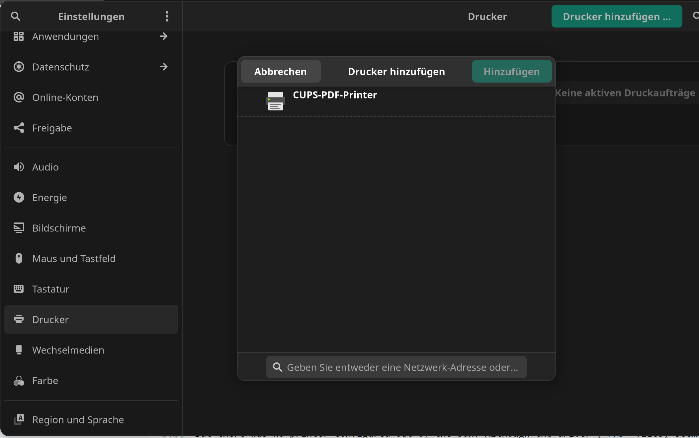

So I went over to the console and started the CUPS gui directly just executing `system-config-printer`. Now adding a new printer in the CUPS gui also shows `network printers` - and there my Canon MX870 showed up!

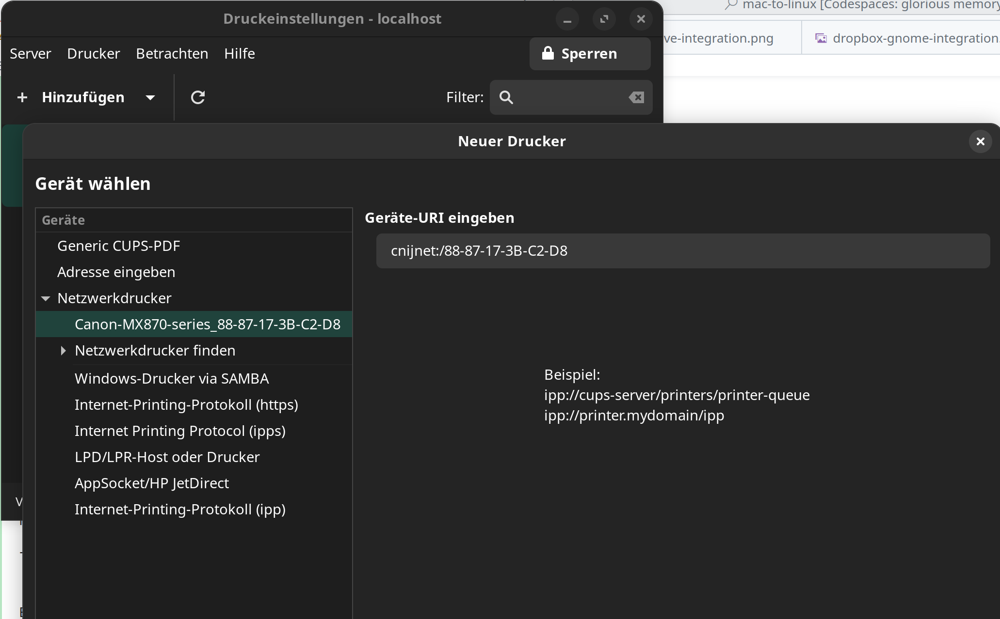

Really nice. I clicked `forward` and the Driver was automatically set to `Canon MX870 series - CUPS+Gutenprint v5.3.4 Simplified`, which may also work - but we installed the original `Canon MX870 series Ver.3.30` right?! Therefore I changed the created printer after the wizard is finished and clicked on `brand and model` and change... and then selected the correct driver from the database:

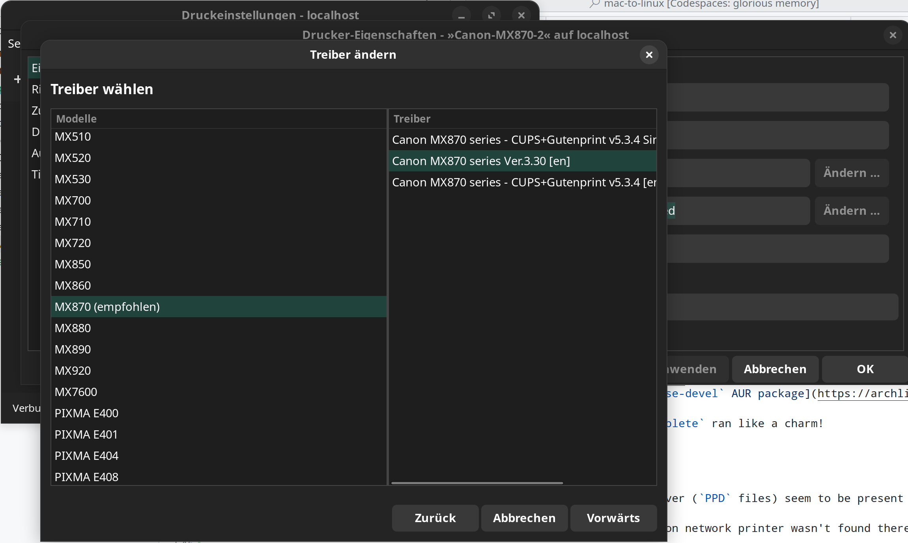

I hoped my printer would work now, but trying to print a example page didn't work. A final piece was missing.

But finally I found it: In the printer's settings under `guidelines` the condition was not `activated`. I activated the printer here and everything worked fine!


As a side note: If you want to use the open source drivers and need to configure `ldp` protocol instead, here's maybe help: https://bbs.archlinux.org/viewtopic.php?id=143349

Also the CUPS system itself is a very good source of information http://localhost:631/help/network.html


## Balsamiq Mockups on Linux

There's no official Balsamiq version for Linux https://balsamiq.com/wireframes/desktop/docs/linux/

But you can use Bottles https://usebottles.com (https://github.com/bottlesdevs/Bottles) to install the Windows version of Balsamiq.

> See also https://ostechnix.com/run-windows-software-on-linux-with-bottles/ for more info

Therefore install `Bottles` via the Package Manager `pamac` or via Flatpack:

```shell
pamac install bottles
```

Thereafter finish the UI's Wizard:

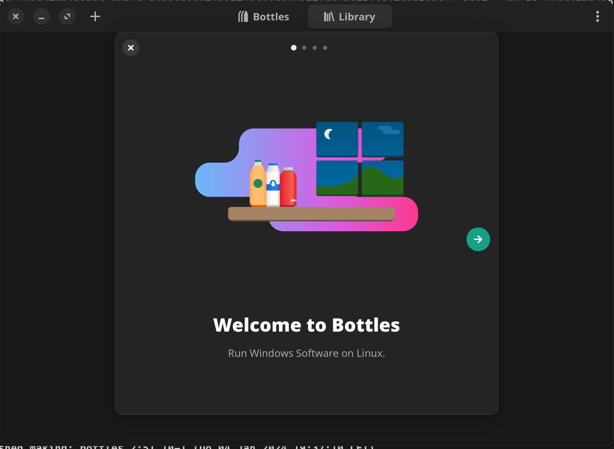

Now we need to download the Balsamiq Windows installer file like `Balsamiq_Wireframes_4.7.4_x64_Setup.exe` from https://balsamiq.com/wireframes/desktop/.

Back in Bottles you need to create a new bottle. I choose `Application`, named it `Balsamiq` and just went with the defaults.

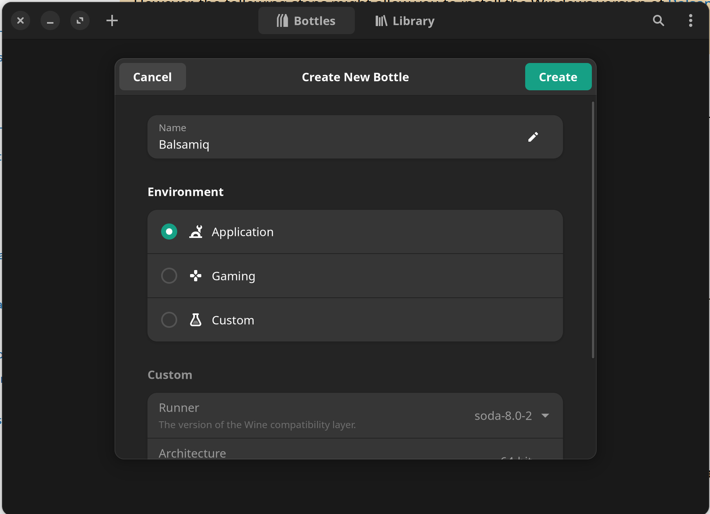

Then let Bottles setup the bottle. This may take a while. If the bottle is ready, hit the `Run Executable...` button and select the downloaded `Balsamiq_Wireframes_4.7.4_x64_Setup.exe`. The balasamic setup wizard should appear:

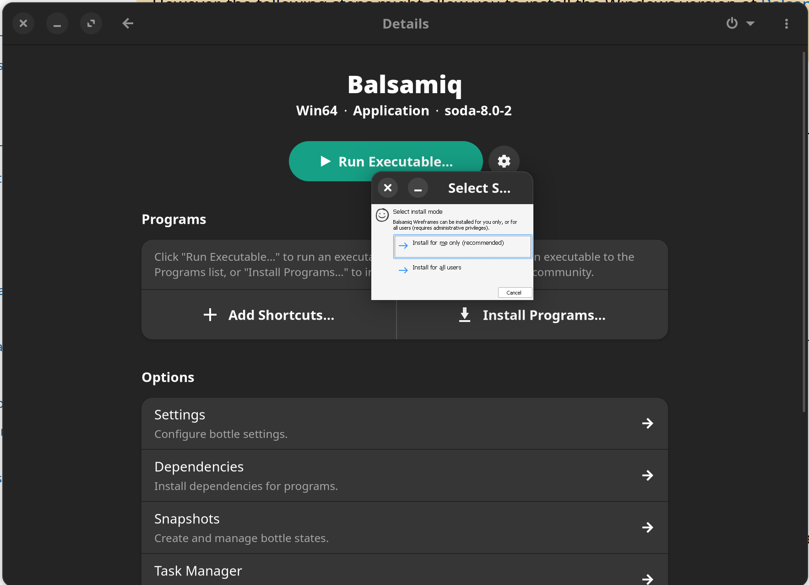

Now click on `Install for all users` and hit `Next` on dir selection, desktop shortcut and then `Install`. Finally click on `launch Balsamiq` and Balsamiq should appear:

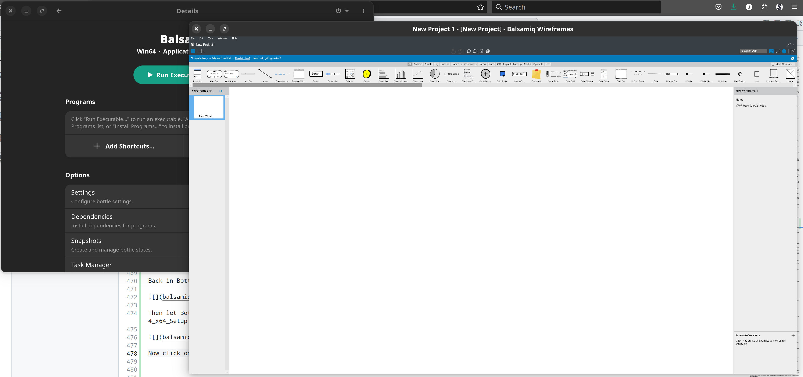

If your Balsamiq is hardly readable (e.g. because you have set Manjaro's screen scaling to 200%), you may need to adjust the Bottle's display settings. Therefore head over to `Options` section and click on `Settings`. Now scroll down to `Display` section and select the `Advanced Display Settings`. Finally tweak the `Screen Scaling` settings. For me the default was `96 DPI`. I doubled it according to my Manjaro screen scaling of 200% to `192 DPI`: 

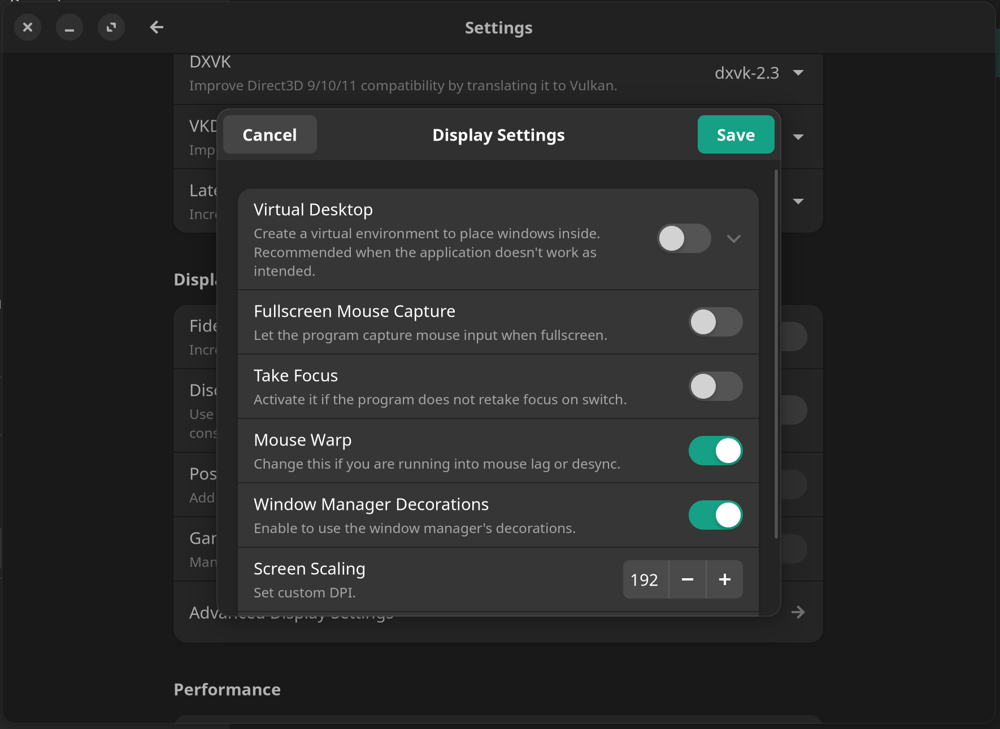

Now Balsamiq looked wonderful:

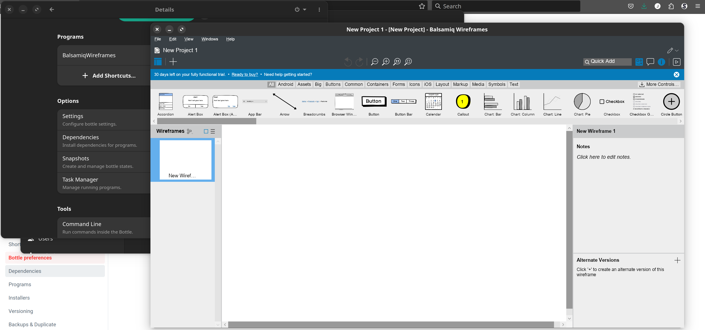

See also https://forum.usebottles.com/t/how-to-scale-the-bottles-application-for-hidpi/862


If you're asking yourself where to find file that you're saving in Balsamiq, just have a look into your profile. All bottles reside in `.var/app/com.usebottles.bottles/data/bottles/bottles`. If you save the file `New Project 1.bmpr` directly to the `My Computer / (C:)`, you'll find it there:

```shell
$ ls ~/.var/app/com.usebottles.bottles/data/bottles/bottles
$ cd Balsamiq/drive_c
$ ls -la
total 112
drwxr-xr-x  7 jonashackt jonashackt  4096  4. Jan 20:38  .
drwxr-xr-x  7 jonashackt jonashackt  4096  4. Jan 20:38  ..
-rw-r--r--  1 jonashackt jonashackt 86016  4. Jan 20:38 'New Project 1.bmpr'
drwxr-xr-x  4 jonashackt jonashackt  4096  4. Jan 19:57  ProgramData
drwxr-xr-x  7 jonashackt jonashackt  4096  4. Jan 19:57 'Program Files'
drwxr-xr-x  6 jonashackt jonashackt  4096  4. Jan 19:47 'Program Files (x86)'
drwxr-xr-x  4 jonashackt jonashackt  4096  4. Jan 19:47  users
drwxr-xr-x 21 jonashackt jonashackt  4096  4. Jan 19:49  windows
```


## Sync files between machines with Syncthing (like Dropbox, but private)

There's a great tool called Syncthing.

> "Syncthing works best when at least one device is always on to ensure continuous syncing." In order to have a machine that's always on, here are the docs on how to build and setup your own fan-less homeserver (as described here https://github.com/jonashackt/homeserver).

Here's [how to install & configure it](https://docs.syncthing.net/intro/getting-started.html) - e.g. on your homeserver:

```shell
pamac install syncthing
```

Since we want to have Syncthing to automatically start when we boot our machine, we should create a System service for it - see https://docs.syncthing.net/users/autostart

On many distributions [this will be `systemd` today](https://docs.syncthing.net/users/autostart#using-systemd).

> To understand the difference between systemd system and user services, have a look at https://superuser.com/questions/393423/the-symbol-and-systemctl-and-vsftpd (the `@` defined Unit files refer to the system services)


### (auto)Start Syncthing via systemd user service on Linux Laptop

If you want Syncthing to be automatically started on your Laptop, you most likely want to start it as a user service (which does not run regardless of logged in users): https://docs.syncthing.net/users/autostart#how-to-set-up-a-user-service

> "Thus, the user service is intended to be used on a (multiuser) desktop computer. It avoids unnecessarily running Syncthing instances."

> Service files for systemd are provided by Syncthing (on Arch/Manjaro there's a `syncthing.service` file present in `~/.config/systemd/user/default.target.wants` after the pamac install ran)

So simply run:

```shell
systemctl --user enable syncthing.service
systemctl --user start syncthing.service
```

To check the status run:

```shell
systemctl --user status syncthing.service
``` 

Or check your Browser at http://127.0.0.1:8384/ which should show the Syncthing admin gui:

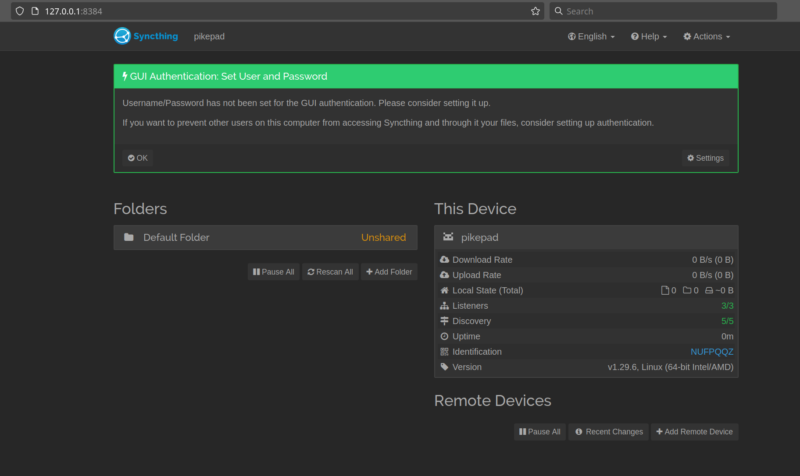


### (auto)Start Syncthing via systemd system service on Linux Server

https://docs.syncthing.net/users/autostart#how-to-set-up-a-system-service

> "Running Syncthing as a system service ensures that Syncthing is run at startup even if the Syncthing user has no active session. Since the system service keeps Syncthing running even without an active user session, it is intended to be used on a server."

> Service files for systemd are provided by Syncthing (on Arch/Manjaro there's a `syncthing@.service` file present in `/usr/lib/systemd/system` after the pamac install ran)

So simply run (replace `myuser` with a actual username):

```shell
systemctl enable syncthing@myuser.service
systemctl start syncthing@myuser.service
``` 

To check the status run (replace `myuser` again):

```shell
systemctl status syncthing@myuser.service
``` 

Or check your Browser at http://127.0.0.1:8384/ which should show the Syncthing admin gui:


### Get Syncthing to sync a Folder between Laptop and Server 

> To get your two devices to talk to each other click “Add Remote Device” at the bottom right on both devices, and enter the device ID of the other side (you can see it in the web GUI by selecting “Actions” (top right) and “Show ID”). You should also select the folder(s) that you want to share. The device name is optional and purely cosmetic. You can change it later if desired.

Do this on all machines you want to connect. You should be promted on the other machines, if you really want to share the defined folder (I just choosed the Default Folder `HOME/Sync` to be shared).

Now place a new file into your folder in sync - and it should magically appear on your other device like this:

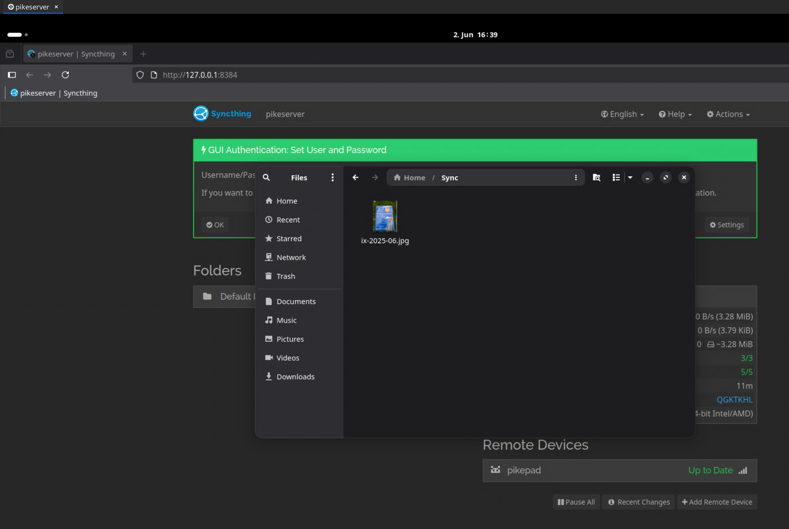


### Syncthing Tray

As with Dropbox we'd like to have a tray icon running for Syncthing. Luckily there's https://github.com/Martchus/syncthingtray

Simply install it via

```shell
pamac install syncthingtray
``` 

Then start it and configure it using the local Syncthing url path and the `API Key` you can copy from the Syncthing web ui under `Actions/Settings`:

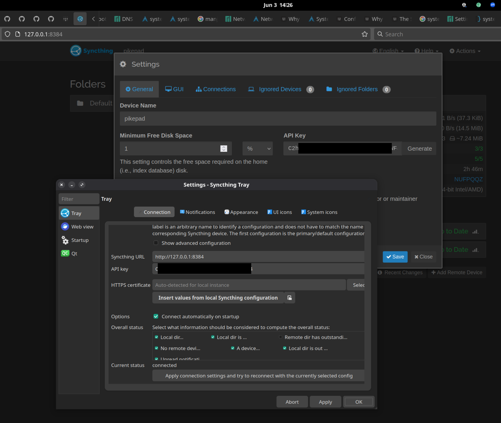


### Sync between Laptop & Server via Tailscale

Now syncing between your devices in the same local network is cool, but we want the "real" Dropbox like experience. So why not use TailScale for that, as I already configured in https://github.com/jonashackt/firefly-iii-ops?tab=readme-ov-file#make-your-homeserver-available-on-the-internet-for-later-app-access

With Tailscale all your devices will be accessible regardless where they are located on earth :) Now to use Syncthing together with Tailscale, we need to: 

1. Get Tailscale host name + magic dns + port for every device:
Each device connected to Tailscale will be assigned a Tailscale host name + magic dns + port in the form `hostname.magic-dns-name.net` within the Tailscale network.

Therefore have a look into the tailscale webinterface at https://login.tailscale.com/admin/machines under `Machine Details` of every connected device.

2. Edit your Remote Devices to support Tailscale hostname + magic dns + port instead of dynamic discovery.
This can be done in every Remote Devices `Advanced` options under `edit device`. In the `Adresses` field enter the Tailscale host name + magic dns + port in this format (where `22000` is the default port)

`tcp://hostname.magic-dns-name.net:22000`

3. Repeat for all devices:
Repeat this process on each Syncthing instance, adding the other device's Tailscale hostname + magic dns + port as a remote device. 

If you're using the Android Syncthing Fork App, use the Web UI to configure this Advanced Option (see next paragraph).


### Add your Android phone (e.g. on CalyxOS) to the Syncthing devices

> See https://github.com/jonashackt/calyxos for instructions to create a De-Googled phone

The original Syncthing App for Android [was discontinued for some reasons](https://www.reddit.com/r/Syncthing/comments/1g7zpvm/syncthing_android_app_discontinued/) 

But there's an alternative fork, that is beeing published to the release channel on F-Droid https://github.com/Catfriend1/syncthing-android - as described there I would not advice to use the PlayStore / Aurora Store version, since it's not published by the maintainer and it's not the most up-to-date version. Simply use F-Droid.

To connect to your Syncthing network, add the Device ID (from the burger menu in the app) to the other machines - and the ids of the other machines to your Syncthing Fork Android app. The devices should then all list themselves, if everything went fine.

The last step is to accept the sharing of the `Default Folder` of your other machines on your Android device. 

> __Therefore head over to `Web UI` in the burger menu of the App and accept the folder to sync.__

Now you should be asked to add the folder and on which path this will be saved (I used `~` for that, this uses the provided path in the app). Then accept every other folder sync from other devices. Now all files in the `Default Folder` should also be synced to your Android phone:

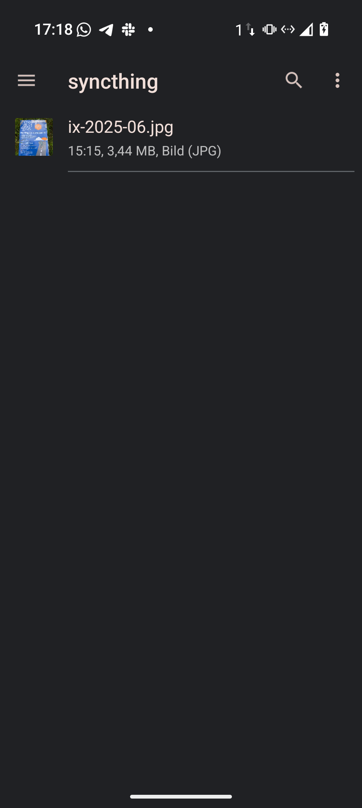


### Sync Obsidian between machines with Syncthing

Imagine you want to use Obsidian for notes management without Google Drive / Dropbox reliance [to sync your notes](https://help.obsidian.md/sync-notes) (e.g. from your Linux machine to your De-Googled Phone based on CalyxOS (as described here https://github.com/jonashackt/calyxos))

To be able to sync your Obsidian Vault using Syncthing, first try to locate your Obsidian Vault on Android. To find the location of your vault, you need to tap on the menu icon in the top left and click on your vaults name. Now a pop up should show up and present `Manage vaults...`. Now click on your created vault again and there should be a `This vault is located at /storage/emulated/0/xyz` under your vault's name. This is the folder we want to sync using the already setup Syncthing.

Simply copy the Obsidian vault folder to your Syncthing Default Folder created earlier. Now open a new Obisidian vault from this exact folder location and delete the old one.

On your Desktop devices you can do the same. That's it, now your Obsidian notes are in sync on all your devices!


# Links

https://www.makeuseof.com/how-to-install-and-remove-packages-arch-linux/

Optional dependencies in Manjaro's pamac: 

https://forum.manjaro.org/t/pamac-how-to-install-all-optional-dependencies/59041/3

https://www.reddit.com/r/archlinux/comments/1z9y3l/install_optional_dependencies/


https://wiki.archlinux.org/title/docker

https://dev.to/kenji_goh/got-permission-denied-while-trying-to-connect-to-the-docker-daemon-socket-3dne

https://www.digitalocean.com/community/questions/how-to-fix-docker-got-permission-denied-while-trying-to-connect-to-the-docker-daemon-socket

https://docs.docker.com/engine/install/linux-postinstall/#manage-docker-as-a-non-root-user