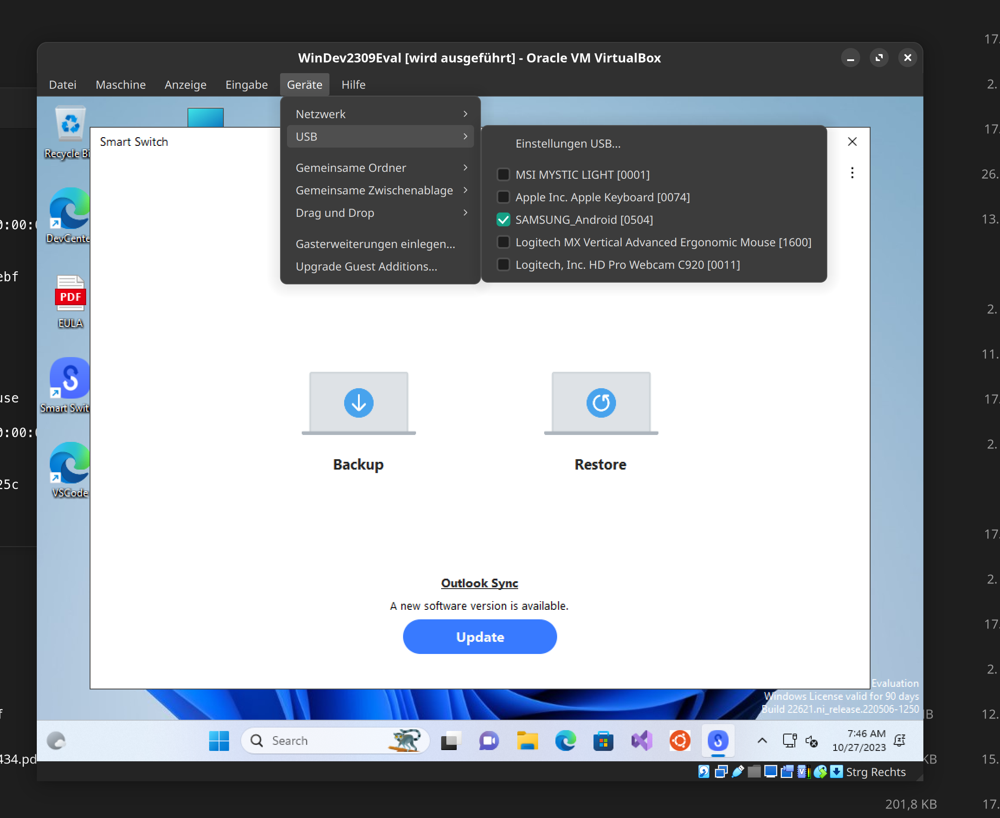
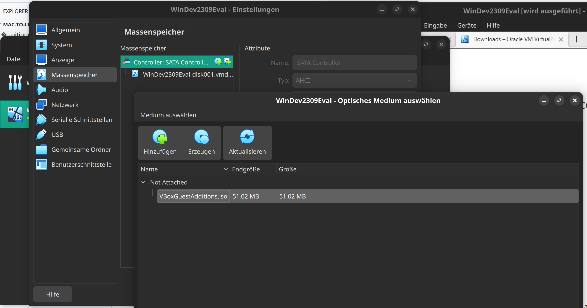
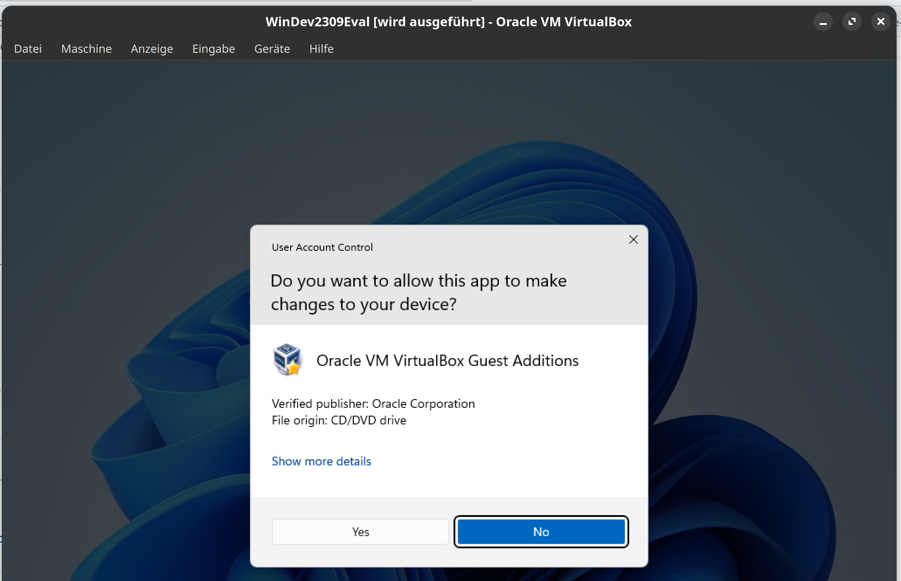
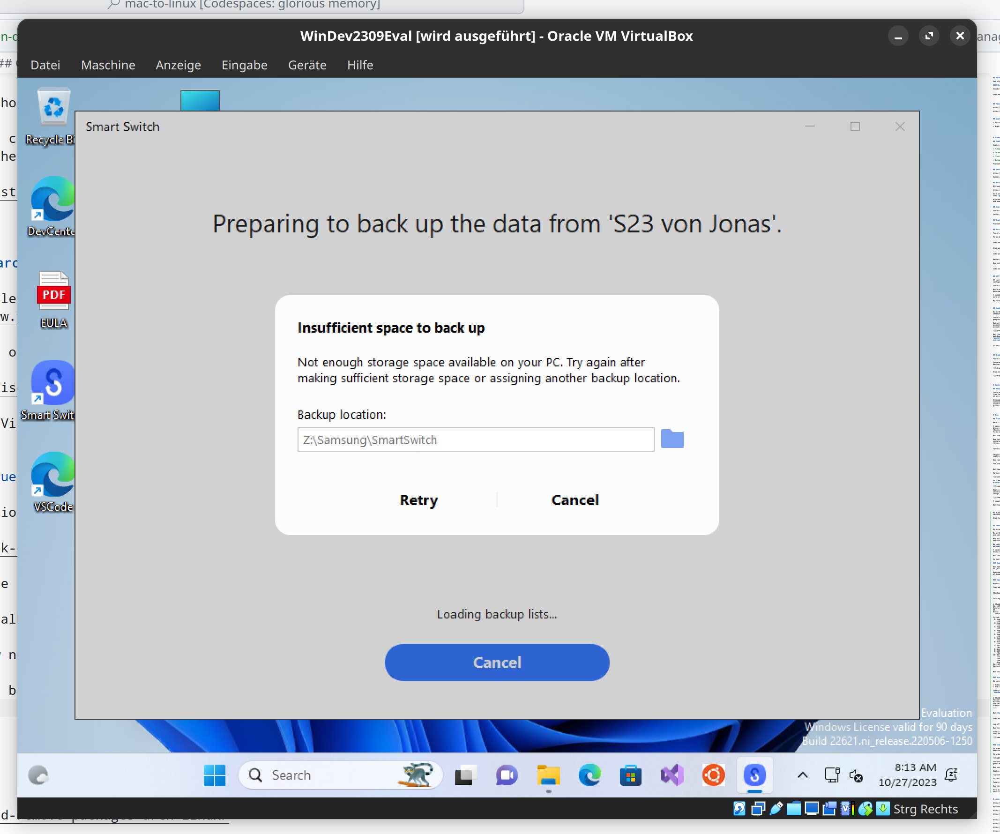
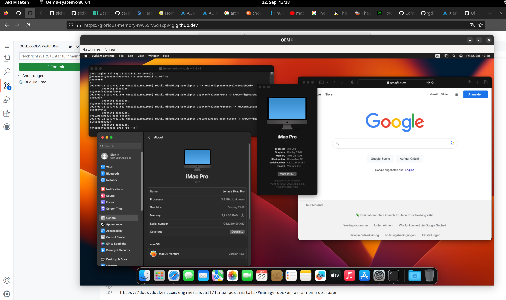
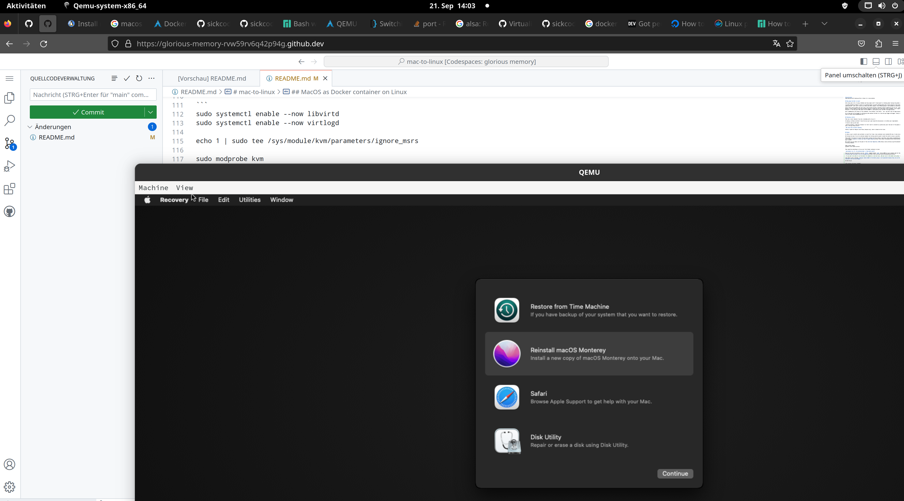
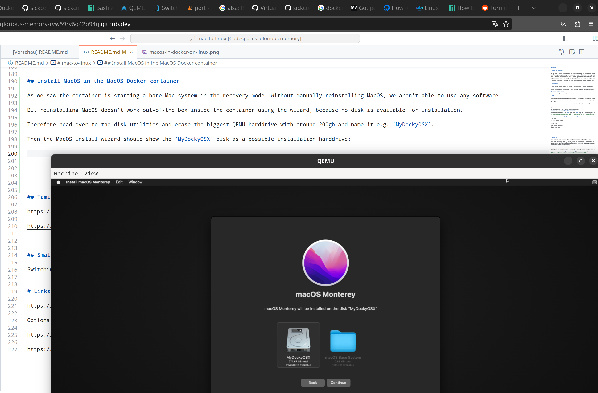
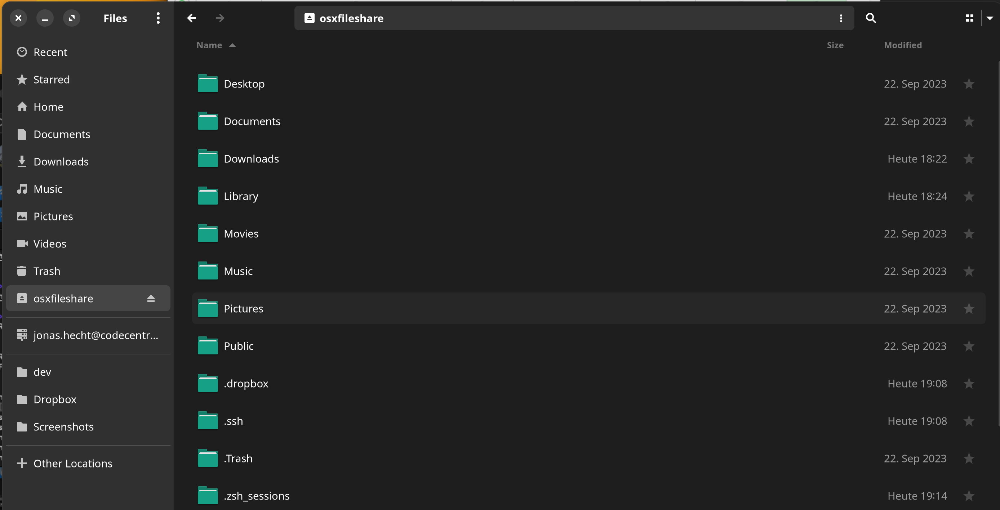

# Virtualized Windows & MacOS on Linux

This section covers using Windows and MacOS on Linux.


## Windows with VirtualBox

As already said I dropped my iPhone in favour of Android. As Samsung has a great overall package of 5 years of updates, I went for a S23.

On my Mac I used Samsung Smart Switch for the backups, which was quite easy to use. So why not use it on Manjaro too? Well, there's no Linux version sadly :( https://www.samsung.com/de/apps/smart-switch/

Now we have a few alternatives left: https://xdaforums.com/t/samsung-smart-swith-for-ubuntu.3335276/ & https://superuser.com/questions/1314720/how-to-backup-a-samsung-mobile-to-linux 

We could use Wine as a Windows app emulator on Linux, but there doesn't seem to be good experiences with Smart Switch sadly. In the Wine database [this is rated as garbage](https://appdb.winehq.org/objectManager.php?sClass=application&iId=17967).

I opted for the VirtualBox / Windows path. I already had a project in place here, where I could simply follow the guide and have a running Windows box in minutes: https://github.com/jonashackt/windows-vagrant-ansible (well at least I thought so, because the base Vagrant box Edge dev was discontinued by Microsoft).

But luckily we only need to get a Windows VirtualBox VM here, no automation with Ansible or Vagrant for now.

So just do the following:

### Download Windows 11 evaluation VirtualBox .ova

But maybe there's help & there is a way to add an already existant VirtualBox `.ova` as a VagrantBox: https://gist.github.com/aondio/66a79be10982f051116bc18f1a5d07dc. So let's try it.

Download a pre-packaged VirtualBox `.ova` here https://developer.microsoft.com/en-us/windows/downloads/virtual-machines/ which already includes an evaluation version of Windows 11. The link should download the VirtualBox `.zip` file (22gigs will take their time depending on your Internet speed).


### Import .ova into VirtualBox

Unpack the `WinDev2309Eval.ova`.

Then add it to the local VirtualBox installation [via `VBoxManage import`](https://docs.oracle.com/en/virtualization/virtualbox/6.0/user/vboxmanage-import.html):

```
VBoxManage import ~/Downloads/WinDev2309Eval.VirtualBox/WinDev2309Eval.ova
```

This may take some time:

```
$ VBoxManage import ~/Downloads/WinDev2309Eval.VirtualBox/WinDev2309Eval.ova             1 ✘ 
0%...10%...20%...30%...40%...50%...60%...70%...80%...90%...100%
Interpreting /home/jonashackt/Downloads/WinDev2309Eval.VirtualBox/WinDev2309Eval.ova...
OK.
Disks:
  vmdisk1	134217728000	-1	http://www.vmware.com/interfaces/specifications/vmdk.html#streamOptimized	WinDev2309Eval-disk001.vmdk	-1	-1	

Virtual system 0:
 0: Suggested OS type: "Windows11_64"
    (change with "--vsys 0 --ostype <type>"; use "list ostypes" to list all possible values)
 1: Suggested VM name "WinDev2309Eval"
    (change with "--vsys 0 --vmname <name>")
 2: Suggested VM group "/"
    (change with "--vsys 0 --group <group>")
 3: Suggested VM settings file name "/home/jonashackt/VirtualBox VMs/WinDev2309Eval/WinDev2309Eval.vbox"
    (change with "--vsys 0 --settingsfile <filename>")
 4: Suggested VM base folder "/home/jonashackt/VirtualBox VMs"
    (change with "--vsys 0 --basefolder <path>")
 5: Number of CPUs: 4
    (change with "--vsys 0 --cpus <n>")
 6: Guest memory: 8192 MB
    (change with "--vsys 0 --memory <MB>")
 7: USB controller
    (disable with "--vsys 0 --unit 7 --ignore")
 8: Network adapter: orig NAT, config 3, extra slot=0;type=NAT
 9: SATA controller, type AHCI
    (disable with "--vsys 0 --unit 9 --ignore")
10: Hard disk image: source image=WinDev2309Eval-disk001.vmdk, target path=WinDev2309Eval-disk001.vmdk, controller=9;port=0
    (change target path with "--vsys 0 --unit 10 --disk path";
    change controller with "--vsys 0 --unit 10 --controller <index>";
    change controller port with "--vsys 0 --unit 10 --port <n>";
    disable with "--vsys 0 --unit 10 --ignore")
0%...10%...20%...30%...40%...50%...60%...70%...80%...90%...100%
Successfully imported the appliance.
```

Now the box is already available inside your VirtualBox gui. 


### Accessing USB devices (like Samsung Android phones) inside the Windows guest

Be sure to configure the following tweaks manually (until we get the automation working again):

* Video: Scalingfactor to 200% (in order to see something)
* USB: Activate the USB controller and choose `USB 3.0-Controller (xHCI)`

Finally VirtualBox needs access to the USB devices, that are connected to the host. This doesn't work out-of-the-box and produces the following error, if we run a `VBoxManage list usbhost`:

```
$ VBoxManage list usbhost
Failed to access the USB subsystem.
VirtualBox is not currently allowed to access USB devices. 
You can change this by adding your user to the 'vboxusers' group. 
Please see the user manual for a more detailed explanation
...
```

But [there's help](https://askubuntu.com/a/377781/451114): We need to add our user to the `vboxusers` group via:

```
sudo usermod -a -G vboxusers $USER
```

Log off or even restart your machine - and then check via `groups $USER`, if your user is part of the group `vboxusers`. 

Now the command `VBoxManage list usbhost` should work as expected.

Finally go to your VirtualBoxed Windows and click on `Devices / USB` and select your phone (which will exclusively bind your phone to the guest Windows for now). With that SmartSwitch should be able to access the phone:




### Creating a shared folder between Manjaro host and Windows guest

In order to create a shared folder to be able to have a directory, where Samsung Smart Switch can store our backup on the Manjaro host, we need to install the Guest Additions into our Windows guest https://www.virtualbox.org/manual/ch04.html#additions-windows

In order to do that, we need to configure a optical drive to our VM:



Therefor head over to our VM's settings in VirtualBox and add a optical drive in the storage settings. Now VirtualBox will create a virtual optical drive with the guest additions iso inside.

Now inside the VM go to `Devices / insert guest additions` and they should show up inside the Windows Explorer.

Double click on the drive and the installation should start:

)

Follow through the Wizard and finally do the reboot required.

Finally create a shared folder in the VirtualBox settings of the VM. Be sure to check `bind automatically` and `permanently create`!

Now the folder should be available as a new networking location inside the Windows guest.

Fire up Samsung SmartSwitch and try to do a backup to your Manjaro host: Use somthing like `Z:\Samsung\SmartSwitch` as a path, since SmartSwitch will complain that it hasn't enough space available.




## MacOS on Linux

You may already guessed it: I will need MacOS for some time to follow - just to be able migrate some workflows I created over all those years. And also to use Samsung Smart Switch, my tax software and others. So is there a problem to run MacOS virtualized on Linux?

First I thought about using VirtualBox to do the job - but then I read statements like: "It could work (after many crazy configuration steps) - but then you shouldn't do an upgrade ever, since it may stop working right after the update". What...?! OMG.

See https://najigram.com/2022/01/run-macos-in-virtualbox-on-linux-os/, https://github.com/hkdb/VBoxMacSetup, https://www.macwelt.de/article/1506511/macos-ventura-mit-virtualbox-als-vm-betreiben.html


## MacOS as Docker container on Linux

But then I had an idea: Why not use containers to do the job? And a quick google search got me to https://github.com/sickcodes/Docker-OSX 

Let's try this out! First we need to [get some prerequisites ready](https://github.com/sickcodes/Docker-OSX?utm_source=pocket_saves#initial-setup):

> Before you do anything else, you will need to turn on hardware virtualization in your BIOS.

Now if you have hardware virtualization activated, we need to install some packages:

```
sudo pamac install qemu libvirt qemu-desktop dnsmasq virt-manager bridge-utils flex bison iptables-nft edk2-ovmf
```

Since pamac [will prompt you for optional dependencies](https://www.reddit.com/r/archlinux/comments/1z9y3l/install_optional_dependencies/), I choosed `none` and used `2:  qemu-desktop  8.1.0-2  extra` as the QEMU provider.

Now we also need to enable libvirt and load the KVM kernel module:

```
sudo systemctl enable --now libvirtd
sudo systemctl enable --now virtlogd

echo 1 | sudo tee /sys/module/kvm/parameters/ignore_msrs

sudo modprobe kvm
```

Finally we should be able to run a MacOS Docker container like [Monterey](https://github.com/sickcodes/Docker-OSX#monterey-):

```
docker run -it \
    --device /dev/kvm \
    -p 50922:10022 \
    -v /tmp/.X11-unix:/tmp/.X11-unix \
    -e "DISPLAY=${DISPLAY:-:0.0}" \
    -e GENERATE_UNIQUE=true \
    -e MASTER_PLIST_URL='https://raw.githubusercontent.com/sickcodes/osx-serial-generator/master/config-custom.plist' \
    sickcodes/docker-osx:monterey
```

or [Ventura](https://github.com/sickcodes/Docker-OSX#ventura-):

```
docker run -it \
    --device /dev/kvm \
    -p 50922:10022 \
    -v /tmp/.X11-unix:/tmp/.X11-unix \
    -e "DISPLAY=${DISPLAY:-:0.0}" \
    -e GENERATE_UNIQUE=true \
    -e MASTER_PLIST_URL='https://raw.githubusercontent.com/sickcodes/osx-serial-generator/master/config-custom.plist' \
    sickcodes/docker-osx:ventura
```



It's important to run the `docker` command without `sudo` (see https://github.com/sickcodes/Docker-OSX/issues/91#issuecomment-786794711):

> Run without sudo (GTK can't run in roots desktop because root isn't running a display server.)

Now we should see a QEMU firing up running MacOS in recovery mode:




## Troubleshooting MacOS in Docker

see also https://github.com/sickcodes/Docker-OSX#troubleshooting

I had some issues getting the container to run.

#### iptables

```
iptables: No chain/target/match by that name
```

See https://stackoverflow.com/questions/31667160/running-docker-container-iptables-no-chain-target-match-by-that-name - clearing all the chaings fixed it for me:

```
sudo iptables -t filter -F
sudo iptables -t filter -X
systemctl restart docker
```

#### gtk initialization failed

```
alsa: Could not initialize ADC
alsa: Failed to open `default':
alsa: Reason: No such file or directory
ALSA lib confmisc.c:855:(parse_card) cannot find card '0'
ALSA lib conf.c:5181:(_snd_config_evaluate) function snd_func_card_inum returned error: No such file or directory
ALSA lib confmisc.c:422:(snd_func_concat) error evaluating strings
ALSA lib conf.c:5181:(_snd_config_evaluate) function snd_func_concat returned error: No such file or directory
ALSA lib confmisc.c:1334:(snd_func_refer) error evaluating name
ALSA lib conf.c:5181:(_snd_config_evaluate) function snd_func_refer returned error: No such file or directory
ALSA lib conf.c:5704:(snd_config_expand) Evaluate error: No such file or directory
ALSA lib pcm.c:2666:(snd_pcm_open_noupdate) Unknown PCM default
alsa: Could not initialize ADC
alsa: Failed to open `default':
alsa: Reason: No such file or directory
audio: Could not create a backend for voice `adc'
gtk initialization failed
```

As described here https://github.com/sickcodes/Docker-OSX/issues/91#issuecomment-786794711 execute the following:

```
xhost +
```

#### qemu Gdk-WARNING 'BadAccess (attempt to access private resource denied)'. (Details: serial 220 error_code 10 request_code 130 (MIT-SHM) minor_code 1)

I got a:

```
(qemu:972): Gdk-WARNING **: 09:10:53.652: The program 'qemu' received an X Window System error.
This probably reflects a bug in the program.
The error was 'BadAccess (attempt to access private resource denied)'.
  (Details: serial 220 error_code 10 request_code 130 (MIT-SHM) minor_code 1)
  (Note to programmers: normally, X errors are reported asynchronously;
   that is, you will receive the error a while after causing it.
   To debug your program, run it with the GDK_SYNCHRONIZE environment
   variable to change this behavior. You can then get a meaningful
   backtrace from your debugger if you break on the gdk_x_error() function.)
```

Check what status the services `libvirtd` and `virtlogd` have - and restart them, if they have `inactive (dead)`:

```
$ systemctl status libvirtd                                                                                                                                                      ✔ 
○ libvirtd.service - Virtualization daemon
     Loaded: loaded (/usr/lib/systemd/system/libvirtd.service; enabled; preset: disabled)
     Active: inactive (dead) since Fri 2023-09-22 10:36:17 CEST; 47min ago
   Duration: 2min 2ms
TriggeredBy: ● libvirtd-ro.socket
             ● libvirtd.socket
             ● libvirtd-admin.socket
       Docs: man:libvirtd(8)
             https://libvirt.org
    Process: 742 ExecStart=/usr/bin/libvirtd $LIBVIRTD_ARGS (code=exited, status=0/SUCCESS)
   Main PID: 742 (code=exited, status=0/SUCCESS)
        CPU: 222ms

Sep 22 10:34:17 pikelinux systemd[1]: Starting Virtualization daemon...
Sep 22 10:34:17 pikelinux systemd[1]: Started Virtualization daemon.
Sep 22 10:36:17 pikelinux systemd[1]: libvirtd.service: Deactivated successfully.
$ systemctl status virtlogd                                                                                                                                                    3 ✘ 
○ virtlogd.service - Virtual machine log manager
     Loaded: loaded (/usr/lib/systemd/system/virtlogd.service; indirect; preset: disabled)
     Active: inactive (dead)
TriggeredBy: ● virtlogd.socket
             ○ virtlogd-admin.socket
       Docs: man:virtlogd(8)
             https://libvirt.org
$ sudo systemctl enable --now libvirtd
$ sudo systemctl enable --now virtlogd
```


## Install MacOS in the MacOS Docker container

As we saw the container is starting a bare Mac system in the recovery mode. Without manually reinstalling MacOS, we aren't able to use any software.

But reinstalling MacOS doesn't work out-of-the box inside the container using the wizard, because no disk is available for installation.

Therefore head over to the disk utilities and erase the biggest QEMU harddrive with around 200gb and name it e.g. `MyDockyOSX`.

Then the MacOS install wizard should show the `MyDockyOSX` disk as a possible installation harddrive:



No worries: it's a virtual drive and only grows as needed :)

This actually may take a while!

After 2 hours or so the setup process should be ready and the MacOS configuration wizard will ask you about iCloud login etc.

If you managed to get past these screens, you should have a running MacOS:


## Save the hdd for later MacOS Docker runs (to not be forced to install MacOS again)

Steps taken from https://www.youtube.com/watch?v=wLezYl77Ll8

Run `docker ps -a` to find your MacOS container's id:

```
$ docker ps -a

e4e227957bb9   sickcodes/docker-osx:monterey   "/bin/bash -c 'sudo …"   48 minutes ago      Up 48 minutes                  0.0.0.0:50922->10022/tcp, :::50922->10022/tcp   sad_ganguly
```

Now inspect the container and search for `Upper`:

```
$ docker inspect e4 | grep Upper
"UpperDir": "/var/lib/docker/overlay2/fe1f1d8e462caa79fc89aa9bfe9892382ccda1d954a975f53c3f88875de36291/diff",
```

Visit the folder (which is our containers base file system) and go to `home/arch/OSX-KVM`:

```
$ su root
$ cd /var/lib/docker/overlay2/fe1f1d8e462caa79fc89aa9bfe9892382ccda1d954a975f53c3f88875de36291/diff/home/arch/OSX-KVM
$ ls -lha

[pikelinux OSX-KVM]# ls -lha
insgesamt 31G
drwxr-xr-x  8 jonashackt jonashackt  4,0K 21. Sep 13:58 .
drwxr-xr-x  3 jonashackt jonashackt  4,0K 19. Nov 2022  ..
-rw-r--r--  1 jonashackt jonashackt  711M 21. Sep 16:58 BaseSystem.img
drwxr-xr-x  2 jonashackt jonashackt  4,0K 21. Sep 13:58 bootdisks
-rw-r--r--  1 jonashackt jonashackt   39K 21. Sep 13:58 config-custom.plist
drwxr-xr-x  4 jonashackt jonashackt  4,0K 19. Nov 2022  EFI
drwxr-xr-x  2 jonashackt jonashackt  4,0K 21. Sep 13:58 envs
-rw-r--r--  1 jonashackt jonashackt   31G 21. Sep 16:59 mac_hdd_ng.img
-rwxr-xr-x  1 jonashackt jonashackt 1021K 21. Sep 13:58 macserial
-rw-------  1 jonashackt jonashackt     0 21. Sep 13:58 nohup.out
drwxr-xr-x  2 jonashackt jonashackt  4,0K 19. Nov 2022  OpenCore
drwxr-xr-x 20 jonashackt jonashackt  4,0K 21. Sep 13:58 OpenCorePkg
-rw-r--r--  1 jonashackt jonashackt  128K 21. Sep 16:54 OVMF_VARS-1024x768.fd
drwxr-xr-x  2 jonashackt jonashackt  4,0K 21. Sep 13:58 plists
-rw-r--r--  1 jonashackt jonashackt   116 21. Sep 13:58 serial_sets-2023-09-21-11:58:27.csv
-rw-r--r--  1 jonashackt jonashackt   100 21. Sep 13:58 serial.tsv
-rw-r--r--  1 jonashackt jonashackt    26 21. Sep 13:58 startup.nsh
-rw-r--r--  1 jonashackt jonashackt   56K 21. Sep 13:58 vendor_macs.tsv
```

The file `mac_hdd_ng.img` is our (big, after installation) hdd, where the installed MacOS resides.

Now we can copy that over and use it with other MacOS containers (leveraging the nacked image):

```
$ cp mac_hdd_ng.img /home/jonashackt/mac_hdd_ventura.img
$ su jonashackt
$ cd $HOME
$ sudo chown jonashackt mac_hdd_ventura.img 
```

Now we should be able to use the naked image like that, defining our own hdd image:

```
docker run -it \
    --device /dev/kvm \
    -p 50922:10022 \
    -v "${PWD}/mac_hdd_ventura.img:/image" \
    -v /tmp/.X11-unix:/tmp/.X11-unix \
    -e "DISPLAY=${DISPLAY:-:0.0}" \
    -e GENERATE_UNIQUE=true \
    -e MASTER_PLIST_URL='https://raw.githubusercontent.com/sickcodes/osx-serial-generator/master/config-custom.plist' \
    sickcodes/docker-osx:naked
```

And voilà our container should start with MacOS fully installed!


## Optimizing performance of the dockerized MacOS

See https://github.com/sickcodes/osx-optimizer

#### Disable spotlight indexing on macOS to heavily speed up Virtual Instances

Inside the MacOS instance, open a terminal and execute:

```
sudo mdutil -i off -a
```


## Filesharing with the Dockerized MacOS

In the docs https://github.com/sickcodes/Docker-OSX?tab=readme-ov-file#share-directories-sharing-files-shared-folder-mount-folder there's a solution described for sharing files using `sshfs`. Before using it, we need to have a working ssh connection to the Dockerized MacOS VM.


Add `-e "USERNAME=xyz"` and `-e "PASSWORD=a"` to the `docker run` command like this:

We also need to use the `naked-auto` image instead of `naked`, since only with this we have `-e USERNAME & -e PASSWORD` support https://github.com/sickcodes/Docker-OSX?tab=readme-ov-file#technical-details

```
docker run -it \
    --device /dev/kvm \
    -p 50922:10022 \
    -v "${PWD}/mac_hdd_ventura.img:/image" \
    -v /tmp/.X11-unix:/tmp/.X11-unix \
    -e "DISPLAY=${DISPLAY:-:0.0}" \
    -e "USERNAME=user" \
    -e "PASSWORD=alpine" \
    -e GENERATE_UNIQUE=true \
    -e MASTER_PLIST_URL='https://raw.githubusercontent.com/sickcodes/osx-serial-generator/master/config-custom.plist' \
    sickcodes/docker-osx:naked-auto
```


Inside the started Dockerized MacOS we need to enable SSH in network sharing! Therefore head over to Apple menu  > System Settings, click General in the sidebar, then click Sharing on the right. Now turn on Remote Login https://support.apple.com/lt-lt/guide/mac-help/mchlp1066/mac

Now we should be ready to go with SSH. Our Linux host console should ask to add the host permanently to known hosts. Give it a `yes`:

```shell
Warning: Permanently added '[127.0.0.1]:10022' (ED25519) to the list of known hosts.
Host 127.0.0.1
    User user
    Port 10022
    IdentityFile ~/.ssh/id_docker_osx
    StrictHostKeyChecking no
    UserKnownHostsFile=/dev/null
Warning: Permanently added '[127.0.0.1]:10022' (ED25519) to the list of known hosts.
Last login: Sun Mar  3 19:05:09 2024
user@Jonass-iMac-Pro ~ %
```

Now install `sshfs` via pamac:

```shell
pamac install sshfs
```

Now finally use `sshfs` to mount for example the MacOS `User` dir to your Linux host:

```shell
sshfs user@localhost:/Users/jonashecht/ -p 50922 ~/osxfileshare
```

Double click onto `~/osxfileshare` inside the home dir of the Linux host and the MacOS home dir should be accessible via the GNOME filemanager:



