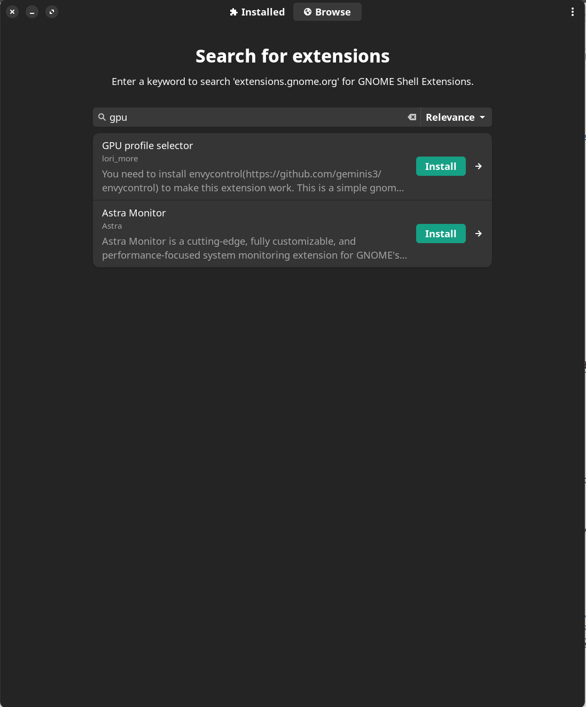
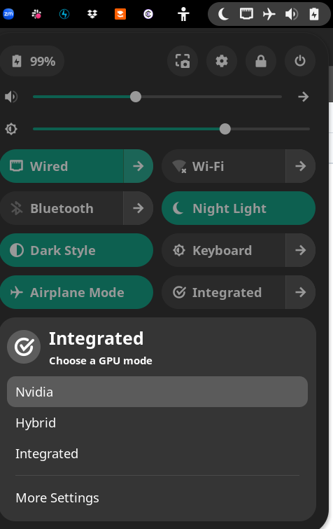
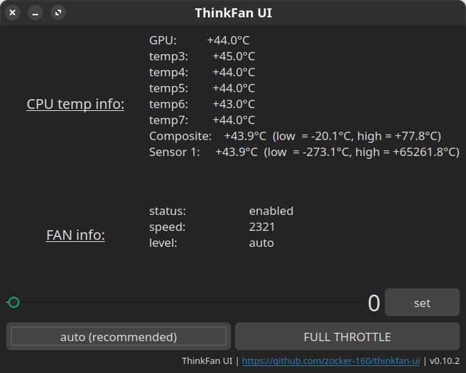
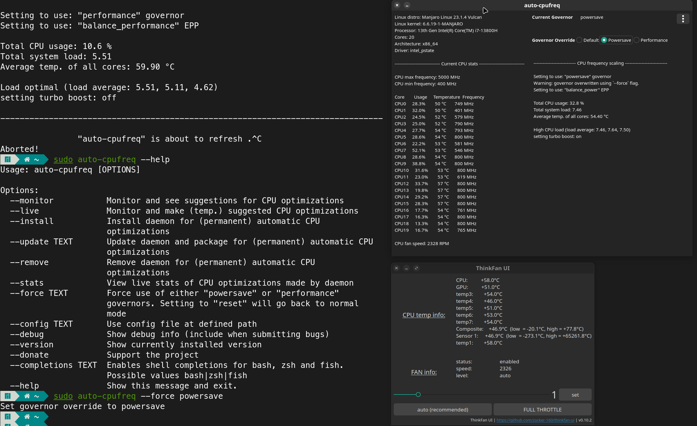
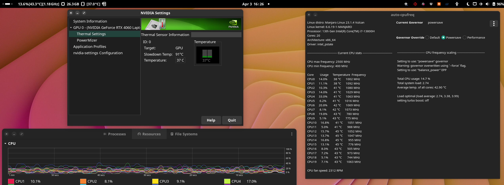
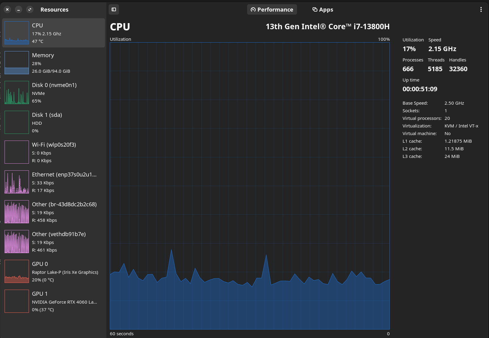
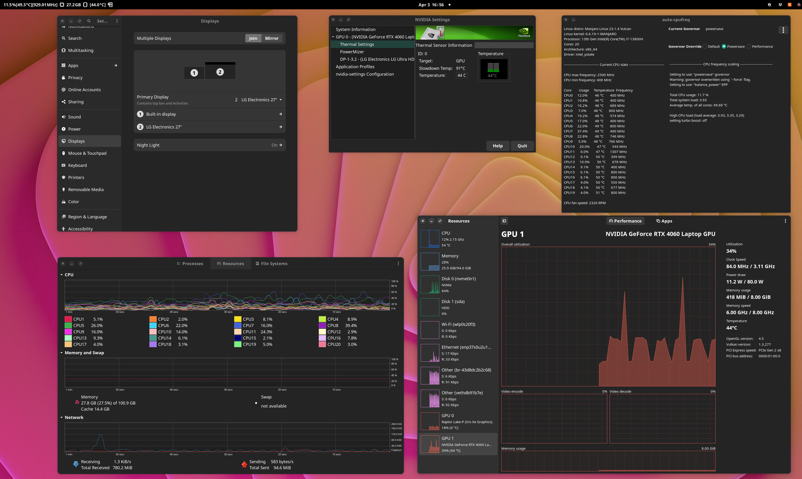
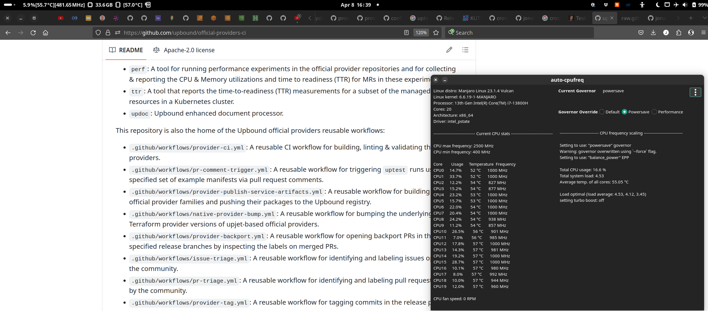

# Hardware recommendations

This section contains details on how to find a good Laptop to run Linux on. And how to configure a Thinkpad in detail:

* Finding a good laptop for Linux
* Configure NVidia graphics card (driver, external Display, power consumption)
* Getting your laptop silent & prolong battery life
  * envycontrol
  * auto-cpufreq
  * Fancontrol
  * Thinkpads: thinkfan


## Finding a good laptop for Linux

Finding a good enough laptop, that is suitable for Linux is really the hard part of the whole story! Especially, if you're coming from a Mac Book Pro. These are so incredibly good, that you need to dig deep into the hardware landscape.

I already ordered and returned the Schenker Vision Pro 16 for various reasons (see TBD). But I really like the company! They are so incredibly open to the community, just look at their Reddit subgroup. Or the sister company Tuxedo, which crafts Linux-ready Laptops based on the Schenker hardware... wow. I'm utterly impressed!

So I didn't really give up on them - and that might come to a good end: https://www.reddit.com/r/XMG_gg/comments/18wrz0c/news_xmg_roadmap_2024_new_laptops_from_xmg_and/ Because at CES a great Laptpop has been announced: the XMG Focus 15 2024. Currently unavailable, this thing is undergoing a complete makeover and I'm so exited!

News from reddit https://www.reddit.com/r/XMG_gg/comments/1ax7uty/news_xmg_roadmap_2024_xmg_neo_16_xmg_fusion_15/

Here is also some new info: https://bestware.com/en/news/xmg-fusion-15-e24-and-core-15-m24

> "XMG CORE 15 has the same connectivity options: the Thunderbolt 4 port is substituted with a USB-C 3.2 Gen2 port, which is also capable of PowerDelivery and DisplayPort, but linked to the integrated AMD graphics unit. However, the laptop also offers an additional Mini DisplayPort 1.4 with dGPU connection."

Luckily the XMG Core will have a Thunderbold port wired to the **internal GPU**, thus you can run the system fully in iGPU only mode - even if you connect external screens!


## Look for your Notebook model on the Arch forums

Since I currently run a Lenovo Thinkpad P1 Gen 6, I searched for it - and there are lots of suggestions:

https://wiki.archlinux.org/title/Lenovo_ThinkPad_P1

Especially for the graphics, there is a crucial point:

> There are two difficulties with configuring graphics on ThinkPad P1: there is no "integrated graphics only" option in the BIOS, and the external display ports (HDMI, etc.) are wired into the NVIDIA chip.

I already encountered that I can't use my HDMI or Thunderbold 4 ports for display outputs, when on integrated only mode.

Maybe we can change that using Reverse PRIME? https://wiki.archlinux.org/title/PRIME#Reverse_PRIME


## Search for experiences with your Model under Linux

https://kofler.info/erfahrungsbericht-lenovo-thinkpad-p1-unter-linux/


## Install AMD graphicscard driver

No need to do anything here, since the Mesa drivers are already installed - they are developed as OpenSource drivers by AMD and should work OOTB.


## Install NVidia driver

https://wiki.manjaro.org/index.php/Configure_Graphics_Cards

For me the command `foo` didn't work as expected:

```shell
sudo mhwd -a pci nonfree 0300
> Using config 'video-nvidia' for device: 0000:2d:00.0 (0300:10de:2504) Display controller nVidia Corporation GA106 [GeForce RTX 3060 Lite Hash Rate]
> Installing video-nvidia...
Sourcing /etc/mhwd-x86_64.conf
Has lib32 support: true
Sourcing /var/lib/mhwd/db/pci/graphic_drivers/nvidia/MHWDCONFIG
Processing classid: 0300
Sourcing /var/lib/mhwd/scripts/include/0300
Processing classid: 0302
:: Synchronizing package databases...
 core downloading...
 extra downloading...
 multilib downloading...
error: target not found: linux65-nvidia
Error: pacman failed!
Error: script failed!
```

So I used the package manager to install the matching nvidia driver for my kernel version.

List your kernel version using `mhwd-kernel -li`:

```shell
Currently running: 6.6.19-1-MANJARO (linux66)
The following kernels are installed in your system:
   * linux65
   * linux66
```

Now install the `linux66-nvidia` package using pamac. Also `nvidia-settings` comes in handy as a GUI for your Nvidia card's settings, temperature etc.


## External display support without dGPU

Check before you buy! If you can disable the dGPU for longer battery life and still be able to use external displays. 

Sadly it seems that my Thinkpad P1 has hard-wired USB-C/Thunderbold and HDMI ports to the NVIDIA dGPU :(

https://www.reddit.com/r/thinkpad/comments/yv9viy/thinkpad_p1_gen_5_with_nvidia_disabled_external


# Getting your laptop silent & prolong battery life

## Disable the NVidia dGPU for longer battery life: envycontrol

https://forum.manjaro.org/t/more-tools-for-optimus-laptops-are-now-available/148609 (https://gitlab.com/asus-linux/supergfxctl)

There are multiple options like PRIME etc. But what I heard the best about is envycontrol: https://github.com/bayasdev/envycontrol

Install envycontrol via AUR and then run:

```shell
sudo envycontrol -s integrated
```

You need to reboot afterwards.

There are a multitude of options available: https://github.com/bayasdev/envycontrol?tab=readme-ov-file#some-examples

Especially, there are options like:

* `--coolbits XY`: Coolbits support for GPU overclocking (not relevant for me :) )
* `--rtd3`: PCI-Express Runtime D3 (RTD3) Power Management support for Turing and later
* `--force-comp` (force composition pipeline): which can be used to prevent tearing on external screens https://github.com/Askannz/nvidia-force-comp-pipeline

> For more info check out the envycontrol FAQ https://github.com/bayasdev/envycontrol/wiki/Frequently-Asked-Questions

If you want to revert anything envycontrol configured, run:

```shell
sudo envycontrol --reset
```


### Switch graphics mode in settings UI: Combine envycontrol with GNOME extension

BUT the best: envycontrol works together with the GNOME profile selector https://github.com/LorenzoMorelli/GPU_profile_selector and we get a cool GUI switcher integrated into the GNOME settings bar.

For this to work, you need to install the extension (when not already selected as a optional dependency of envycontrol):

```shell
pamac install gnome-shell-extension-gpu-profile-selector
```

Finally we also need to activate the extension. According to https://itsfoss.com/gnome-shell-extensions/ there are two ways: [Use the website](https://extensions.gnome.org/extension/5009/gpu-profile-selector/) or use the GNOME Extensions Manager App (which is installed on Manjaro by default):

```shell
pamac install extension-manager
```

Now fire up the GNOME Extension Manager, search for `gpu-profile-selector` and install it:



With this your first `User-Installed Extension` should show up activated in the Extension Manager. Also bar now has the a new entry!!



There's also a great Gnome extension showing all relevant temperatures in the system's top bar: [Resource Monitor](https://extensions.gnome.org/extension/1634/resource-monitor/) https://github.com/0ry0n/Resource_Monitor Install it via Extension Manager and configure it accordingly.

### Switching to Hybrid mode with envycontrol: No Desktop after restart

I had the problem that after clicking on `Hybrid` in the `gnome-shell-extension-gpu-profile-selector` UI or running `envycontrol -s hybrid` and restarting, my system only boots and ends up with a blinking cursor. I had to `Ctrl + Alt + F2 or F3` and change the tty to have a working console again. But it seems that the XServer just crashed at boot!

I researched a bit but didn't really find a solution (only uninstalling `gnome-shell-extension-gpu-profile-selector` & `envycontrol`, which wasn't what I wanted).

But there's a simple fix: Just reset envycontrol to it's defaults and the laptop will be in `Hybrid` mode again. Therefore simply run:

```shell
sudo envycontrol --reset
```

Now restart and the laptop is in Hybrid mode :)


## Use more efficient energy profiles

If you bought one of the following laptops, you have great chances to be able to configure your fans in detail (sometimes including fan curves):

* Lenovo Legion (https://github.com/johnfanv2/LenovoLegionLinux)
* Tuxedo (NOT Schenker! These do have a different Firmware in their Embedded Controller (EC), which differentiates them from Tuxedo Laptops although hardware equivalent https://github.com/tuxedocomputers/tuxedo-control-center)
* Asus Notebook (https://asus-linux.org/)
* Slimbook (https://github.com/Slimbook-Team/slimbookbattery & https://github.com/Slimbook-Team/slimbookintelcontroller)

The cool thing about the latter is, that you can use both fully on other Laptops. Like for me I didn't found anything like these tools for Lenovo Thinkpads (only Vantage for Windows), although [they are fully certified for Linux since 2020](https://news.lenovo.com/pressroom/press-releases/lenovo-brings-linux-certification-to-thinkpad-and-thinkstation-workstation-portfolio-easing-deployment-for-developers-data-scientists/).

But there are also tools that are vendor agnostic:

* TLP https://github.com/linrunner/TLP - uses `powertop --autotune` for example, see https://linrunner.de/tlp/introduction.html
* https://itsfoss.com/cpufreq-ubuntu/
* https://github.com/konkor/cpufreq


## First things first: monitor your CPU temps & fan speed levels with thinkfan-ui

The UI tool https://github.com/zocker-160/thinkfan-ui (not dependant nor related to the thinkfan package!) makes monitoring CPU temps and fan speed levels a breeze:



```shell
pamac install thinkfan-ui
```

Also you can override the fan speed levels yourself and get your machine silent for some time (but be aware, that it might overheat without further tooling and configuration!)-


## TBD: Power PRofiles Daemon

https://www.notebookcheck.com/Ubuntu-24-04-LTS-soll-die-Energie-Effizienz-der-Linux-Distribution-auf-Laptops-verbessern.824159.0.html

https://gitlab.freedesktop.org/upower/power-profiles-daemon


## Getting your laptop silent: auto-cpufreq

In some deep subreddit thread I found: https://github.com/AdnanHodzic/auto-cpufreq

Which might be the tool I was searching for! It even hit 2.x not long ago: https://foolcontrol.org/?p=4603 and now features a GUI too. (there's also an intro post to the original tool release on 2020: https://foolcontrol.org/?p=3124)

There's also a great introductory video on Youtube by the creator: https://youtu.be/SPGpkZ0AZVU?feature=shared

> One of the problems with Linux today on laptops is that the CPU will run in an unoptimized manner which will negatively impact battery life. For example, the CPU may run using the "performance" governor with turbo boost enabled regardless of whether it's plugged into a power outlet or not.


### Install auto-cpufreq

Install via

```shell
sudo pamac install auto-cpufreq
```

As stated in the docs https://github.com/AdnanHodzic/auto-cpufreq?tab=readme-ov-file#aur-package-archmanjaro-linux we should also disable the Gnome Power Profiles daemon: 

> The GNOME Power Profiles daemon is automatically disabled by auto-cpufreq-installer due to it's conflict with auto-cpufreq.service. However, this doesn't happen with AUR installs, which can lead to problems (e.g., #463) if not masked manually. 

So we should mask the `power-profiles-daemon` via:

```shell
sudo systemctl mask power-profiles-daemon.service
```


Testdrive it via `sudo auto-cpufreq --monitor`

```shell
$ sudo auto-cpufreq --monitor

Note: You can quit monitor mode by pressing "ctrl+c"

-------------------------------------------------------------------------------

Linux distro: Manjaro Linux 23.1.4 Vulcan
Linux kernel: 6.6.19-1-MANJARO
Processor: 13th Gen Intel(R) Core(TM) i7-13800H
Cores: 20
Architecture: x86_64
Driver: intel_pstate

------------------------------ Current CPU stats ------------------------------

CPU max frequency: 5000 MHz
CPU min frequency: 400 MHz

Core	Usage	Temperature	Frequency
CPU0      9.9%        58 °C      4911 MHz
CPU1     13.0%        58 °C      4616 MHz
CPU2      8.1%        59 °C      2452 MHz
CPU3      0.0%        59 °C      3478 MHz
CPU4      4.0%        58 °C      3908 MHz
CPU5      3.0%        58 °C      1440 MHz
CPU6      6.9%        62 °C      3395 MHz
CPU7      3.0%        62 °C      3739 MHz
CPU8      5.0%        60 °C      3213 MHz
CPU9      1.0%        60 °C       400 MHz
CPU10      3.0%        58 °C       587 MHz
CPU11      3.0%        58 °C      2576 MHz
CPU12      5.0%        62 °C      3393 MHz
CPU13      3.9%        62 °C      2461 MHz
CPU14      3.0%        62 °C      3602 MHz
CPU15      2.0%        62 °C      3668 MHz
CPU16      2.0%        59 °C      3673 MHz
CPU17      1.0%        59 °C       400 MHz
CPU18      1.0%        59 °C      2800 MHz
CPU19      2.0%        59 °C      1402 MHz

CPU fan speed: 2335 RPM

---------------------------- CPU frequency scaling ----------------------------

Battery is: charging

Currently using: performance governor
Suggesting use of "performance" governor

Total CPU usage: 2.3 %
Total system load: 2.40
Average temp. of all cores: 59.70 °C 

Load optimal (load average: 2.40, 2.62, 2.90)
suggesting to set turbo boost: on
Currently turbo boost is: on

-------------------------------------------------------------------------------
```

If you already installed `slimbookbattery`, you will be warned that TLP https://github.com/linrunner/TLP. You can remove both via `sudo pamac remove --orphans slimbookbattery`

```shell
...
----------------------------------- Warning -----------------------------------

Detected you are running a TLP service!
This daemon might interfere with auto-cpufreq which can lead to unexpected results.
We strongly encourage you to remove TLP unless you really know what you are doing.

-------------------------------------------------------------------------------
...

$ sudo pamac remove --orphans slimbookbattery
```

`--orphans` should also delete `tlp` and `tlp-rdw`, which is installed by slimbookbattery.


We should also enable the daemon for autostart:

```shell
Important notice: the daemon installer provided does not work, instead run the following command:

systemctl enable --now auto-cpufreq

To view live log, run:

auto-cpufreq --stats
```


### Use auto-cpufreq UI & `--force powersave` for silence

There's also a new UI in 2.x. Find it in the Gnome activities menu:


Now starting it, you have some options - but the UI is mostly useful to monitor the temps & clock speeds of your CPU(s).

There is a button to do a CPU `Governor Override`, but this did not work on my Thinkpad P1 Gen 6. Because I wanted my laptop to be silent also when the powercord was plugged in. But there's a solution: run `sudo auto-cpufreq --force powersave` on the command line:

```shell
sudo auto-cpufreq --force powersave
Set governor override to powersave
```

Now my laptop seems to be finally silent (running in the lowest RPM level 1 according to thinkfan UI):




### Using Hybrid Mode instead of Integrated Graphics only

I like to tinker and play with the tools once I got to know them, so I wanted to test, what the Thinkpad would do, if I switched to the `Hybrid` mode in envycontrol (on my machine, only this option doesn't work through the Gnome UI extension or even using `envycontrol -s hybrid. But what works for me is to simply reset envycontrol, which also means Hybrid via `envycontrol --reset`).

What happend now really amazed me!! After restarting my Thinkpad, fans got a little louder and I opted for `sudo auto-cpufreq --force powersave` for auto-cpufreq. AND THIS was the GAMECHANGER: The system went 10 degrees DOWN! From average around 52 Celsius to 42! WITH the Nvidia card prepared to step in. Also the Nvidia Card itself got much cooler, only 37 Celsius instead of 40something with `Integrated`!

> fans also STOPPED from time to time now!



The temporarily installed mission-center shows (you have to be careful, since it has a relatively high CPU load itself and thus changes the gauged temps!), that the integrated graphics are used in Hybrid mode with powersave Governor:




### Using external Screens with auto-cpufreq powersave & NVidia is even possible in fan level 1!

After also pluggin in my external screen (which is hard-wired to the discrete NVidia graphics card), I get a silent setup running smootly under 50 Celcius and thus in fan level 1! 



This means an external monitor (or presentation beamer) only uses 6-7 Celcius more of our thermal budget - which is now not a problem anymore, since we're starting from 42 Celsius!

I'm really satisfied now finally. This was what I was searching for! Support for external screens without a much to loudly fan!


## Getting your laptop silent No.2: Fancontrol

There are a multitude of options to change your fan control speeds, if your laptop goes crazy: https://wiki.archlinux.org/title/fan_speed_control

https://www.baeldung.com/linux/control-fan-speed

https://www.libe.net/lueftersteuerung-debian


Install lm_sensors

```shell
sudo pamac install lm_sensors
```

See https://wiki.ubuntuusers.de/Lm_sensors/

Show your Systems fan and thermal configuration via `sensors` command:

```shell
$ sensors

ucsi_source_psy_USBC000:002-isa-0000
Adapter: ISA adapter
in0:           0.00 V  (min =  +0.00 V, max =  +0.00 V)
curr1:         0.00 A  (max =  +0.00 A)

coretemp-isa-0000
Adapter: ISA adapter
Package id 0:  +61.0°C  (high = +100.0°C, crit = +100.0°C)
Core 0:        +50.0°C  (high = +100.0°C, crit = +100.0°C)
Core 4:        +52.0°C  (high = +100.0°C, crit = +100.0°C)
Core 8:        +53.0°C  (high = +100.0°C, crit = +100.0°C)
Core 12:       +53.0°C  (high = +100.0°C, crit = +100.0°C)
Core 16:       +53.0°C  (high = +100.0°C, crit = +100.0°C)
Core 20:       +53.0°C  (high = +100.0°C, crit = +100.0°C)
Core 24:       +55.0°C  (high = +100.0°C, crit = +100.0°C)
Core 25:       +55.0°C  (high = +100.0°C, crit = +100.0°C)
Core 26:       +55.0°C  (high = +100.0°C, crit = +100.0°C)
Core 27:       +55.0°C  (high = +100.0°C, crit = +100.0°C)
Core 28:       +54.0°C  (high = +100.0°C, crit = +100.0°C)
Core 29:       +54.0°C  (high = +100.0°C, crit = +100.0°C)
Core 30:       +54.0°C  (high = +100.0°C, crit = +100.0°C)
Core 31:       +54.0°C  (high = +100.0°C, crit = +100.0°C)

thinkpad-isa-0000
Adapter: ISA adapter
fan1:        2329 RPM
fan2:        2036 RPM
CPU:          +56.0°C  
GPU:          +49.0°C  
temp3:        +52.0°C  
temp4:        +40.0°C  
temp5:        +49.0°C  
temp6:        +49.0°C  
temp7:        +50.0°C  
temp8:            N/A  

BAT0-acpi-0
Adapter: ACPI interface
in0:          17.52 V  

ucsi_source_psy_USBC000:001-isa-0000
Adapter: ISA adapter
in0:           0.00 V  (min =  +0.00 V, max =  +0.00 V)
curr1:         3.00 A  (max =  +0.00 A)

iwlwifi_1-virtual-0
Adapter: Virtual device
temp1:            N/A  

nvme-pci-0600
Adapter: PCI adapter
Composite:    +41.9°C  (low  = -20.1°C, high = +77.8°C)
                       (crit = +81.8°C)
Sensor 1:     +41.9°C  (low  = -273.1°C, high = +65261.8°C)

acpitz-acpi-0
Adapter: ACPI interface
temp1:        +56.0°C  
```


### Thinkpads: thinkfan

https://wiki.archlinux.org/title/fan_speed_control#ThinkPad_laptops

There is a special tool for Thinkpads: https://github.com/vmatare/thinkfan 

https://blog.monosoul.dev/2021/10/17/how-to-control-thinkpad-p14s-fan-speed-in-linux/

Thinkpad related: https://github.com/vmatare/thinkfan/issues/58

Note that the thinkfan package installs /usr/lib/modprobe.d/thinkpad_acpi.conf, which contains the following kernel module parameter (so fan control is enabled by default):

```shell
options thinkpad_acpi fan_control=1
```

Install thinkfan:

```shell
# Install thinkfan
pamac install thinkfan 

# Now, load the module
modprobe thinkpad_acpi

# Show config
cat /proc/acpi/ibm/fan
status:		enabled
speed:		2341
level:		auto
commands:	level <level> (<level> is 0-7, auto, disengaged, full-speed)
commands:	enable, disable
commands:	watchdog <timeout> (<timeout> is 0 (off), 1-120 (seconds))
```


#### Temperatur sensors

In order to configure thinkfan, use this file as the starting point: `/usr/share/doc/thinkfan/examples/thinkfan.yaml`

> To configure the temperature thresholds, you will need to copy the example configuration file (/usr/share/doc/thinkfan/examples/thinkfan.yaml) to /etc/thinkfan.conf, and modify to taste. **This file specifies which sensors to read, and which interface to use to control the fan.**

I found this gist of great help: 

* https://gist.github.com/abn/de81ba413f860b00c2db3ee4aa83e035 
* https://github.com/vmatare/thinkfan/discussions/153

To specify your system's sensors for thinkfan, run `find /sys/devices -type f -name 'temp*_input'`.

On my Thinkpad P1 Gen 6 I have the following sensors:

```shell
$ find /sys/devices -type f -name 'temp*_input'
/sys/devices/platform/thinkpad_hwmon/hwmon/hwmon6/temp6_input
/sys/devices/platform/thinkpad_hwmon/hwmon/hwmon6/temp3_input
/sys/devices/platform/thinkpad_hwmon/hwmon/hwmon6/temp7_input
/sys/devices/platform/thinkpad_hwmon/hwmon/hwmon6/temp4_input
/sys/devices/platform/thinkpad_hwmon/hwmon/hwmon6/temp8_input
/sys/devices/platform/thinkpad_hwmon/hwmon/hwmon6/temp1_input
/sys/devices/platform/thinkpad_hwmon/hwmon/hwmon6/temp5_input
/sys/devices/platform/thinkpad_hwmon/hwmon/hwmon6/temp2_input
/sys/devices/platform/coretemp.0/hwmon/hwmon4/temp26_input
/sys/devices/platform/coretemp.0/hwmon/hwmon4/temp6_input
/sys/devices/platform/coretemp.0/hwmon/hwmon4/temp33_input
/sys/devices/platform/coretemp.0/hwmon/hwmon4/temp27_input
/sys/devices/platform/coretemp.0/hwmon/hwmon4/temp10_input
/sys/devices/platform/coretemp.0/hwmon/hwmon4/temp30_input
/sys/devices/platform/coretemp.0/hwmon/hwmon4/temp14_input
/sys/devices/platform/coretemp.0/hwmon/hwmon4/temp18_input
/sys/devices/platform/coretemp.0/hwmon/hwmon4/temp28_input
/sys/devices/platform/coretemp.0/hwmon/hwmon4/temp31_input
/sys/devices/platform/coretemp.0/hwmon/hwmon4/temp1_input
/sys/devices/platform/coretemp.0/hwmon/hwmon4/temp29_input
/sys/devices/platform/coretemp.0/hwmon/hwmon4/temp22_input
/sys/devices/platform/coretemp.0/hwmon/hwmon4/temp32_input
/sys/devices/platform/coretemp.0/hwmon/hwmon4/temp2_input
/sys/devices/pci0000:00/0000:00:06.0/0000:06:00.0/nvme/nvme0/hwmon3/temp1_input
/sys/devices/pci0000:00/0000:00:06.0/0000:06:00.0/nvme/nvme0/hwmon3/temp2_input
/sys/devices/virtual/thermal/thermal_zone0/hwmon1/temp1_input
/sys/devices/virtual/thermal/thermal_zone9/hwmon5/temp1_input
```

> Be aware that the path `/sys/devices/platform/thinkpad_hwmon/hwmon/hwmon6/` will change - only it's last number, but that will be enough to currupt your thinkfan configuration!

Therefore to prepare the sensors for our `thinkfan.conf`, we should use the `Base path with name-based search` configuration method - which should work with all hwmon drivers and is robust against driver load order!

With this configuration method `thinkfan` will search for the sensors itself. Be sure to only use `coretemp` instead of `coretemp.0` or `thinkpad` instead of `thinkpad_hwmon` for example. Otherwise you will end up with error like `Could not find a hwmon with this name`!

```shell
sensors:
  # CPU Cores
  - hwmon: /sys/devices/platform
    name: coretemp # use coretemp instead of actual coretemp.0, which will lead to error: Could not find a hwmon with this name
    indices: [1, 2, 6, 10, 14, 18, 22, 26, 27, 28, 29, 30, 31, 32, 33]

  # Chassis
  - hwmon: /sys/devices/platform
    name: thinkpad # use thinkpad instead of actual thinkpad_hwmon, which will lead to error: Could not find a hwmon with this name
    indices: [1, 3, 4, 6, 7] # leave out 2, 5 & 8, since this sensor is always broken and gives: Failed to read temperature(s) from /sys/devices/platform/thinkpad_hwmon/hwmon/hwmon5/temp8_input: No such device or address

  # The SSDs have a stable path with their pci address
  # SSD
  - hwmon: /sys/devices/pci0000:00/0000:00:06.0/0000:06:00.0/nvme/nvme0/hwmon3/temp1_input
  - hwmon: /sys/devices/pci0000:00/0000:00:06.0/0000:06:00.0/nvme/nvme0/hwmon3/temp2_input
...
```

As you see my SSD also supports using the direct pci address - so we can simply use that!

I left out all the `/sys/devices/virtual/thermal/thermal_zone0/hwmon1/` lines - they gave an error like `ERROR: /sys/devices/virtual/thermal/thermal_zone9/hwmon5/temp1_input: No such file or directory`.

> Avoid using nvml option (temperatures read from proprietary nVidia GPU driver). Using nvml prevents the GPU from switching to suspend power state, causing battery drain and high temperatures. (see https://blog.monosoul.dev/2021/10/17/how-to-control-thinkpad-p14s-fan-speed-in-linux/)

For me, these are 10 sensors. If you want to use the advanced fan configuration, you need to keep that in mind for the last configuration step.


#### Simple fans & levels configuration

If you can live with the 0-7 levels the Thinkpad offers, you can use this method. My `fans:` & `levels:` sections look like this:

```shell
fans:
  - tpacpi: /proc/acpi/ibm/fan

levels:
  - [0, 0, 75]
  - [1, 74, 80]
  - [2, 79, 87]
  - [3, 86, 90]
  - [7, 89, 255]
```

This is my current configuration for Spring and not so hot temperatures - it works well right now, __with the Thinkpad hovering around 62°C__ with lot's of apps open / Firefox with 200 tabs / kind cluster etc. And only in combination with the `auto-cpufreq` powersave Governor, NO external screen and envycontrol Hybrid mode! Might change in summer though :)

For the best CPU temp levels, see https://www.avast.com/c-how-to-check-cpu-temperature & `What CPU temperature is normal?` paragraph

> __Generally, anything between 40–65°C (or 104–149°F) is considered a safe heat range for a normal workload.__ While running more intensive apps or games, the normal CPU temp range can increase to between 70–80°C (158–176°F). The rule of thumb is, a bad CPU temp is 80-85°C (176–185°F) or above. There could be a serious problem if you’re reaching this temperature without gaming or running any resource-intensive programs.


This repo has also my fully working [`thinkfan.yaml`](thinkfan.yaml) ready, if you're interested.


#### Testdrive thinkfan 

Copy the configuration you just crafted to:

```shell
sudo cp ~/thinkfan.yaml /etc/thinkfan.yaml
```

And testdrive thinkfan:

```shell
sudo thinkfan -n
```

If you get an error like this, remove the sensor from your `thinkfan.conf` (e.g. the indices section) and start again (you also need to adjust your sensor counts):

```shell
sudo thinkfan -n 
ERROR: Lost sensor read_temps_: Failed to read temperature(s) from /sys/devices/platform/thinkpad_hwmon/hwmon/hwmon6/temp8_input: No such device or address
```

If everything runs fine, you can watch thinkfan at work:


> Alternatively we can also configure multiple fans in thinkfan: https://github.com/vmatare/thinkfan/discussions/153


#### Start thinkfan on boot

If you're satisfied with your thinkfan configuration, you can enable the thinkfan service to be there right after restarts:

```shell
# without the -n thinkfan will start as a daemon
sudo thinkfan

# enable the thinkfan service
sudo systemctl enable thinkfan.service
```

Now thinkfan should work all the time as we configured it!


Look at the service status from time to time:

```shell
$ sudo systemctl status thinkfan.service
Place your right index finger on the fingerprint reader
× thinkfan.service - simple and lightweight fan control program
     Loaded: loaded (/usr/lib/systemd/system/thinkfan.service; enabled; preset: disabled)
    Drop-In: /etc/systemd/system/thinkfan.service.d
             └─override.conf
     Active: failed (Result: exit-code) since Fri 2024-04-05 10:26:11 CEST; 36s ago
   Duration: 27.015s
    Process: 996 ExecStart=/usr/bin/thinkfan $THINKFAN_ARGS (code=exited, status=0/SUCCESS)
   Main PID: 1035 (code=exited, status=1/FAILURE)
        CPU: 45ms

Apr 05 10:25:44 pikepad systemd[1]: Starting simple and lightweight fan control program...
Apr 05 10:25:44 pikepad thinkfan[996]: Daemon PID: 1035
Apr 05 10:25:44 pikepad thinkfan[1035]: Temperatures(bias): 71(0), 62(0), 66(0), 71(0), 62(0), 67(0), 67(0), 67(0), 67(0), 65(0), 65(0), 65(0), 65(0), 65(0), 60(0), 64(0), 56(0), 57(0), 43(0), 56(0), 53(0), 54(0), 43(0), 43(0) -> >
Apr 05 10:25:44 pikepad systemd[1]: Started simple and lightweight fan control program.
Apr 05 10:26:11 pikepad thinkfan[1035]: ERROR: Lost sensor read_temps_: Failed to read temperature(s) from /sys/devices/platform/thinkpad_hwmon/hwmon/hwmon6/temp2_input: No such device or address
Apr 05 10:26:11 pikepad systemd[1]: thinkfan.service: Main process exited, code=exited, status=1/FAILURE
Apr 05 10:26:11 pikepad systemd[1]: thinkfan.service: Failed with result 'exit-code'.
```

Maybe there is a sensor not readable and you need to revamp your `thinkfan.yaml`. Then restart the service:

```shell
sudo cp ~/thinkfan.yaml /etc/thinkfan.yaml
sudo systemctl start thinkfan.service 
```

Now the thinkfan service should work like a charme:

```shell
● thinkfan.service - simple and lightweight fan control program
     Loaded: loaded (/usr/lib/systemd/system/thinkfan.service; enabled; preset: disabled)
    Drop-In: /etc/systemd/system/thinkfan.service.d
             └─override.conf
     Active: active (running) since Fri 2024-04-05 11:08:36 CEST; 50s ago
    Process: 1138 ExecStart=/usr/bin/thinkfan $THINKFAN_ARGS (code=exited, status=0/SUCCESS)
   Main PID: 1149 (thinkfan)
      Tasks: 1 (limit: 115413)
     Memory: 1.7M (peak: 4.1M)
        CPU: 48ms
     CGroup: /system.slice/thinkfan.service
             └─1149 /usr/bin/thinkfan -b0

Apr 05 11:08:36 pikepad systemd[1]: Starting simple and lightweight fan control program...
Apr 05 11:08:36 pikepad thinkfan[1138]: Daemon PID: 1149
Apr 05 11:08:36 pikepad systemd[1]: Started simple and lightweight fan control program.
Apr 05 11:08:36 pikepad thinkfan[1149]: Temperatures(bias): 66(0), 73(0), 61(0), 73(0), 59(0), 63(0), 63(0), 63(0), 63(0), 62(0), 61(0), 61(0), 61(0), 61(0), 63(0), 59(0), 54(0), 50(0), 51(0), 53(0), 48(0), 48(0) -> Fans: level 0
```

And stay at `level 0` for most of the time (which was my goal in the first place)!


#### Advanced fans configuration

> You don't necessarily need this paragraph - only if you want to configure thinkfan even more finegrained

My problem was, that the often mentioned `- tpacpi: /proc/acpi/ibm/fan` doesn't work for the more advanced configuration, where we want to change the fan speed from `0 - 255`:

```shell
sudo thinkfan -n
ERROR: /etc/thinkfan.conf:
Your highest fan level is 255, but fan levels greater than 7 are not supported by thinkpad_acpi
```

But there's help. First let's see an overview of our laptop's PWM sensors via `pwmconfig list`:

```shell
$ sudo pwmconfig list

# pwmconfig version 3.6.0+git
This program will search your sensors for pulse width modulation (pwm)
controls, and test each one to see if it controls a fan on
your motherboard. Note that many motherboards do not have pwm
circuitry installed, even if your sensor chip supports pwm.

We will attempt to briefly stop each fan using the pwm controls.
The program will attempt to restore each fan to full speed
after testing. However, it is ** very important ** that you
physically verify that the fans have been to full speed
after the program has completed.

Found the following devices:
   hwmon0 is AC
   hwmon1 is acpitz
   hwmon2 is BAT0
   hwmon3 is nvme
   hwmon4 is iwlwifi_1
   hwmon5 is coretemp
   hwmon6 is thinkpad
   hwmon7 is ucsi_source_psy_USBC000:001
   hwmon8 is ucsi_source_psy_USBC000:002

Found the following PWM controls:
   hwmon6/pwm1           current value: 255
hwmon6/pwm1 is currently setup for automatic speed control.
```

The crucial lines here are: `Found the following PWM controls: hwmon6/pwm1           current value: 255`. From this we can derive the full path to the `pwm1` file needed: `/sys/class/hwmon/hwmon6/pwm1`.

Now we need to configure this PWM device as the `fans` section in `thinkfan.conf`:

```yaml
fans:
  # hwmon: Full path to a PWM file
  # ==============================
  # Also subject to the potential problem with driver load order (see above)
   - hwmon: /sys/class/hwmon/hwmon6/pwm1
```

Remember that we have 10 sensors? Well we therefore need 10 temperature entries (altough we only want to configure the speed levels more granularly):

```yaml
levels:
  - speed: 0
    upper_limit: [50, 50, 50, 50, 50, 50, 50, 50, 50, 50]

  - speed: 30
    lower_limit: [50, 50, 50, 50, 50, 50, 50, 50, 50, 50]
    upper_limit: [56, 56, 56, 56, 56, 56, 56, 56, 56, 56]

  - speed: 70
    lower_limit: [56, 56, 56, 56, 56, 56, 56, 56, 56, 56]
    upper_limit: [65, 65, 65, 65, 65, 65, 65, 65, 65, 65]

  - speed: 160
    lower_limit: [65, 65, 65, 65, 65, 65, 65, 65, 65, 65]
    upper_limit: [75, 75, 75, 75, 75, 75, 75, 75, 75, 75]

  - speed: 255
    lower_limit: [75, 75, 75, 75, 75, 75, 75, 75, 75, 75]
```

But sadly on my Thinkpad P1 Gen 6 I could change the lowest fan speed RPM to around 1000 - which would have been pretty nice!

Maybe these guys have something for me: https://github.com/vmatare/thinkfan/issues/58 - time will tell :D


## Getting your laptop silent No.3: Combining Hybrid Mode, auto-cpufreq & Fancontrol with thinkfan service for ultimate silence

After some more testing I observed that I maybe was wrong in analysing modern thermal throttling and energy saving tactics of CPUs.

I thought that eliminating the graphics card, must lead to a colder laptop: I was wrong! Hybrid mode is much cooler (see above)

The temperatures are really low right now in completely fanless setup - around 55 Degrees:



> 55 Degrees seems to be related no non-battery-charging situations, whereas the 62 Degress occur, when the battery is charging.


## Schenker Vision Pro 16: loudly fans

https://www.reddit.com/r/XMG_gg/comments/18h093b/schenker_vision_pro_16_m23_fan_noise/

There's control center under Windows, that writes fan configuration to the EC-Firmware ([Embedded Controller Firmware](https://de.wikipedia.org/wiki/Embedded_Controller)):

https://www.reddit.com/r/XMG_gg/comments/qqej19/neo_15_keine_automatische_l%C3%BCftersteuerung_hilfe/

There you can configure the fan profiles.

BIOS Updates Schenker Vision Pro: https://download.schenker-tech.de/package/schenker-vision-14-16-16-pro-m23-svs14m23-svs16m23-svs16pm23/

This seems to be the exact difference to the TUXEDO computers - see https://www.sagrland.de/2021/08/21/schenker-vision-14-tuxedo-infinitybook-pro-14-gen6-erster-eindruck/

### Is the CPU the problem

Graphical UIs for CPU temperature monitoring are hard to find for Linux interestingly. I used the old psensor, installed via `pamac install psensor`:

https://www.tecmint.com/psensor-monitors-hardware-temperature-in-linux/


### Is the NVIDIA card a problem?

Here's a thread where Schenker/XMG states, that if the laptop only runs for 2,5 hours on battery and is the Nvidia card is on all the time.

https://www.computerbase.de/forum/threads/sammelthread-schenker-vision-16-pro-und-vision-16-die-weltweit-leichtesten-16-zoll-ultrabooks-in-ihrer-leistungsklasse.2110044/page-2

There's also a paragraph & GUIDE in the official FAQ:

https://www.xmg.gg/faq/troubleshooting/#power-consumption-guide

So we should maybe try to deactivate the Nvidia card?

https://www.baeldung.com/linux/nvidia-gpu-enable-disable & https://unix.stackexchange.com/questions/654075/how-can-i-disable-and-later-re-enable-one-of-my-nvidia-gpus

Show your available graphic cards via `lspci -k | grep -A 2 -E '(3D|VGA)'`:

```shell
$ lspci -k | grep -A 2 -E '(3D|VGA)'

00:02.0 VGA compatible controller: Intel Corporation Raptor Lake-P [Iris Xe Graphics] (rev 04)
	DeviceName: Onboard - Video
	Subsystem: Tongfang Hongkong Limited Raptor Lake-P [Iris Xe Graphics]
--
01:00.0 VGA compatible controller: NVIDIA Corporation AD107M [GeForce RTX 4060 Max-Q / Mobile] (rev a1)
	Subsystem: Tongfang Hongkong Limited AD107M [GeForce RTX 4060 Max-Q / Mobile]
	Kernel driver in use: nvidia
```

Now disable the NVidia card on the second slot:

```shell
$ sudo nvidia-smi --id 0000:01:00.0 --persistence-mode 0
$ sudo nvidia-smi drain --pciid 0000:01:00.0 --modify 1
``

Activate it again:

```shell
$ sudo nvidia-smi drain --pciid 0000:01:00.0 --modify 0
```


### Difference Schenker TUXEDO

https://www.computerbase.de/forum/threads/sammelthread-schenker-vision-16-pro-und-vision-16-die-weltweit-leichtesten-16-zoll-ultrabooks-in-ihrer-leistungsklasse.2110044/post-28242726


## hardware relevant links

https://www.gamestar.de/artikel/braucht-es-ueberhaupt-noch-windows-ein-linux-selbstversuch,3412657.html

https://www.youtube.com/watch?v=R2FPLuYB1o4


# Strange problems and solutions

## Thunderbold Dock incl. USB-C Power Delivery stopped working

On July 29 2024 my Thinkpad suddenly lost connection to my Thunderbold Dock. I double checked with my USB-C charger - and it also didn't work. I started to google and found https://github.com/pop-os/pop/issues/2525 and https://bbs.archlinux.org/viewtopic.php?pid=2186894#p2186894

I really wondered, if in 2024 there are really hardware reset holes in laptop cases... But yeah, there are. And THEY WORK! Here's [a video explanation](https://www.youtube.com/watch?v=AxUI5WKDr7s). After using a paper clip and pressing it into the bottom of my laptop for 10 secs, Thunderbold started to work again :)


