# mac-to-linux
Experimenting with leaving my Mac in favour of a Linux machine


# Why going from Mac to Linux?

After many years (nearly 9) of using a MacBook and fancy Apple stuff I found myself in thinking about leaving the golden cage.

I already dropped my iPhone in favour of an Android phone (currently Samsung Galaxy S23, mainly because of the great camera, the small form factor and the long update period) - and I don't really use iPhoto and others anymore. Also tethering doesn't work between an Android phone and a Mac (really! in 2023). 

Since I had a hard accident this year with a long recovery period I started to build a gaming PC just for fun - after maybe 10 years! At first I thought it was because I really wanted to play the new Diablo version (I loved the old v2 back when I was a teenager), but I experienced the fun building your own rig the way YOU want it. From the parts YOU choose from the MARKET or used market prices (and NOT from Apple prices).

And I remembered my old values of free standards, free software, free choice... wow - why did I opt for Apple devices in the first place?

So as time went by the thought of switching my main machine from Mac to a Linux box got bigger and bigger. Finally I cought myself in reading through laptop tests at https://www.notebookcheck.com :)


## Choosing a distro: Why not going rolling release & AUR?

That one is hard. Because if you ask, everybody yells at you :D 

So beeing a software architect I know the only way to get around the discussions is to define your requirements.

I tried to come up with some:

* Rolling releases: I hate big releases! So I don't want to reinstall my system every year like most of the people are used to from MacOS, Ubuntu, Fedora etc. I want a rolling release distro.

There are some popular options with rolling releases like https://distrowatch.com/table.php?distribution=endeavour

`tbd: more info on distro choosing`

Finally I opted for Manjaro Linux https://manjaro.org/, which is based on Arch Linux.


# Manjaro Wiki main page

https://wiki.manjaro.org/index.php?title=Main_Page


# Install Manjaro Linux

Mostly nowadays that should be the UEFI guide that's interesting for you https://wiki.manjaro.org/index.php/UEFI_-_Install_Guide

Download the matching ISO here https://manjaro.org/download/

Format the `.iso` file into a USB stick. If you're on a Mac e.g. use https://etcher.balena.io.

If you already have a Linux with Gnome running, you can use the `Disks` utility: Start `Disks`, select your USB stick, click on the two gears icons and select `Restore Partition Image`. Now find your downloaded e.g. `manjaro-gnome-23.1.3-240113-linux66.iso` from your file system and hit `Restore Image`:

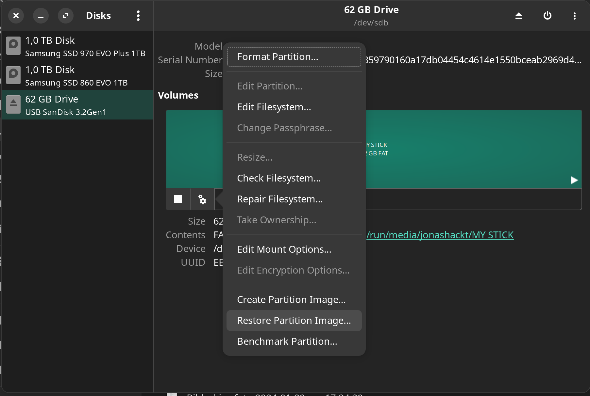


## Prepare your UEFI for Manjaro installation

Disable Secure Boot in your UEFI setup. If you have concerns, see this thread and especially this answer: https://forum.manjaro.org/t/is-it-possible-to-enable-secure-boot/16156/12

> Since everything is installed by a package manager from a trusted source (packages are signed and have checksums like secure boot does), malicious code is not a problem, but Windows has potentially such a problem. The drivers are not builtin the kernel, but have to be installed from other sources etc etc… **I don’t see a real benefit from using secure boot on a linux system**, but more or less having a good feeling to be secure from users point of view.

Although [you could implement Secure Boot with Linux](https://wiki.archlinux.org/title/Unified_Extensible_Firmware_Interface/Secure_Boot), it isn't 


## HDD Encryption

If you're working for a company chances are that you have will have to use encryption with your harddrive.

You can either use a self-encrypting SSD or encryt the whole file system (or folders). The Arch docs have direct us into the first solution if possible, since the latter can become quite complex (although supported by Manjaro installer).

https://wiki.archlinux.org/title/Data-at-rest_encryption

> A very strong disk encryption setup (e.g. full system encryption with authenticity checking and no plaintext boot partition) is required to stand a chance against professional attackers who are able to tamper with your system before you use it. [...] The best remedy might be [hardware-based full-disk encryption](https://wiki.archlinux.org/title/Self-encrypting_drives) and Trusted Computing. (aka Self-encrypting SSDs) 


### Self-encrypting SSD (TCG OPAL 2) support (incl. Hardware acceleration)

https://wiki.archlinux.org/title/Self-encrypting_drives


As I also read about security concerns about TPMs and 


### Encryt whole file system with LUKS

https://wiki.archlinux.org/title/Dm-crypt/Encrypting_an_entire_system

https://wiki.archlinux.org/title/Data-at-rest_encryption

Manjaro supports full disk encryption right from the OS setup based on LUKS (the defacto Linux standard for hdd encryption). The [best way seems to be a fresh install with HDD encryption](https://forum.manjaro.org/t/disk-encryption/139464/2), since many parts need to be altered. Here's also a good discussion about it:

https://forum.manjaro.org/t/manjaro-with-full-disk-encryption-how-fast-how-stable/136855/17

verdict:
* Use Manjaro over Arch (since the installer has the encryption process baked in)
* Use a SSD with Manjaro/Arch to have nearly no performance issues due to encryption
* 

In the Manjaro installer, the LUKS encryption is easily setup. Simply check `Encrypt system` and set a password:

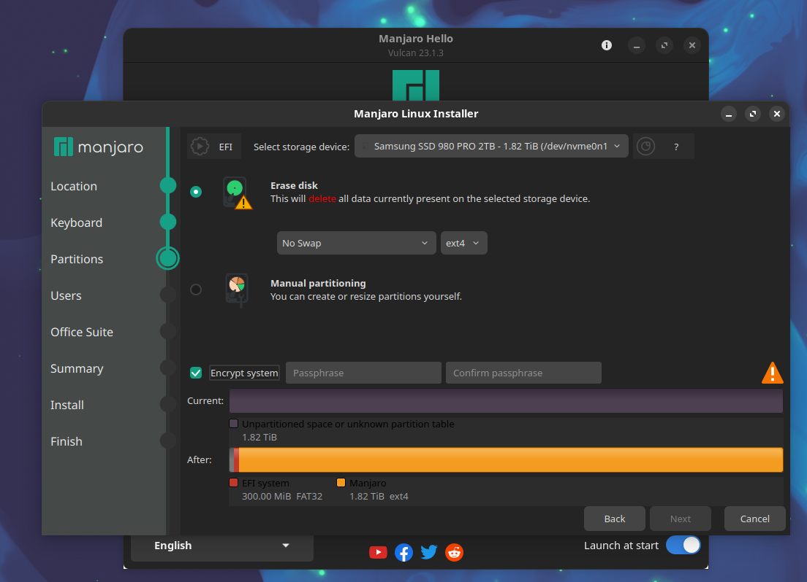

This leverages dm-crypt's `LUKS on a partition` scenario https://wiki.archlinux.org/title/Dm-crypt/Encrypting_an_entire_system#LUKS_on_a_partition.


#### Change or add LUKS password(s)

https://www.tuxedocomputers.com/en/Infos/Help-Support/Instructions/Change-LUKS-encryption-password.tuxedo

```shell
# Show which partitions are available (here nvme0n1p6 and nvme0n1p4(efi partition))
lsblk -f 

# change LUKS password
sudo cryptsetup luksChangeKey /dev/nvme0n1p2

# add LUKS password
sudo cryptsetup luksAddKey /dev/nvme0n1p2
```

#### Speeding up LUKS decryption in GRUB

Bootup will be quite a bit delayed (few seconds, depending on CPU speed), because GRUB doesn't use multiple processors and needs to decrypt the partition container. If you want to speed this up, you can either manually encrypt things and leave out the boot partition (long process, not recommended). Or lower the LUKS iteration cycles for the boot partion: https://unix.stackexchange.com/questions/497746/how-to-change-luks-encryption-difficulty-on-manjaro-full-disk-encrypt

https://wiki.archlinux.org/title/GRUB/Tips_and_tricks#Manual_configuration_of_core_image_for_early_boot

If you're a bit frustrated for waiting to long at boot time, this can be due to a high cost parameters of the key derivation function. Dump all current LUKS keys first:

```shell
cryptsetup luksDump /dev/nvme0n1p2
```

Now choose the key slot you want to change. We need to provide it as `-S x` parameter, where `x` is your key's slot.

If your password provides enough entropy to counter common attacks by itself, you can lower the parameters:

```shell
cryptsetup luksChangeKey --iter-time 1000 /dev/nvme0n1p2 -S 0
```

If you use `luksDeleteKey` or `luksKillSlot` for whatever reason (I wanted to delete my not that high entropy password after creating a new key), there might be a nasty window popping up - only after a restart of your machine stating:

> "The password you use to log in to your computer no longer matches that of your login keyring."

This is due to an outdated Gnome keyring, which is no big deal but may scare you a bit (like me - since non of the current passwords work, but the old `luksKillSlot` deleted does!). Luckily [it's easy to solve](https://askubuntu.com/a/65294/451114):

```shell
rm ~/.local/share/keyrings/login.keyring
```

Then logout and re-login again. Done :)


# Backup

It's also a good idea to start with the goary details like backups right before you use your rig productively. I had some recommendations for https://github.com/restic/restic, but wanted to give the GNOME backup called `Deja Dup` https://apps.gnome.org/DejaDup/ a chance. Since I also want to explore the merrits of Linux not only for me, but also for other users, that might not be that used to a command line.

The first thing in Backups is to configure the exclusions, which files you don't want to backup - folders like `~/.cache`, `~/.vagrant`, `~/VirtualBox VMs` etc.

I also have some `.iso` files in my `Downloads` dir, which I opted to exclude, since they really take long to encrypt and just grab a whole lot of time!

```shell
/home/jonashackt/Downloads/iso

/home/jonashackt/.config/Code/Cache
/home/jonashackt/.config/Code/CachedData/
/home/jonashackt/.config/Code/logs/

/home/jonashackt/.cache
/home/jonashackt/.config/Code - OSS/CachedData/
/home/jonashackt/.config/libreoffice/4/cache/
/home/jonashackt/.npm/
/home/jonashackt/.pyenv/
/home/jonashackt/.local/share/virtualenv/
/home/jonashackt/.ansible/test/venv/
/home/jonashackt/go/pkg/mod/

/home/jonashackt/.var/app/io.freetubeapp.FreeTube/
/home/jonashackt/.var/app/com.google.Chrome/config/google-chrome/Default/Service Worker/CacheStorage/
/home/jonashackt/.var/app/com.microsoft.Edge/config/microsoft-edge/Default/Service Worker/CacheStorage
/home/jonashackt/.var/app/com.github.IsmaelMartinez.teams_for_linux/config/teams-for-linux/Partitions/teams-4-linux/Cache/

/home/jonashackt/.config/Slack/Service Worker/CacheStorage/
/home/jonashackt/.var/app/com.slack.Slack/config/Slack/Cache/
/home/jonashackt/.var/app/com.slack.Slack/config/Slack/Service Worker/CacheStorage/
/home/jonashackt/.config/Slack/Cache/

/home/jonashackt/.kube/cache/
/home/jonashackt/.local/pipx/venvs/
/home/jonashackt/snap/miro/3/.config/miro/Cache
/home/jonashackt/.vagrant.d
/home/jonashackt/VirtualBox VMs
```

But in Deja Dups UI one cannot configure file patterns to exclude (see https://askubuntu.com/questions/690990/can-i-ignore-files-by-pattern-in-deja-dup-backup), only full paths.

Or in [`dconf-editor`](https://apps.gnome.org/DconfEditor/) (`pamac install dconf-editor`), locate org -> gnome -> deja-dup -> exclude-list and edit:

```shell
['$TRASH', '/home/jonashackt/Downloads/iso', '/home/jonashackt/.config/Code - OSS/CachedData/', '/home/jonashackt/.config/libreoffice/4/cache/', '/home/jonashackt/.vagrant.d', '/home/jonashackt/.cache', '/home/jonashackt/VirtualBox VMs', '/home/jonashackt/.npm/', '/home/jonashackt/.pyenv/', '/home/jonashackt/.local/share/virtualenv/', '/home/jonashackt/.ansible/test/venv/', '/home/jonashackt/go/pkg/mod/', '/home/jonashackt/.var/app/io.freetubeapp.FreeTube/', '/home/jonashackt/.var/app/com.google.Chrome/config/google-chrome/Default/Service Worker/CacheStorage/', '/home/jonashackt/.var/app/com.github.IsmaelMartinez.teams_for_linux/config/teams-for-linux/Partitions/teams-4-linux/Cache/', '/home/jonashackt/.var/app/com.microsoft.Edge/config/microsoft-edge/Default/Service Worker/CacheStorage', '/home/jonashackt/.config/Slack/Service Worker/CacheStorage/', '/home/jonashackt/.var/app/com.slack.Slack/config/Slack/Service Worker/CacheStorage/', '/home/jonashackt/.var/app/com.slack.Slack/config/Slack/Cache/', '/home/jonashackt/.config/Slack/Cache/', '/home/jonashackt/.kube/cache/', '/home/jonashackt/.local/pipx/venvs/', '/home/jonashackt/snap/miro/3/.config/miro/Cache']
```

Also worth a try: https://medium.com/@shimo164/ignore-node-modules-directories-in-deja-dup-433997fd2461 But that means creating `.deja-dup-ignore` files everywhere.


Ok, Deja Dup just can't finish the scanning on my system in any way - don't know why, it simply hangs.

---> IT WAS THE SANDISK SUPPLIED USB-C to USB-A ADAPTER! DAMN... restic also froze!


#### Backup with restic and resticprofile

Restic might be a faster and more robust solution than other backup tools: https://www.datamate.org/linux-server-backup-mit-restic-und-duplicity/

It handles backups more like git repositories and doesn't hold changed files multiple times. Every object is divided into small blocks and just occurs once in the backup. If something changes, only those differences will be transfered. Thus filechanges do not result in duplication and massively reduces the needed disk space for backups. 

restic eliminates nearly all fallacies of duplicity (and thus Gnome Backup / Deja Dup). A restore is extremely fast, since there's no need to put together files from different difftars. Additionally it has no effect on the overall backup status, if single data blocks are currupt.

In my experiences restict also needs far less CPU resources then duplicity/Deja Dup: And that's kind a killer criteria also, since 2 hours of backup is a lot of CPU time...

* restic: https://github.com/restic/restic docs: https://restic.readthedocs.io/en/stable/010_introduction.html
* resticprofile: https://github.com/creativeprojects/resticprofile docs: https://creativeprojects.github.io/resticprofile/index.html

> Getting started: https://creativeprojects.github.io/resticprofile/configuration/getting_started/index.html


```shell
pamac install restic resticprofile-bin
```

With resticprofile we get a nice YAML config file, where we can configure restic to do our backups!

> Be sure to have a YAML extension installed in your VSCode https://marketplace.visualstudio.com/items?itemName=redhat.vscode-yaml


Let's create our restic(profile) configuration. Start by creating a folder in your home directory:

```shell
mkdir /home/jonashackt/restic
cd /home/jonashackt/restic
```

First we want to define, which files we don't want to backup. Thus let's create a `excludes.txt`:

```shell
# general
.cache
.config/libreoffice/4/cache

# IDEs
.config/Code/Cache
.config/Code/CachedData
.config/Code/logs
.config/Code - OSS/CachedData

# dev packages
.npm
.pyenv
.local/share/virtualenv
.local/pipx/venvs
.ansible/test/venv
go/pkg/mod
node_modules

# Apps
.var/app/io.freetubeapp.FreeTube
snap/miro/3/.config/miro/Cache
.var/app/com.github.IsmaelMartinez.teams_for_linux/config/teams-for-linux/Partitions/teams-4-linux/Cache

### Browsers
.var/app/**/Cache*
.var/app/com.google.Chrome/config/google-chrome/Default/Service Worker/CacheStorage
.var/app/com.microsoft.Edge/config/microsoft-edge/Default/Service Worker/CacheStorage
.mozilla/firefox/**/cache/

### Slack
.config/Slack/Cache
.config/Slack/Service Worker/CacheStorage
.var/app/com.slack.Slack/config/Slack/Cache
.var/app/com.slack.Slack/config/Slack/Service Worker/CacheStorage

# VMs
.kube/cache
#.vagrant.d
#VirtualBox VMs
```

You can check your filepatterns here: https://www.digitalocean.com/community/tools/glob

Now create a file named `profiles.yaml` inside your new folder (you can also [use different configuration formats like toml, hcl, json](https://creativeprojects.github.io/resticprofile/configuration/getting_started/index.html)):

```yaml
# yaml-language-server: $schema=https://creativeprojects.github.io/resticprofile/jsonschema/config-1.json

version: "1"

default:
   repository: "local:/run/media/jonashackt/Extreme SSD/linuxbackup"
   password-file: "password.txt"

   backup:
      exclude-file: "excludes.txt"
      exclude-caches: true
      verbose: true
      source:
      - "/home/jonashackt"
```

The restic [repository is the place, where your backups are saved](https://restic.readthedocs.io/en/stable/030_preparing_a_new_repo.html)).

> "The repository can be stored locally, or on some remote server or service."

`default:repository` configures the repository kind and path

So in my case, where I want to use a *locally* attached external SSD drive mounted at `/run/media/jonashackt/Extreme SSD/linuxbackup`, this is `"local:/run/media/jonashackt/Extreme SSD/linuxbackup"`.

Also create a `password.txt`. resticprofile can do that for you, if you want:

```shell
resticprofile generate --random-key > password.txt
```

Now we need to initialize a new restic repository vis `resticprofile init`:

```shell
$ resticprofile init

2024/02/04 14:15:07 using configuration file: profiles.yaml
2024/02/04 14:15:07 profile 'default': starting 'init'
created restic repository b1a22de480 at local:/run/media/jonashackt/Extreme SSD/linuxbackup

Please note that knowledge of your password is required to access
the repository. Losing your password means that your data is
irrecoverably lost.
2024/02/04 14:16:05 profile 'default': finished 'init'
```

Before really running the backup we can testdrive it:

```shell
resticprofile backup --dry-run
```

And finally let the backup run:

```shell
$ resticprofile backup

2024/02/04 14:58:30 using configuration file: profiles.yaml
2024/02/04 14:58:30 profile 'default': starting 'backup'
open repository
repository b1a22de4 opened (version 2, compression level auto)
lock repository
no parent snapshot found, will read all files
load index files

start scan on [/home/jonashackt]
start backup on [/home/jonashackt]
scan finished in 1.522s: 102434 files, 354.759 GiB

Files:       102435 new,     0 changed,     0 unmodified
Dirs:        13654 new,     0 changed,     0 unmodified
Data Blobs:  385365 new
Tree Blobs:  12494 new
Added to the repository: 324.617 GiB (284.612 GiB stored)

processed 102435 files, 354.759 GiB in 2:12:27
snapshot 3122d6d5 saved
2024/02/04 17:10:58 profile 'default': finished 'backup'
```

After the command has finished, you can have a look at the snapshots created:

```shell
$ restic -r "/run/media/jonashackt/Extreme SSD/linuxbackup" snapshots

enter password for repository: 
repository b1a22de4 opened (version 2, compression level auto)
ID        Time                 Host        Tags        Paths
-----------------------------------------------------------------------
3122d6d5  2024-02-04 14:58:30  pikelinux               /home/jonashackt
-----------------------------------------------------------------------
1 snapshots
```

Now how does a restore work? https://restic.readthedocs.io/en/stable/050_restore.html

If you want to restore it to another machine, detach your SSD and attach it to the other machine. Now head to the root `/` and run the following:

```shell
restic -r "/run/media/jonashackt/Extreme SSD/linuxbackup" restore latest --target .
```

Don't insert the `--target` path with `/home/jonashackt` again, since that would create the restored backup in `/home/jonashackt/home/jonashackt`.


# Productivity Software on Linux

## Enable AUR & flathub Repositories in Manjaro package management

Simply activate in Add/Remove Programs, since it's already installed - as the docs state https://flatpak.org/setup/Manjaro

> Flatpak & AUR/pacman are installed by default on Manjaro 20 or higher.

> To enable their support, navigate to the Software Manager (Add/Remove Programs)

> Click on the triple line menu [or dots depending on the Desktop Environment] on the right, in the drop down menu select "Preferences"

> Navigate to the "AUR" and "Flatpak" tabs and slide the support toggle (it is also possible to enable checking for updates, which is recommended).

Flatpack is super useful to install many Desktop applications like MS Teams, Zoom, Slack etc, but also has it's drawback.


## Spotlight like search

https://github.com/cerebroapp/cerebro

Install it via the AUR package https://aur.archlinux.org/packages/cerebro-bin


## Microsoft Teams

Microsoft announced to discontinue the Linux client in favour of a Progressive Web App (PWA), which is integrated in Microsoft Edge for Linux:

https://techcommunity.microsoft.com/t5/microsoft-teams-blog/microsoft-teams-progressive-web-app-now-available-on-linux/ba-p/3669846

But installing Microsoft Edge on Linux (although available) doesn't feel right to me. Alternativeley one can use the (also flatpack managed) unofficial `Teams for Linux` client (which is hosted on GitHub https://github.com/IsmaelMartinez/teams-for-linux and powered by Electron).


__Both solutions (Microsoft Edge + PWA and unofficial Teams for Linux) didn't work for me the way I thought they would.__ The unofficial client didn't startup when clicking on the Teams links. And joining a meeting using the ID and password from the app itself also started my default Browser Firefox, which is said to be not a good basis for Teams.

> In the end I settled just with using Chrome (installed via Flatpack) and using the url copied from my Google calender in Firefox.

But there was one thing that didn't work: Screensharing!


### Screensharing in Microsoft Teams running in Chrome installed via Flatpack

Flatpack isolates apps from the main OS. I simply forgot that, as I tried to use screen sharing with Microsoft Teams from within Chrome.

But [the problem is well known](https://techcommunity.microsoft.com/t5/microsoft-teams/unable-to-share-screen-on-ms-teams-in-google-chrome-109-0-5414/m-p/3717629) - and there's a solution: https://wiki.archlinux.org/title/XDG_Desktop_Portal:

> "Portals were designed for use with applications sandboxed through Flatpak, but any application can use portals to provide uniform access to features independent of desktops and toolkits. This is commonly used, for example, to allow screen sharing on Wayland via PipeWire"

So let's install `xdg-desktop-portal xdg-desktop-portal-gnome` via pamac! On my Manjaro machine they were already installed :)

Interestingly the `xdg-desktop-portal-gnome` [also needs additional `xdg-desktop-portal-gtk`](https://bbs.archlinux.org/viewtopic.php?pid=2086805#p2086805), which Manjaro also had installed already.

Also I needed to configure two Chrome flags:

```shell
--> chrome://flags/#ozone-platform-hint = Auto
--> chrome://flags/#enable-webrtc-pipewire-capturer = Enabled
```

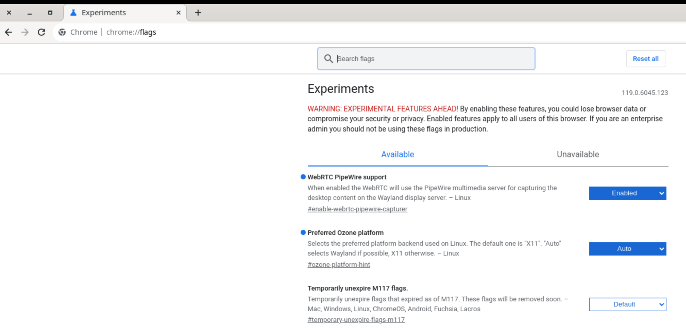


Sadly my screensharing still didn't work! Looking into the service `xdg-desktop-portal-gnome`, I found lot's of `Failed to associate portal window with parent window` errors:

```shell
$ systemctl --user status xdg-desktop-portal-gnome
● xdg-desktop-portal-gnome.service - Portal service (GNOME implementation)
     Loaded: loaded (/usr/lib/systemd/user/xdg-desktop-portal-gnome.service; static)
     Active: active (running) since Wed 2023-11-15 10:10:53 CET; 1h 21min ago
   Main PID: 3064 (xdg-desktop-por)
      Tasks: 18 (limit: 38392)
     Memory: 78.5M
        CPU: 1.517s
     CGroup: /user.slice/user-1000.slice/user@1000.service/app.slice/xdg-desktop-portal-gnome.service
             └─3064 /usr/lib/xdg-desktop-portal-gnome

Nov 15 10:10:53 pikelinux systemd[2077]: Starting Portal service (GNOME implementation)...
Nov 15 10:10:53 pikelinux systemd[2077]: Started Portal service (GNOME implementation).
Nov 15 10:32:10 pikelinux xdg-desktop-por[3064]: Failed to associate portal window with parent window 
Nov 15 10:32:15 pikelinux xdg-desktop-por[3064]: Failed to associate portal window with parent window 
Nov 15 11:18:35 pikelinux xdg-desktop-por[3064]: Failed to associate portal window with parent window 
Nov 15 11:18:41 pikelinux xdg-desktop-por[3064]: Failed to associate portal window with parent window 
Nov 15 11:32:00 pikelinux xdg-desktop-por[3064]: Failed to associate portal window with parent window 
Nov 15 11:32:10 pikelinux xdg-desktop-por[3064]: Failed to associate portal window with parent window 
```


But luckily there's a great post here https://askubuntu.com/a/1398720/451114

And what was missing on my machine was `pipewire-media-session`! And yes, searching for and installing the package states that it's deprecated. 

```shell
>>> pipewire-media-session is deprecated and will soon be removed from the
    repositories. Please use 'wireplumber' instead.
```

But the community doesn't really seem to be quite fixed on that `wireplumber` is always the best option: https://forum.endeavouros.com/t/pipewire-pipewire-media-session-vs-wireplumber/20705 Also the replacement of pipewire-media-session [has been undone already](https://archlinux.org/news/undone-replacement-of-pipewire-media-session-with-wireplumber/). So I gave it a try:

```shell
pamac install pipewire-media-session
systemctl --user enable pipewire-media-session
systemctl --user start pipewire-media-session
```

Now `systemctl --user status pipewire-media-session` and `systemctl --user status xdg-desktop-portal-gnome` should be green and running without fault:

```shell
$ systemctl --user status pipewire-media-session
● pipewire-media-session.service - PipeWire Media Session Manager
     Loaded: loaded (/usr/lib/systemd/user/pipewire-media-session.service; enabled; preset: enabled)
     Active: active (running) since Wed 2023-11-15 11:48:50 CET; 2s ago
   Main PID: 14990 (pipewire-media-)
      Tasks: 3 (limit: 38392)
     Memory: 1.8M
        CPU: 9ms
     CGroup: /user.slice/user-1000.slice/user@1000.service/session.slice/pipewire-media-session.service
             └─14990 /usr/bin/pipewire-media-session

Nov 15 11:48:50 pikelinux systemd[2077]: Started PipeWire Media Session Manager.


$ systemctl --user status xdg-desktop-portal-gnome
● xdg-desktop-portal-gnome.service - Portal service (GNOME implementation)
     Loaded: loaded (/usr/lib/systemd/user/xdg-desktop-portal-gnome.service; static)
     Active: active (running) since Wed 2023-11-15 11:49:04 CET; 20s ago
   Main PID: 15030 (xdg-desktop-por)
      Tasks: 5 (limit: 38392)
     Memory: 28.5M
        CPU: 348ms
     CGroup: /user.slice/user-1000.slice/user@1000.service/app.slice/xdg-desktop-portal-gnome.service
             └─15030 /usr/lib/xdg-desktop-portal-gnome

Nov 15 11:49:04 pikelinux systemd[2077]: Starting Portal service (GNOME implementation)...
Nov 15 11:49:04 pikelinux systemd[2077]: Started Portal service (GNOME implementation).
```

Now in Microsoft Teams again I granted the screensharing access to my whole screen:

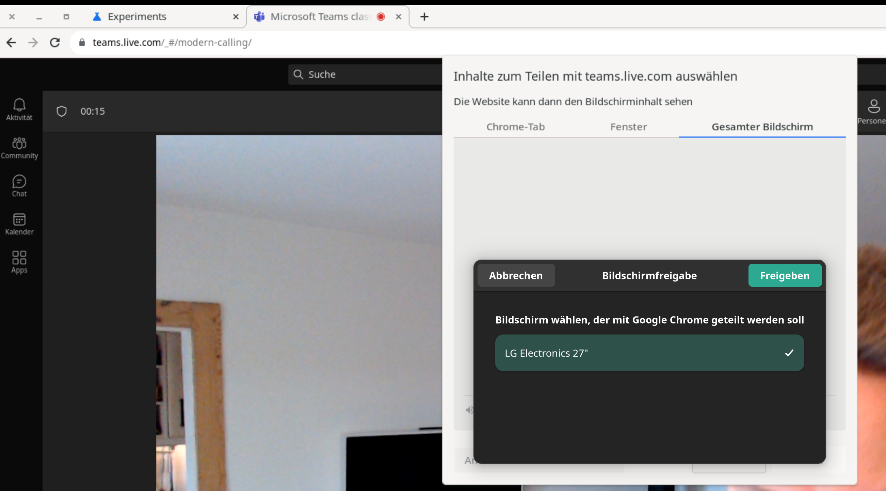

Finally Screensharing in Teams worked:

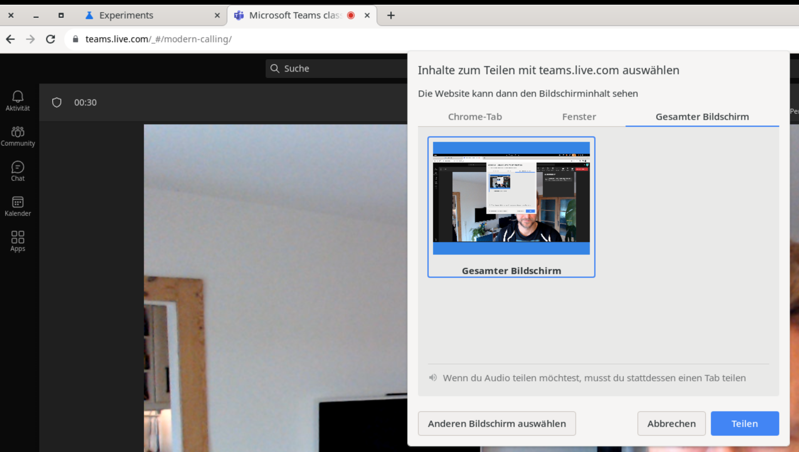


## Zoom

If you want Screensharing to work, don't use the Flatpack package, use the Arch one https://aur.archlinux.org/packages/zoom

Install it via Manjaros package manager (gui or command line).

There are great tips at https://wiki.archlinux.org/title/Zoom_Meetings


### Issue: login data & SSO not saved after restart (of system or Zoom app only)

It's annoying to have to login into SSO every time I use Zoom or restarted my system. 

The simple solution is to delete/rename the `~/.zoom` directory (see https://www.reddit.com/r/Zoom/comments/10vfbtk/comment/j8gxunn/)!

Now the settings will be successfully saved in `/home/jonashackt/.config/zoomus.conf` (which doesn't work, when the `~/.zoom` directory persists)


## Slack

Flatpack is here to help again: https://flathub.org/apps/com.slack.Slack

But if you want working drag and drop, you might want to use the Arch package https://aur.archlinux.org/packages/slack-desktop


## Miro

There's a snap available here https://snapcraft.io/install/miro/manjaro

To be able to use Snapcraft on Manjaro we need to install it first - again either via gui or command line:

```
sudo pacman -S snapd
```

Also enable the systemd unit that manages the main snap communication socket:

```
sudo systemctl enable --now snapd.socket
```

Restart your system to ensure snap’s paths are updated correctly. 

Now install Miro via snap:

```
sudo snap install miro
```


## SIP Telefone app for Linux

If you're like me you want to be callable even when you're mobile phone is on airplane mode. The easiest solution is a SIP phone client software, where you just configure your SIP credentials and can use your laptop or desktop machine to have phone calls.

There's huge list of SIP clients around, but already on my Android phone there are only a few that really work.

While writing this docs I found out about linphone https://www.linphone.org/technical-corner/linphone, which has clients for nearly every OS. And it's also OpenSource, developed on GitLab.com https://gitlab.linphone.org/BC/public/linphone-desktop

I installed the AUR AppImage package https://aur.archlinux.org/packages/linphone-desktop-appimage (the other https://aur.archlinux.org/packages/linphone-desktop didn't work on my machine).

My first tests worked like a charm!


## Google Drive Desktop file sync

On my Mac I had a Desktop App to sync my Drive files into my file manager. Sadly there's no Google Drive Desktop for Linux https://support.google.com/drive/answer/10838124

There's a great post on baeldung about this topic: https://www.baeldung.com/linux/google-drive-guide (see also https://askubuntu.com/questions/1390151/google-drive-in-ubuntu-with-full-local-copy)

But we have some alternatives. First thing I checked was `gnome-online-accounts` (see [the docs](https://help.gnome.org/users/gnome-help/stable/accounts-which-application.html.en)). This package is already pre-installed on Manjaro. Simply head over to `preference / online accounts` and log in to your Google account. Now the Gnome file manager should have a new entry, where you can access your Google Drive files: 

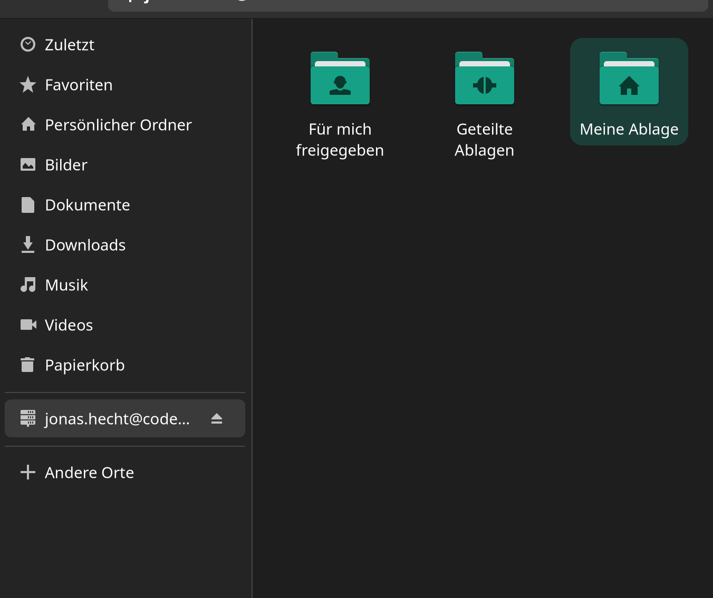

But [they aren't stored locally sadly](https://gitlab.gnome.org/GNOME/nautilus/-/issues/784), so they will be downloaded every time you access them. And as the baeldung post states, the file names are completely obscured on the command line. E.g. if you have a file called `bla` in the file manager, it's named like `11lfzX-8dH_eWtf2JWa3caRtodOnlXDbN` on the command line and you even need to access it in a weird way like `cd '/run/user/1000/gvfs/google-drive:host=gmail.com,user=myemail'`.


If you need locally stored files with Google Drive, IMHO there's no perfect solution. Maybe https://www.insynchq.com is worth a try, but also costs some 30 bucks...


## Dropbox Linux client

There's a official Dropbox Linux client https://help.dropbox.com/de-de/installs/linux-commands and also a AUR package https://aur.archlinux.org/packages/dropbox

Compared to Drive the integration is superb. Start the app via the application menu and after the login you will find a Dropbox icon right at the top of your Gnome Desktop - just as you are used to on a Mac:

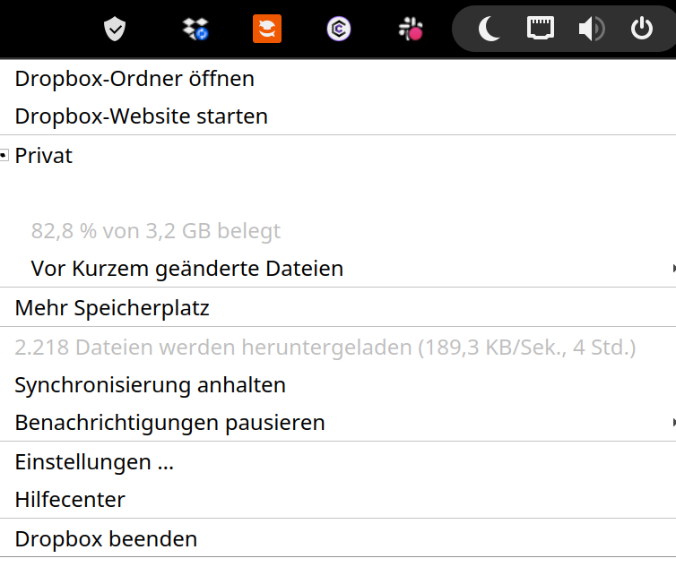

Also you can drag the folder `Dropbox` in your profile directory into the left menu bar of the Gnome file manager. And voila: you have the same integration as on a Mac!

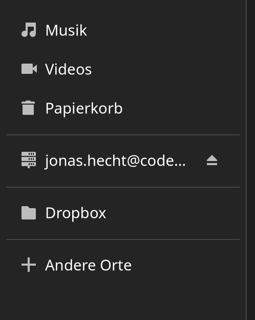


## Remarkable Linux client

https://github.com/reHackable/awesome-reMarkable

I use the eBook-Reader like notepad Remarkable and on a Mac and on iPhone/Android there are quite good clients to use the cloud sync. There's no current AUR package sadly, but snap is here to help:

https://snapcraft.io/remarkable-desktop and specifically for Manjaro https://snapcraft.io/install/remarkable-desktop/manjaro

But sadly, this Windows app packaged as a wine app didn't work on my machine. It started once, but after an update didn't start anymore.


Other strategies to get to your documents using Linux:

If you only want to get single documents and download them to your desktop, there's a simple web interface you can enable inside your Remarkable tablet's settings. Just head over to `Settings / Storage` and enable `USB web interface`. My remarkable is now accessible via http://10.11.99.1/ and I can download single documents easily.

We can even create a Gnome Dock Icon to link to the Remarkable web interface: https://askubuntu.com/questions/1045723/how-to-add-website-url-shortcut-to-ubuntu-dock-on-ubuntu-18-04 ([here's an icon](https://www.reddit.com/r/RemarkableTablet/comments/m063iu/i_was_tired_of_the_macos_app_icon_so_i_redesigned/) if you'd like)


## Remote Desktop on Manjaro

I had the issue, that the kids were playing on the Wii in the basement where my Manjaro PC is located (waiting for my new Laptop ever since). So I grabbed a Laptop from my Mother's husband (also on Manjaro) and wanted to connect via Remote Desktop to my machine.

According to https://www.howtogeek.com/429190/how-to-set-up-remote-desktop-on-ubuntu VNC isn't a secure protocol anymore (see also https://en.wikipedia.org/wiki/Virtual_Network_Computing#Security) and VNC is interfering with Wayland, which is the default on modern Linux desktops right now:

> In fact, the VNC back end for the GNOME remote desktop functionality has been turned off by default in GNOME, and Ubuntu have followed suit. Restoring it requires building various components from source with the appropriate build flags reinstated.

And 

> The preferred method, and one natively supported by GNOME and Ubuntu, is to use the remote desktop protocol instead of VNC.

But nevertheless don't use plain RDP over the internet without VPN etc.!

This is super cool: So just enter the system settings menu, click on `Sharing` and activate `Remote Desktop` and `Remote Control` on the machine you want to connect to.

Now on the client machine you need an RDP client. There are many around, like remmina https://software.manjaro.org/package/remmina#! or Thincast https://thincast.com/en . I tried Thincast and used my basement machines local network IP and the credentials from the Gnome Sharing menu. And it worked like a charm:

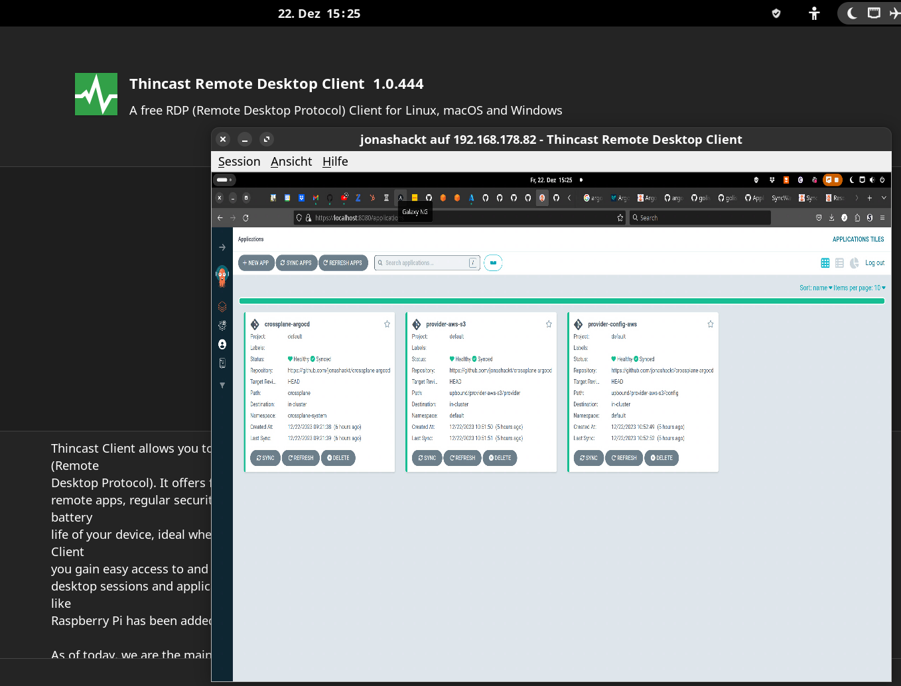

In Thincast the option `View / Smart Sizing` comes in very helpful, if the screens of Client and Server do have different resolutions.


# Development software

## VSCode

There are plenty of ways to install VSCode to Linux / Manjaro. First I tried the flathub package, but then I realised that a Flatpack packaged app is really separated from the rest of the system. Since it runs in a container. So no other development tools or frameworks will work inside the VSCode container, we would have to install it all into it... 

Although I love the idea of container packaged software, I don't really wanted to live it that kind of hard fashioned with my development setup. Sure, development containers would also work. But I wanted kind of a more traditional installation. And luckily there's the AUR package https://aur.archlinux.org/packages/visual-studio-code-bin . Beware of the `-bin` in the name of the package, the other one installs the `Code - OSS` app instead. [See the differences here](https://github.com/microsoft/vscode/wiki/Differences-between-the-repository-and-Visual-Studio-Code).


## Taming the terminal

https://forum.manjaro.org/t/bash-with-autocomplete-and-fancy-flags/112108

https://github.com/romkatv/powerlevel10k

* Unable to cancel a command on Gnome terminal? Have a look at https://unix.stackexchange.com/a/33017/140406 and delete every `Strg+C` keyboard shortcut in the Gnome terminal settings!


# Misc

## Small tweaks

* Switching back to last tab on Firefox: https://superuser.com/questions/290704/switching-back-to-last-tab-on-firefox

* Night mode: https://www.reddit.com/r/ManjaroLinux/comments/ogf1iy/turn_on_night_mode/


## Print multiple jpgs to PDF

The easy "Vorschau" app on MacOS had this feature, but I can't find it in gthumb. But it's there somehow https://gnulinux.ch/bilder-drucken with the great [ImageMagick](https://en.wikipedia.org/wiki/ImageMagick).

Execute the following on your console:

```shell
convert *.jpg multiples.pdf
```

Now you can even print all sites on one pdf.


## Write into and sign PDFs

According to https://askubuntu.com/questions/1330708/fill-sign-pdf-on-ubuntu the best seems to be Xournal++ (there is also an older Xournal)

https://xournalpp.github.io/

The correct Arch/Manjaro package is named `xournalpp`:

```shell
pamac install xournalpp
```

I also often read about LibreOffice Draw (like in here https://askubuntu.com/a/786795/451114), where you can

* open the pdf
* then "export as pdf"
* set "jpeg compression quality" to 50% and "image resolution" to 150 dpi


## Configure LibreOffice tabbed style (like MS Office)

Install LibreOffice (see https://wiki.archlinux.org/title/LibreOffice) via the Arch package [`libreoffice-fresh`](https://archlinux.org/packages/?name=libreoffice-fresh):

```shell
pamac install libreoffice-fresh
```

LibreOffice looks way better than OpenOffice. But if you want to have it even slicker with the Tabbed User Interface style, then have a look here: https://itsfoss.com/libreoffice-ribbon-interface/:

Go to `View/User Interface...` and select `Tabbed`.

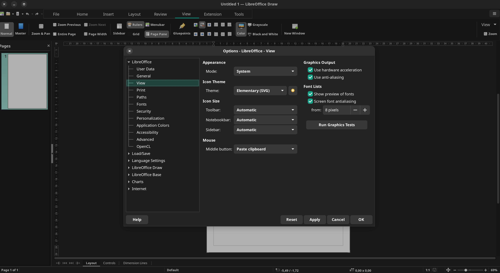

Choose another Icon theme, if the dark (black and white) icons aren't what you're looking for https://askubuntu.com/questions/979032/libreoffice-icons-hard-to-see-with-dark-themes


## Printer setup

Here I learned to __ALWAYS__ search for an AUR package first!

I have an old Canon MX870 printer, which has ultra low cost and separate printer cartridges. So I went to the Canon Driver page and it was simply empty. No Linux drivers at all. A google search got me to [driverscollection.com](https://de.driverscollection.com/?file_cid=4527114398460c3f541c53ebcfb), but there were only `.deb` (Ubuntu, Debian) and `.rpm` (Fedora, SUSE) packages. The build from source also didn't work, since file were missing... (I already searched for "How to Install .DEB files in Arch Based Distros" - [don't do that!](https://forum.manjaro.org/t/how-to-install-deb/34452/3)).

But than I simply searched for `canon mx870 linux driver arch` - and there really was an AUR package for my printer! Horay!

Now installing `canon-pixma-mx870-complete` gave me some errors - but I managed to solve them. The first error indicated, that I didn't have `autoconf` installed. So I installed it with `pamac`. The second error got me to the missing `automake`, which I also installed. Then I had a strange error with the [lib32-libusb-compat package](https://archlinux.org/packages/core/x86_64/libusb/), which is needed by the `canon-pixma-mx870-complete` package: 

```
syntax error near unexpected token `LIBUSB,'
```

Luckily [this thread](https://bbs.archlinux.org/viewtopic.php?id=251492) and also the [`lib32-libusb-compat` AUR package site](https://aur.archlinux.org/packages/lib32-libusb-compat) got me to the problem: I needed to install [`base-devel` AUR package](https://archlinux.org/packages/core/any/base-devel/) first!

Now running `pamac install lib32-libusb-compat canon-pixma-mx870-complete` ran like a charm!

The scanner now worked using the app `Document Scanner`.


But there was no printer configured out-of-the-box. Although the driver (`PPD` files) seem to be present correctly.

In the normal settings dialog had a `add printer` button, but my Canon network printer wasn't found there and I couldn't add it though:

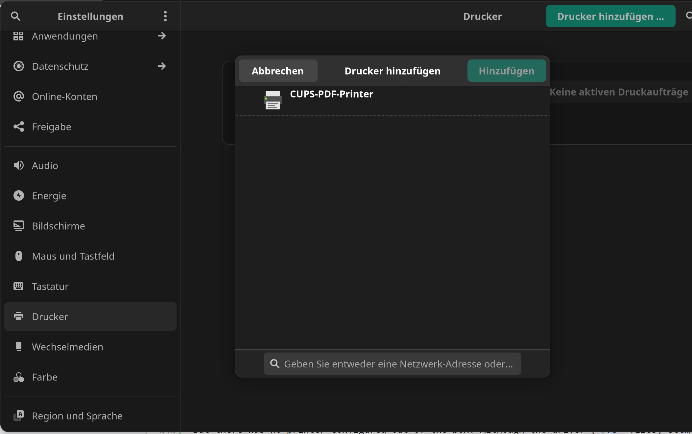

So I went over to the console and started the CUPS gui directly just executing `system-config-printer`. Now adding a new printer in the CUPS gui also shows `network printers` - and there my Canon MX870 showed up!

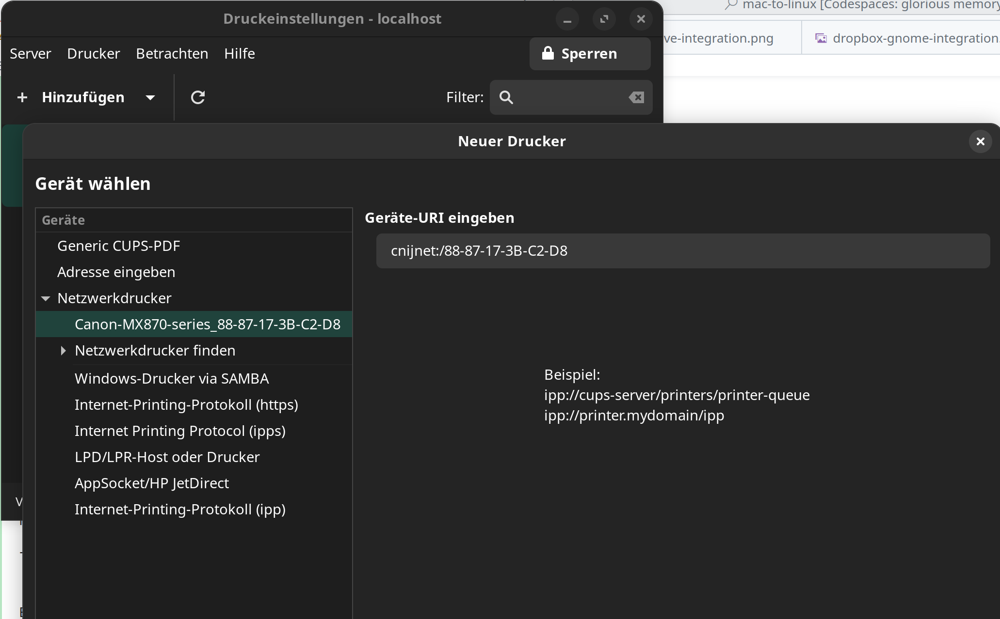

Really nice. I clicked `forward` and the Driver was automatically set to `Canon MX870 series - CUPS+Gutenprint v5.3.4 Simplified`, which may also work - but we installed the original `Canon MX870 series Ver.3.30` right?! Therefore I changed the created printer after the wizard is finished and clicked on `brand and model` and change... and then selected the correct driver from the database:

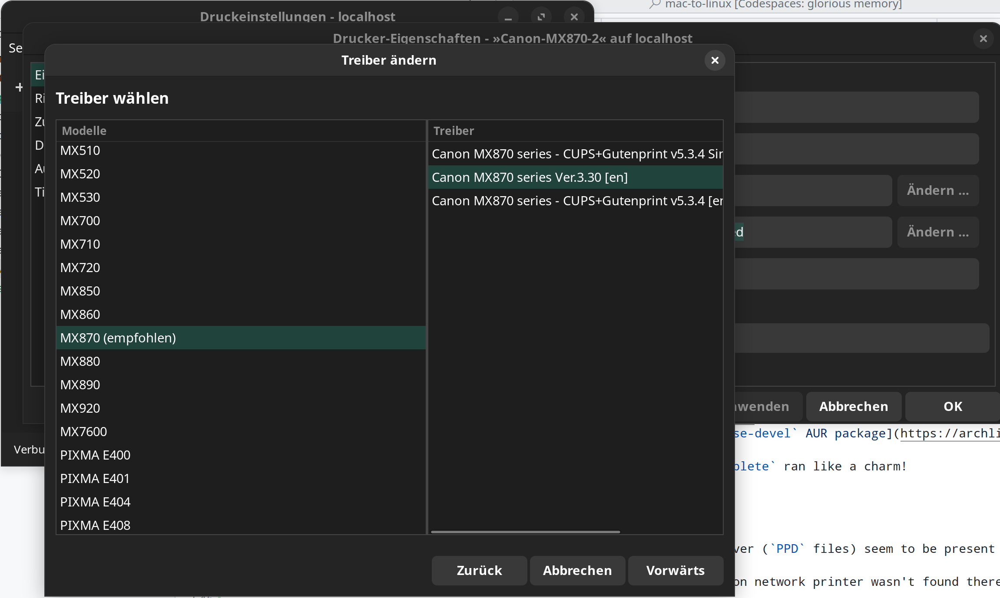

I hoped my printer would work now, but trying to print a example page didn't work. A final piece was missing.

But finally I found it: In the printer's settings under `guidelines` the condition was not `activated`. I activated the printer here and everything worked fine!


As a side note: If you want to use the open source drivers and need to configure `ldp` protocol instead, here's maybe help: https://bbs.archlinux.org/viewtopic.php?id=143349

Also the CUPS system itself is a very good source of information http://localhost:631/help/network.html


## Balsamiq Mockups on Linux

There's no official Balsamiq version for Linux https://balsamiq.com/wireframes/desktop/docs/linux/

But you can use Bottles https://usebottles.com (https://github.com/bottlesdevs/Bottles) to install the Windows version of Balsamiq.

> See also https://ostechnix.com/run-windows-software-on-linux-with-bottles/ for more info

Therefore install `Bottles` via the Package Manager `pamac` or via Flatpack:

```shell
pamac install bottles
```

Thereafter finish the UI's Wizard:

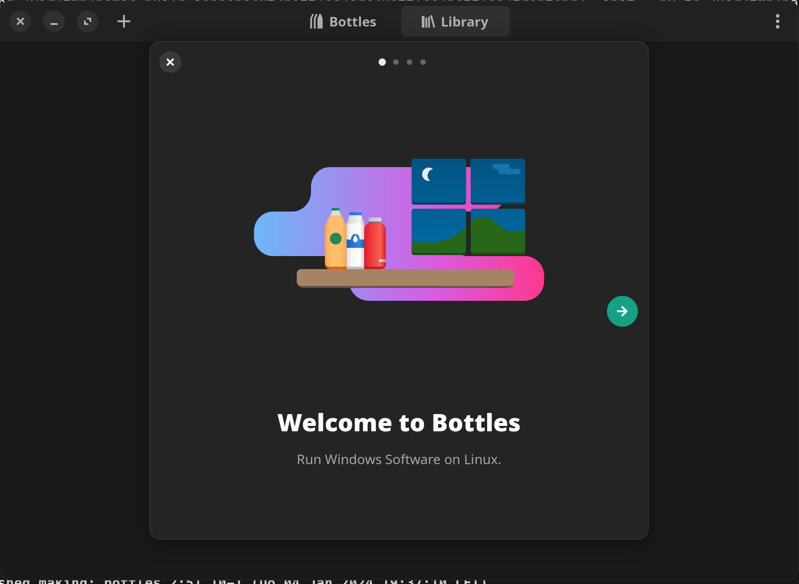

Now we need to download the Balsamiq Windows installer file like `Balsamiq_Wireframes_4.7.4_x64_Setup.exe` from https://balsamiq.com/wireframes/desktop/.

Back in Bottles you need to create a new bottle. I choose `Application`, named it `Balsamiq` and just went with the defaults.

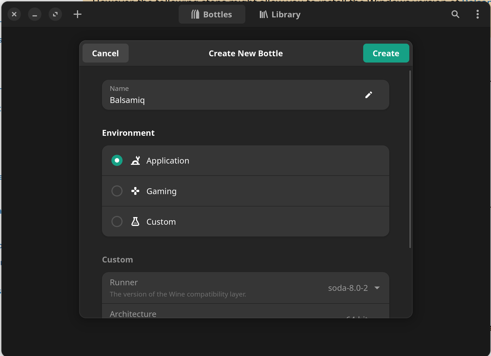

Then let Bottles setup the bottle. This may take a while. If the bottle is ready, hit the `Run Executable...` button and select the downloaded `Balsamiq_Wireframes_4.7.4_x64_Setup.exe`. The balasamic setup wizard should appear:

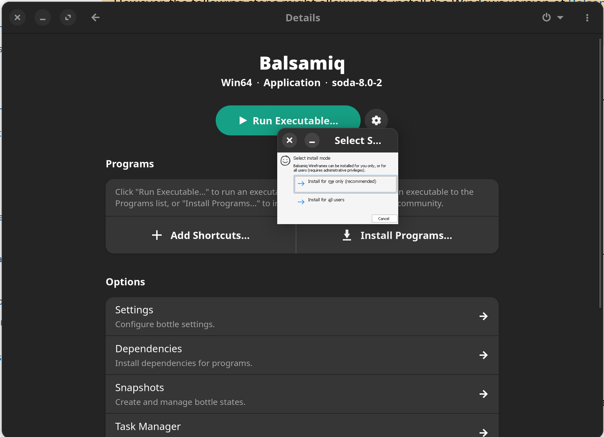

Now click on `Install for all users` and hit `Next` on dir selection, desktop shortcut and then `Install`. Finally click on `launch Balsamiq` and Balsamiq should appear:

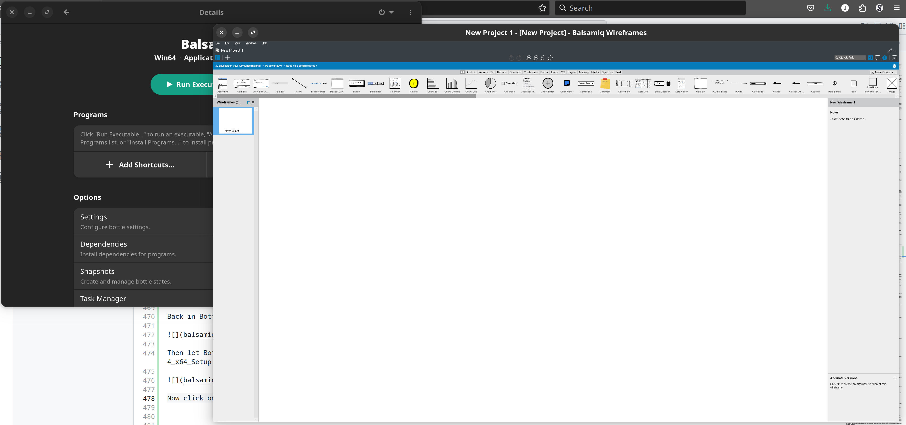

If your Balsamiq is hardly readable (e.g. because you have set Manjaro's screen scaling to 200%), you may need to adjust the Bottle's display settings. Therefore head over to `Options` section and click on `Settings`. Now scroll down to `Display` section and select the `Advanced Display Settings`. Finally tweak the `Screen Scaling` settings. For me the default was `96 DPI`. I doubled it according to my Manjaro screen scaling of 200% to `192 DPI`: 

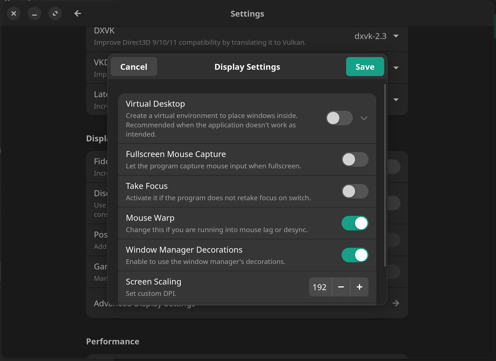

Now Balsamiq looked wonderful:

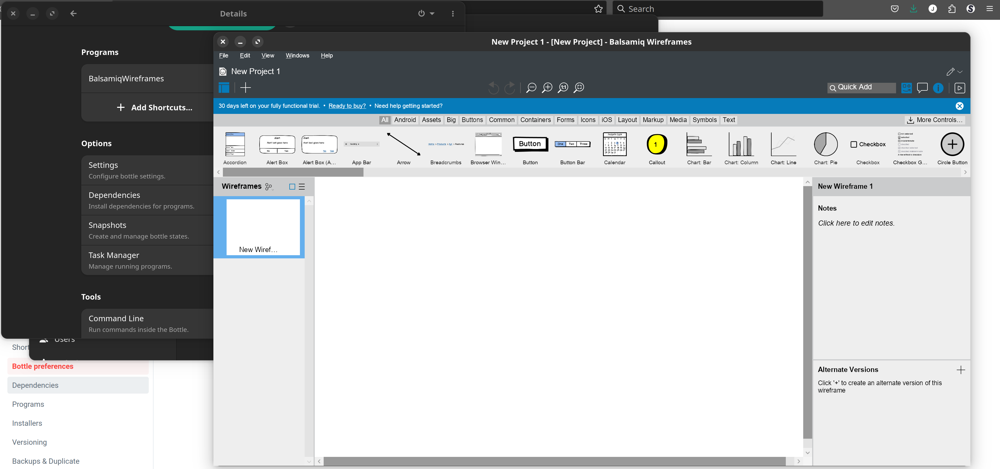

See also https://forum.usebottles.com/t/how-to-scale-the-bottles-application-for-hidpi/862


If you're asking yourself where to find file that you're saving in Balsamiq, just have a look into your profile. All bottles reside in `.var/app/com.usebottles.bottles/data/bottles/bottles`. If you save the file `New Project 1.bmpr` directly to the `My Computer / (C:)`, you'll find it there:

```shell
$ ls ~/.var/app/com.usebottles.bottles/data/bottles/bottles
$ cd Balsamiq/drive_c
$ ls -la
total 112
drwxr-xr-x  7 jonashackt jonashackt  4096  4. Jan 20:38  .
drwxr-xr-x  7 jonashackt jonashackt  4096  4. Jan 20:38  ..
-rw-r--r--  1 jonashackt jonashackt 86016  4. Jan 20:38 'New Project 1.bmpr'
drwxr-xr-x  4 jonashackt jonashackt  4096  4. Jan 19:57  ProgramData
drwxr-xr-x  7 jonashackt jonashackt  4096  4. Jan 19:57 'Program Files'
drwxr-xr-x  6 jonashackt jonashackt  4096  4. Jan 19:47 'Program Files (x86)'
drwxr-xr-x  4 jonashackt jonashackt  4096  4. Jan 19:47  users
drwxr-xr-x 21 jonashackt jonashackt  4096  4. Jan 19:49  windows
```


## Samsung Smart Switch

As already said I dropped my iPhone in favour of Android. As Samsung has a great overall package of 5 years of updates, I went for a S23.

On my Mac I used Samsung Smart Switch for the backups, which was quite easy to use. So why not use it on Manjaro too? Well, there's no Linux version sadly :( https://www.samsung.com/de/apps/smart-switch/

Now we have a few alternatives left: https://xdaforums.com/t/samsung-smart-swith-for-ubuntu.3335276/ & https://superuser.com/questions/1314720/how-to-backup-a-samsung-mobile-to-linux 

We could use Wine as a Windows app emulator on Linux, but there doesn't seem to be good experiences with Smart Switch sadly. In the Wine database [this is rated as garbage](https://appdb.winehq.org/objectManager.php?sClass=application&iId=17967).

I opted for the VirtualBox / Windows path. I already had a project in place here, where I could simply follow the guide and have a running Windows box in minutes: https://github.com/jonashackt/windows-vagrant-ansible (well at least I thought so, because the base Vagrant box Edge dev was discontinued by Microsoft).

But luckily we only need to get a Windows VirtualBox VM here, no automation with Ansible or Vagrant for now.

So just do the following:

### Download Windows 11 evaluation VirtualBox .ova

But maybe there's help & there is a way to add an already existant VirtualBox `.ova` as a VagrantBox: https://gist.github.com/aondio/66a79be10982f051116bc18f1a5d07dc. So let's try it.

Download a pre-packaged VirtualBox `.ova` here https://developer.microsoft.com/en-us/windows/downloads/virtual-machines/ which already includes an evaluation version of Windows 11. The link should download the VirtualBox `.zip` file (22gigs will take their time depending on your Internet speed).


### Import .ova into VirtualBox

Unpack the `WinDev2309Eval.ova`.

Then add it to the local VirtualBox installation [via `VBoxManage import`](https://docs.oracle.com/en/virtualization/virtualbox/6.0/user/vboxmanage-import.html):

```
VBoxManage import ~/Downloads/WinDev2309Eval.VirtualBox/WinDev2309Eval.ova
```

This may take some time:

```
$ VBoxManage import ~/Downloads/WinDev2309Eval.VirtualBox/WinDev2309Eval.ova             1 ✘ 
0%...10%...20%...30%...40%...50%...60%...70%...80%...90%...100%
Interpreting /home/jonashackt/Downloads/WinDev2309Eval.VirtualBox/WinDev2309Eval.ova...
OK.
Disks:
  vmdisk1	134217728000	-1	http://www.vmware.com/interfaces/specifications/vmdk.html#streamOptimized	WinDev2309Eval-disk001.vmdk	-1	-1	

Virtual system 0:
 0: Suggested OS type: "Windows11_64"
    (change with "--vsys 0 --ostype <type>"; use "list ostypes" to list all possible values)
 1: Suggested VM name "WinDev2309Eval"
    (change with "--vsys 0 --vmname <name>")
 2: Suggested VM group "/"
    (change with "--vsys 0 --group <group>")
 3: Suggested VM settings file name "/home/jonashackt/VirtualBox VMs/WinDev2309Eval/WinDev2309Eval.vbox"
    (change with "--vsys 0 --settingsfile <filename>")
 4: Suggested VM base folder "/home/jonashackt/VirtualBox VMs"
    (change with "--vsys 0 --basefolder <path>")
 5: Number of CPUs: 4
    (change with "--vsys 0 --cpus <n>")
 6: Guest memory: 8192 MB
    (change with "--vsys 0 --memory <MB>")
 7: USB controller
    (disable with "--vsys 0 --unit 7 --ignore")
 8: Network adapter: orig NAT, config 3, extra slot=0;type=NAT
 9: SATA controller, type AHCI
    (disable with "--vsys 0 --unit 9 --ignore")
10: Hard disk image: source image=WinDev2309Eval-disk001.vmdk, target path=WinDev2309Eval-disk001.vmdk, controller=9;port=0
    (change target path with "--vsys 0 --unit 10 --disk path";
    change controller with "--vsys 0 --unit 10 --controller <index>";
    change controller port with "--vsys 0 --unit 10 --port <n>";
    disable with "--vsys 0 --unit 10 --ignore")
0%...10%...20%...30%...40%...50%...60%...70%...80%...90%...100%
Successfully imported the appliance.
```

Now the box is already available inside your VirtualBox gui. 


### Accessing USB devices (like Samsung Android phones) inside the Windows guest

Be sure to configure the following tweaks manually (until we get the automation working again):

* Video: Scalingfactor to 200% (in order to see something)
* USB: Activate the USB controller and choose `USB 3.0-Controller (xHCI)`

Finally VirtualBox needs access to the USB devices, that are connected to the host. This doesn't work out-of-the-box and produces the following error, if we run a `VBoxManage list usbhost`:

```
$ VBoxManage list usbhost
Failed to access the USB subsystem.
VirtualBox is not currently allowed to access USB devices. 
You can change this by adding your user to the 'vboxusers' group. 
Please see the user manual for a more detailed explanation
...
```

But [there's help](https://askubuntu.com/a/377781/451114): We need to add our user to the `vboxusers` group via:

```
sudo usermod -a -G vboxusers $USER
```

Log off or even restart your machine - and then check via `groups $USER`, if your user is part of the group `vboxusers`. 

Now the command `VBoxManage list usbhost` should work as expected.

Finally go to your VirtualBoxed Windows and click on `Devices / USB` and select your phone (which will exclusively bind your phone to the guest Windows for now). With that SmartSwitch should be able to access the phone:

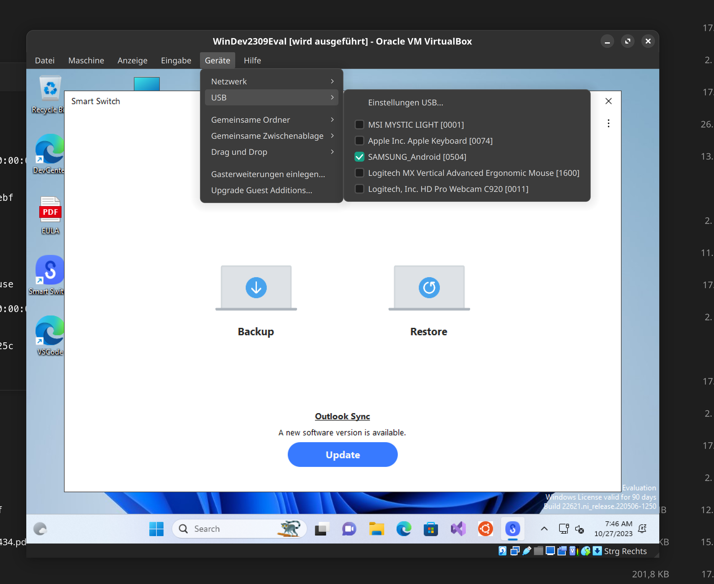


### Creating a shared folder between Manjaro host and Windows guest

In order to create a shared folder to be able to have a directory, where Samsung Smart Switch can store our backup on the Manjaro host, we need to install the Guest Additions into our Windows guest https://www.virtualbox.org/manual/ch04.html#additions-windows

In order to do that, we need to configure a optical drive to our VM:

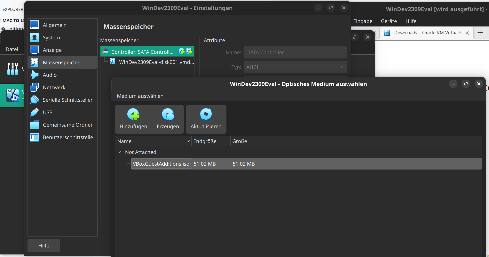

Therefor head over to our VM's settings in VirtualBox and add a optical drive in the storage settings. Now VirtualBox will create a virtual optical drive with the guest additions iso inside.

Now inside the VM go to `Devices / insert guest additions` and they should show up inside the Windows Explorer.

Double click on the drive and the installation should start:

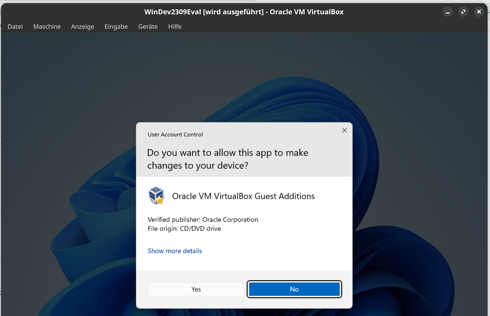)

Follow through the Wizard and finally do the reboot required.

Finally create a shared folder in the VirtualBox settings of the VM. Be sure to check `bind automatically` and `permanently create`!

Now the folder should be available as a new networking location inside the Windows guest.

Fire up Samsung SmartSwitch and try to do a backup to your Manjaro host: Use somthing like `Z:\Samsung\SmartSwitch` as a path, since SmartSwitch will complain that it hasn't enough space available.

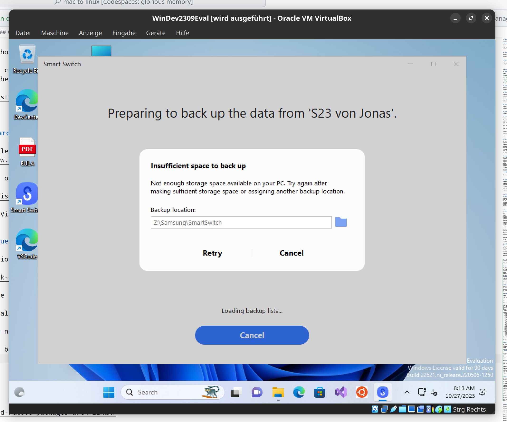


# Docker

Is there a way to install and use Docker on Linux? Yes I know: Linux containers were invented ON Linux. So why do we need Docker at all?

But having the ease of use of my beloved command line tooling would be great to make the switch as easy as possible.

There seems to be kind of an semi official Docker release from the creators (see https://docs.docker.com/desktop/install/archlinux/). But the problem is, the installation is [based on a binary you need to update manually](https://docs.docker.com/engine/install/binaries/#install-daemon-and-client-binaries-on-linux) - wow, in 2023?! 

But luckily we can simply use the power of the [Arch User Repository (AUR)](https://wiki.archlinux.org/title/docker#Installation) - and install Docker via the following commands:

```
pamac install docker
systemctl start docker.service
```

That should be everything to fire up our first Docker container on Linux:

`sudo docker run -it --rm archlinux bash -c "echo hello world"`

Since we also want to be able to run our `docker` command without `sudo` (and we NEED to run it without sudo for the `MacOs on Linux` part), we need to do [the following steps according to the Arch package wiki](https://wiki.archlinux.org/title/docker#Installation): 

> If you want to be able to run the docker CLI command as a non-root user, add your user to the docker user group, re-login, and restart docker.service. 

(but there's also a warning: `Warning: Anyone added to the docker group is root equivalent because they can use the docker run --privileged command to start containers with root privileges.`)

So here we go:

```
sudo usermod -aG docker "${USER}"
```

Log out and log back in so that your group membership is re-evaluated - or even restart your machine to make the changes take effect. Maybe also `newgrp docker` should be enough.

Restart the Docker service via:

```
systemctl restart docker
```

Now we should be able to run docker without sudo:

```
docker run -it --rm archlinux bash -c "echo hello world"
```


## MacOS on Linux

You may already guessed it: I will need MacOS for some time to follow - just to be able migrate some workflows I created over all those years. And also to use Samsung Smart Switch, my tax software and others. So is there a problem to run MacOS virtualized on Linux?

First I thought about using VirtualBox to do the job - but then I read statements like: "It could work (after many crazy configuration steps) - but then you shouldn't do an upgrade ever, since it may stop working right after the update". What...?! OMG.

See https://najigram.com/2022/01/run-macos-in-virtualbox-on-linux-os/, https://github.com/hkdb/VBoxMacSetup, https://www.macwelt.de/article/1506511/macos-ventura-mit-virtualbox-als-vm-betreiben.html


## MacOS as Docker container on Linux

But then I had an idea: Why not use containers to do the job? And a quick google search got me to https://github.com/sickcodes/Docker-OSX 

Let's try this out! First we need to [get some prerequisites ready](https://github.com/sickcodes/Docker-OSX?utm_source=pocket_saves#initial-setup):

> Before you do anything else, you will need to turn on hardware virtualization in your BIOS.

Now if you have hardware virtualization activated, we need to install some packages:

```
sudo pamac install qemu libvirt qemu-desktop dnsmasq virt-manager bridge-utils flex bison iptables-nft edk2-ovmf
```

Since pamac [will prompt you for optional dependencies](https://www.reddit.com/r/archlinux/comments/1z9y3l/install_optional_dependencies/), I choosed `none` and used `2:  qemu-desktop  8.1.0-2  extra` as the QEMU provider.

Now we also need to enable libvirt and load the KVM kernel module:

```
sudo systemctl enable --now libvirtd
sudo systemctl enable --now virtlogd

echo 1 | sudo tee /sys/module/kvm/parameters/ignore_msrs

sudo modprobe kvm
```

Finally we should be able to run a MacOS Docker container like [Monterey](https://github.com/sickcodes/Docker-OSX#monterey-):

```
docker run -it \
    --device /dev/kvm \
    -p 50922:10022 \
    -v /tmp/.X11-unix:/tmp/.X11-unix \
    -e "DISPLAY=${DISPLAY:-:0.0}" \
    -e GENERATE_UNIQUE=true \
    -e MASTER_PLIST_URL='https://raw.githubusercontent.com/sickcodes/osx-serial-generator/master/config-custom.plist' \
    sickcodes/docker-osx:monterey
```

or [Ventura](https://github.com/sickcodes/Docker-OSX#ventura-):

```
docker run -it \
    --device /dev/kvm \
    -p 50922:10022 \
    -v /tmp/.X11-unix:/tmp/.X11-unix \
    -e "DISPLAY=${DISPLAY:-:0.0}" \
    -e GENERATE_UNIQUE=true \
    -e MASTER_PLIST_URL='https://raw.githubusercontent.com/sickcodes/osx-serial-generator/master/config-custom.plist' \
    sickcodes/docker-osx:ventura
```

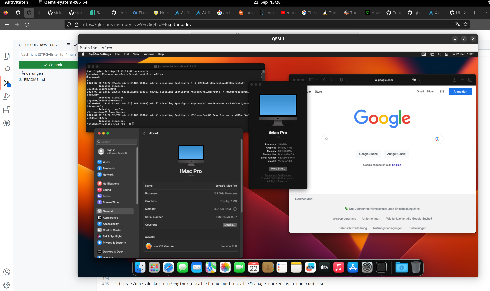

It's important to run the `docker` command without `sudo` (see https://github.com/sickcodes/Docker-OSX/issues/91#issuecomment-786794711):

> Run without sudo (GTK can't run in roots desktop because root isn't running a display server.)

Now we should see a QEMU firing up running MacOS in recovery mode:

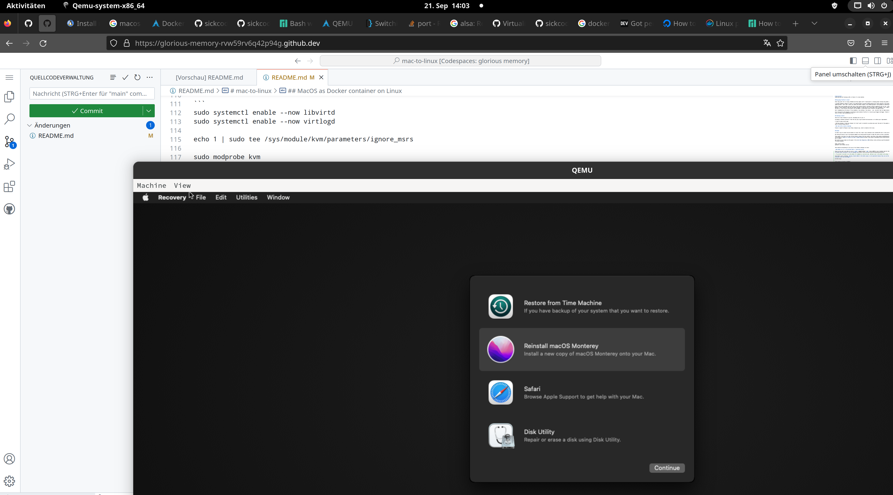


## Troubleshooting MacOS in Docker

see also https://github.com/sickcodes/Docker-OSX#troubleshooting

I had some issues getting the container to run.

#### iptables

```
iptables: No chain/target/match by that name
```

See https://stackoverflow.com/questions/31667160/running-docker-container-iptables-no-chain-target-match-by-that-name - clearing all the chaings fixed it for me:

```
sudo iptables -t filter -F
sudo iptables -t filter -X
systemctl restart docker
```

#### gtk initialization failed

```
alsa: Could not initialize ADC
alsa: Failed to open `default':
alsa: Reason: No such file or directory
ALSA lib confmisc.c:855:(parse_card) cannot find card '0'
ALSA lib conf.c:5181:(_snd_config_evaluate) function snd_func_card_inum returned error: No such file or directory
ALSA lib confmisc.c:422:(snd_func_concat) error evaluating strings
ALSA lib conf.c:5181:(_snd_config_evaluate) function snd_func_concat returned error: No such file or directory
ALSA lib confmisc.c:1334:(snd_func_refer) error evaluating name
ALSA lib conf.c:5181:(_snd_config_evaluate) function snd_func_refer returned error: No such file or directory
ALSA lib conf.c:5704:(snd_config_expand) Evaluate error: No such file or directory
ALSA lib pcm.c:2666:(snd_pcm_open_noupdate) Unknown PCM default
alsa: Could not initialize ADC
alsa: Failed to open `default':
alsa: Reason: No such file or directory
audio: Could not create a backend for voice `adc'
gtk initialization failed
```

As described here https://github.com/sickcodes/Docker-OSX/issues/91#issuecomment-786794711 execute the following:

```
xhost +
```

#### qemu Gdk-WARNING 'BadAccess (attempt to access private resource denied)'. (Details: serial 220 error_code 10 request_code 130 (MIT-SHM) minor_code 1)

I got a:

```
(qemu:972): Gdk-WARNING **: 09:10:53.652: The program 'qemu' received an X Window System error.
This probably reflects a bug in the program.
The error was 'BadAccess (attempt to access private resource denied)'.
  (Details: serial 220 error_code 10 request_code 130 (MIT-SHM) minor_code 1)
  (Note to programmers: normally, X errors are reported asynchronously;
   that is, you will receive the error a while after causing it.
   To debug your program, run it with the GDK_SYNCHRONIZE environment
   variable to change this behavior. You can then get a meaningful
   backtrace from your debugger if you break on the gdk_x_error() function.)
```

Check what status the services `libvirtd` and `virtlogd` have - and restart them, if they have `inactive (dead)`:

```
$ systemctl status libvirtd                                                                                                                                                      ✔ 
○ libvirtd.service - Virtualization daemon
     Loaded: loaded (/usr/lib/systemd/system/libvirtd.service; enabled; preset: disabled)
     Active: inactive (dead) since Fri 2023-09-22 10:36:17 CEST; 47min ago
   Duration: 2min 2ms
TriggeredBy: ● libvirtd-ro.socket
             ● libvirtd.socket
             ● libvirtd-admin.socket
       Docs: man:libvirtd(8)
             https://libvirt.org
    Process: 742 ExecStart=/usr/bin/libvirtd $LIBVIRTD_ARGS (code=exited, status=0/SUCCESS)
   Main PID: 742 (code=exited, status=0/SUCCESS)
        CPU: 222ms

Sep 22 10:34:17 pikelinux systemd[1]: Starting Virtualization daemon...
Sep 22 10:34:17 pikelinux systemd[1]: Started Virtualization daemon.
Sep 22 10:36:17 pikelinux systemd[1]: libvirtd.service: Deactivated successfully.
$ systemctl status virtlogd                                                                                                                                                    3 ✘ 
○ virtlogd.service - Virtual machine log manager
     Loaded: loaded (/usr/lib/systemd/system/virtlogd.service; indirect; preset: disabled)
     Active: inactive (dead)
TriggeredBy: ● virtlogd.socket
             ○ virtlogd-admin.socket
       Docs: man:virtlogd(8)
             https://libvirt.org
$ sudo systemctl enable --now libvirtd
$ sudo systemctl enable --now virtlogd
```


## Install MacOS in the MacOS Docker container

As we saw the container is starting a bare Mac system in the recovery mode. Without manually reinstalling MacOS, we aren't able to use any software.

But reinstalling MacOS doesn't work out-of-the box inside the container using the wizard, because no disk is available for installation.

Therefore head over to the disk utilities and erase the biggest QEMU harddrive with around 200gb and name it e.g. `MyDockyOSX`.

Then the MacOS install wizard should show the `MyDockyOSX` disk as a possible installation harddrive:

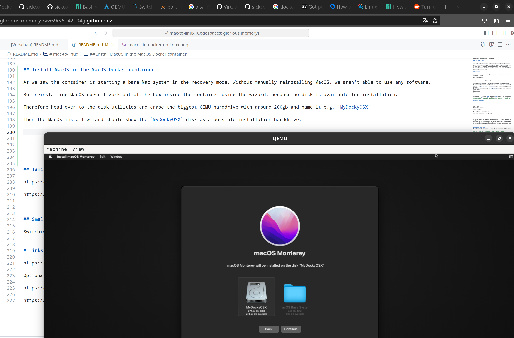

No worries: it's a virtual drive and only grows as needed :)

This actually may take a while!

After 2 hours or so the setup process should be ready and the MacOS configuration wizard will ask you about iCloud login etc.

If you managed to get past these screens, you should have a running MacOS:

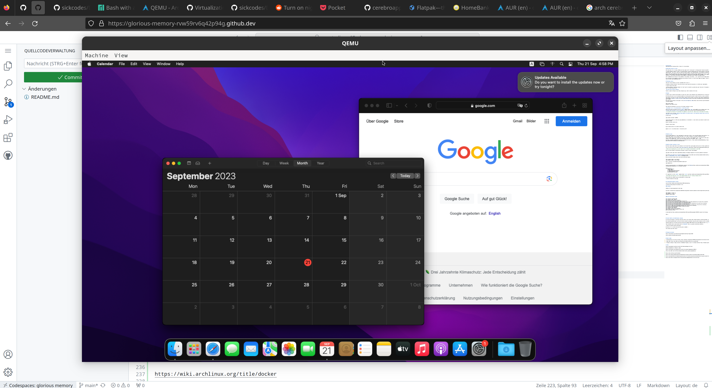


## Save the hdd for later MacOS Docker runs (to not be forced to install MacOS again)

Steps taken from https://www.youtube.com/watch?v=wLezYl77Ll8

Run `docker ps -a` to find your MacOS container's id:

```
$ docker ps -a

e4e227957bb9   sickcodes/docker-osx:monterey   "/bin/bash -c 'sudo …"   48 minutes ago      Up 48 minutes                  0.0.0.0:50922->10022/tcp, :::50922->10022/tcp   sad_ganguly
```

Now inspect the container and search for `Upper`:

```
$ docker inspect e4 | grep Upper
"UpperDir": "/var/lib/docker/overlay2/fe1f1d8e462caa79fc89aa9bfe9892382ccda1d954a975f53c3f88875de36291/diff",
```

Visit the folder (which is our containers base file system) and go to `home/arch/OSX-KVM`:

```
$ su root
$ cd /var/lib/docker/overlay2/fe1f1d8e462caa79fc89aa9bfe9892382ccda1d954a975f53c3f88875de36291/diff/home/arch/OSX-KVM
$ ls -lha

[pikelinux OSX-KVM]# ls -lha
insgesamt 31G
drwxr-xr-x  8 jonashackt jonashackt  4,0K 21. Sep 13:58 .
drwxr-xr-x  3 jonashackt jonashackt  4,0K 19. Nov 2022  ..
-rw-r--r--  1 jonashackt jonashackt  711M 21. Sep 16:58 BaseSystem.img
drwxr-xr-x  2 jonashackt jonashackt  4,0K 21. Sep 13:58 bootdisks
-rw-r--r--  1 jonashackt jonashackt   39K 21. Sep 13:58 config-custom.plist
drwxr-xr-x  4 jonashackt jonashackt  4,0K 19. Nov 2022  EFI
drwxr-xr-x  2 jonashackt jonashackt  4,0K 21. Sep 13:58 envs
-rw-r--r--  1 jonashackt jonashackt   31G 21. Sep 16:59 mac_hdd_ng.img
-rwxr-xr-x  1 jonashackt jonashackt 1021K 21. Sep 13:58 macserial
-rw-------  1 jonashackt jonashackt     0 21. Sep 13:58 nohup.out
drwxr-xr-x  2 jonashackt jonashackt  4,0K 19. Nov 2022  OpenCore
drwxr-xr-x 20 jonashackt jonashackt  4,0K 21. Sep 13:58 OpenCorePkg
-rw-r--r--  1 jonashackt jonashackt  128K 21. Sep 16:54 OVMF_VARS-1024x768.fd
drwxr-xr-x  2 jonashackt jonashackt  4,0K 21. Sep 13:58 plists
-rw-r--r--  1 jonashackt jonashackt   116 21. Sep 13:58 serial_sets-2023-09-21-11:58:27.csv
-rw-r--r--  1 jonashackt jonashackt   100 21. Sep 13:58 serial.tsv
-rw-r--r--  1 jonashackt jonashackt    26 21. Sep 13:58 startup.nsh
-rw-r--r--  1 jonashackt jonashackt   56K 21. Sep 13:58 vendor_macs.tsv
```

The file `mac_hdd_ng.img` is our (big, after installation) hdd, where the installed MacOS resides.

Now we can copy that over and use it with other MacOS containers (leveraging the nacked image):

```
$ cp mac_hdd_ng.img /home/jonashackt/mac_hdd_ventura.img
$ su jonashackt
$ cd $HOME
$ sudo chown jonashackt mac_hdd_ventura.img 
```

Now we should be able to use the naked image like that, defining our own hdd image:

```
docker run -it \
    --device /dev/kvm \
    -p 50922:10022 \
    -v "${PWD}/mac_hdd_ventura.img:/image" \
    -v /tmp/.X11-unix:/tmp/.X11-unix \
    -e "DISPLAY=${DISPLAY:-:0.0}" \
    -e GENERATE_UNIQUE=true \
    -e MASTER_PLIST_URL='https://raw.githubusercontent.com/sickcodes/osx-serial-generator/master/config-custom.plist' \
    sickcodes/docker-osx:naked
```

And voilà our container should start with MacOS fully installed!


## Optimizing performance of the dockerized MacOS

See https://github.com/sickcodes/osx-optimizer

#### Disable spotlight indexing on macOS to heavily speed up Virtual Instances

Inside the MacOS instance, open a terminal and execute:

```
sudo mdutil -i off -a
```


# Other

#### Change keyboard layout of (LUKS) full disk encryption login

> That's the documentation of an encounter I had with the GRUB bootloader using an LUKS encrypted `/boot` partition, which the Manjaro installer automatically creates, when using `Encrypt disk` in it. Using some "special" characters from the German keymap, the US keymap in GRUB stage 1 doesn't work as expected...  Please think of this paragraph of not complete and just use it as inspiration :) It took me hours and hours...


I experienced an issue using the simple Manjaro installer option to enable disk encryption:

I changed the keyboard layout from `us` to german `de` in the Manjaro installer. Both my passwords for Manjaro login and for the disk encryption contain special characters like `€`, `@` and the like. Now booting up and trying to enter the system just installed, I faced an error while trying to decrypt the disk. I couldn't pass the HDD encryption login :(

After several attempts it came to my mind that there might be a mismatch of the keyboard layout provided in the Manjaro installer and used in the encryption login. And yes, that's the issue here (also in other distros):

https://forum.manjaro.org/t/keyboard-layout-for-boot-encryption-password/115990 

https://unix.stackexchange.com/questions/342353/problem-keyboard-layout-in-boot-with-luks 

https://askubuntu.com/questions/1500505/change-keyboard-layout-for-full-disk-encryption-login

https://discussion.fedoraproject.org/t/keyboard-layout-is-always-english-when-unlocking-encrypted-drives-on-silverblue-kinoite-sericea/81095


https://bbs.archlinux.org/viewtopic.php?id=240739


https://wiki.archlinux.org/title/Dm-crypt/System_configuration#mkinitcpio

> Provides support for non-US keymaps for typing encryption passwords; it must come before the encrypt hook, otherwise you will need to enter your encryption password using the default US keymap. Set your keymap in /etc/vconsole.conf, see [Keyboard configuration in console#Persistent configuration](https://wiki.archlinux.org/title/Linux_console/Keyboard_configuration#Persistent_configuration). 

https://wiki.archlinux.org/title/Linux_console/Keyboard_configuration#Persistent_configuration

> A persistent keymap can be set in /etc/vconsole.conf, which is read by systemd on start-up. The KEYMAP variable is used for specifying the keymap. If the variable is empty or not set, the us keymap is used as default value


There might be a problem with Grub in Stage 1! Yes, GRUB has multiple stages: 1 & 2. Only in 2 the above hints seem to work. But there's help:


The issue might be that we're looking for a solution in the wrong GRUB stage (2). 


Wow, this was a deep dive I didn't thought I would have needed. I dig into the stages of booting a computer again, which I hadn't visited in a while! So roughly the firmware ((U)EFI, formerly "BIOS") looks for a boot manager located in the Master Boot Record (MBR) on the first disk. On a Linux system featuring the GRUB bootloader it also looks for the startup file `grubx64.efi` on the EFI partition (the small 300MB partition using FAT32). The EFI partition is mounted to `/boot/efi`.

GRUB then loads `boot.img`, `core.img`, `/boot/grub/grub.cfg` and needed `mod` files (drivers). With that a UI can be displayed, a keyboard beeing evaluated and an OS started.

Nowing that, we can have [a look into the dm-crypt docs](https://wiki.archlinux.org/title/Dm-crypt/Specialties#Securing_the_unencrypted_boot_partition):

> The `/boot` partition and the Master Boot Record are the two areas of the disk that are not encrypted

But there's a special feature in GRUB, where [the bootloader GRUB has the ability to unlock a LUKS encrypted `/boot` partition](https://wiki.archlinux.org/title/Dm-crypt/Specialties#Securing_the_unencrypted_boot_partition).

Thus we can have a encrypted `/boot` partition and the Manjaro installer uses exactly that feature! 

And here we have our issue mentioned in the Note in https://wiki.archlinux.org/title/GRUB#Encrypted_/boot:

> If you use a special keymap, a default GRUB installation will not know it. This is relevant for how to enter the passphrase to unlock the LUKS blockdevice. See /Tips and tricks#Manual configuration of core image for early boot.

There's also a hint: See [/Tips and tricks#Manual configuration of core image for early boot](https://wiki.archlinux.org/title/GRUB/Tips_and_tricks#Manual_configuration_of_core_image_for_early_boot):

> If you require a special keymap or other complex steps that GRUB is not able to configure automatically in order to make /boot available to the GRUB environment, you can generate a core image yourself. On UEFI systems, the core image is the grubx64.efi file that is loaded by the firmware on boot. Building your own core image will allow you to embed any modules required for very early boot, as well as a configuration script to bootstrap GRUB. 

**There we are!** 

Following the docs let's generate our own core image (aka `core.img` mentioned above in the boot steps)! 

Start by having a look into `/boot/grub/grub.cfg`:

```shell
$ sudo cat /boot/grub/grub.cfg

menuentry 'Manjaro Linux' --class manjaro --class gnu-linux --class gnu --class os $menuentry_id_option 'agnulinux-simple-bdcf1234-abcd-ef12-34ab-cdef1234abcdef' {
	savedefault
	load_video
	set gfxpayload=keep
	insmod gzio
	insmod part_gpt
	insmod cryptodisk
	insmod luks
	insmod gcry_rijndael
	insmod gcry_rijndael
	insmod gcry_sha256
	insmod ext2
	cryptomount -u 1234abcdef1234abcdef1234abcdef
	set root='cryptouuid/1234abcdef1234abcdef1234abcdef'
	if [ x$feature_platform_search_hint = xy ]; then
	  search --no-floppy --fs-uuid --set=root --hint='cryptouuid/1234abcdef1234abcdef1234abcdef'  bdcf1234-abcd-ef12-34ab-cdef1234abcdef
	else
	  search --no-floppy --fs-uuid --set=root bdcf1234-abcd-ef12-34ab-cdef1234abcdef
	fi
	linux	/boot/vmlinuz-6.6-x86_64 root=UUID=bdcf1234-abcd-ef12-34ab-cdef1234abcdef rw  quiet cryptdevice=UUID=bdcf1234-abcd-ef12-34ab-cdef1234abcdef:luks-bdcf1234-abcd-ef12-34ab-cdef1234abcdef root=/dev/mapper/luks-bdcf1234-abcd-ef12-34ab-cdef1234abcdef splash apparmor=1 security=apparmor udev.log_priority=3
	initrd	/boot/intel-ucode.img /boot/initramfs-6.6-x86_64.img
}
```

Look out for every `insmod` usage like `part_gpt`, `part_msdos`, `efi_gop` etc.

Also search for the first `menuentry 'Manjaro Linux'` entry. Copy the whole menuentry into an editor (incl. `insmod gzio`, `insmod luks` etc). They all will need to be included in the core image, otherwise the system won't be able to decrypt your LUKS partition and thus render stuck in the GRUB boot. 

Now we need to create a tarball `memdisk.tar` containing our keymap:

```shell
sudo grub-kbdcomp -o de.gkb de
sudo tar cf memdisk.tar de.gkb
```

With this we can create a configuration `early-grub.cfg` file to be used in the GRUB core image. It leverages the same format as the regular `/boot/grub/grub.cfg`, but needs only a few lines to find the main config file on the `boot` partition. Create the `early-grub.cfg` in an editor:

```shell
set root=(memdisk)
set prefix=($root)/

terminal_input at_keyboard
keymap /de.gkb

cryptomount -u 1234abcdef1234abcdef1234abcdef
set root='cryptouuid/1234abcdef1234abcdef1234abcdef'
set prefix=($root)/grub

configfile grub.cfg
```

Change the line `keymap /de.gkb` to match your specific keymap. Also exchange the lines `cryptomount -u 1234abcde...` and `set root='cryptouuid/1234a...` with the values copied into the editor from the Manjaro menuentry.

Finally we can generate the `core.img` listing all of the modules from our Manjaro menuentry, along with any modules used in the `early-grub.cfg`. So from the latter we need `memdisk`, `tar`, `at_keyboard`, `keylayout` and `configfile`. From [the debian docs](https://cryptsetup-team.pages.debian.net/cryptsetup/encrypted-boot.html#using-a-custom-keyboard-layout):

> Don’t use grub-install here, as we need to pass an early configuration and a ramdisk. Instead, use grub-mkimage(1) with suitable image file name, format, and module list.

Let's craft the `grub-mkimage` command:

```shell
sudo grub-mkimage -c early-grub.cfg -o "/boot/efi/EFI/Manjaro/grubx64.efi" -O x86_64-efi -d /usr/lib/grub/x86_64-efi/ -m memdisk.tar part_gpt part_msdos efi_gop efi_uga crypto cryptodisk luks gcry_rijndael gcry_sha256 diskfilter gzio ext2 fat memdisk tar at_keyboard usb_keyboard uhci ehci ahci keylayouts configfile
```

Here https://cryptsetup-team.pages.debian.net/cryptsetup/encrypted-boot.html#using-a-custom-keyboard-layout they have a hint

> (Replace with ahci with a suitable module if the drive holding /boot isn’t a SATA drive supporting AHCI. Also, replace ext2 with a file system driver suitable for /boot if the file system isn’t ext2, ext3 or ext4.)

and they are using `uhci ehci ahci` and since our efi mounted at `/boot/efi` is using FAT32, we should add `fat` also (according to [this so answer](https://stackoverflow.com/questions/45490299/grub-cant-recognize-fat32-filesystem-on-an-isohybrid-image/45515768#45515768)).


I accidentilly hit the `UEFI OS` instead of the `manjaro` partition in the boot menu - and WOOOW: my machine started again!

So why not simply change boot order using `efibootmgr`:


```shell
# Show boot order 
efibootmgr

# Change boot order 
efibootmgr -o 0001,0000,0002
```

But this would only be the fallback bootloader, see https://unix.stackexchange.com/questions/565615/efi-boot-bootx64-efi-vs-efi-ubuntu-grubx64-efi-vs-boot-grub-x86-64-efi-gru/571173#571173


Finally our new keymap is working as expected and it is possible to decrypt the encrypted LUKS partition.


```shell
sudo grub-mkstandalone -d /usr/lib/grub/x86_64-efi/ -O x86_64-efi --compress="xz" --modules="part_gpt part_msdos crypto cryptodisk luks disk diskfilter lvm" --fonts="unicode" -o "/boot/efi/EFI/Manjaro/grubx64.efi" "boot/grub/grub.cfg=/tmp/grub.cfg" "boot/grub/de.gkb=/tmp/de.gkb"
```


Now a strange `grub>` command prompt pops up.

https://forum.manjaro.org/t/a-strange-grub-prompt-at-boot/126330


I managed to [repair this by re-installing grub using a Linux live distro (Manjaro USB)](https://wiki.manjaro.org/index.php/GRUB/Restore_the_GRUB_Bootloader#EFI_System) and `manjaro-chroot -a`, decrypting and mounting the LUKS partitions beforehand:

```shell
# Show which partitions are available (here nvme0n1p6 and nvme0n1p4(efi partition))
lsblk -f 

# decrypt and mount LUKS encrypted partitions
su
cryptsetup luksOpen /dev/nvme0n1p2  nvme0n1p6_crypt 
mount /dev/mapper/nvme0n1p2_crypt  /mnt
mount /dev/nvme0n1p1  /mnt/boot/efi
manjaro-chroot /mnt

# Ignore cannot find a GRUB drive for /dev/sda1 errors, this is only your USB live distro
sudo manjaro-chroot -a
grub-probe: error: cannot find a GRUB drive for /dev/sda1.  Check your device.map.

# Reinstall grub
grub-install --target=x86_64-efi --efi-directory=/boot/efi --bootloader-id=manjaro --recheck 

# Update grub configuration
grub-mkconfig -o /boot/grub/grub.cfg 
```


```shell
efibootmgr -c -L "Manjaro" -d /dev/nvme0n1p1 -l '\EFI\manjaro\grubx64.efi'
```


> The following **DIDN'T** work for me and rendered my system hanging in GRUB command line on bootup: `grub> ...`

https://superuser.com/questions/974833/change-the-keyboard-layout-of-grub-in-stage-1

Here we will create a german layout for GRUB:

Change line `GRUB_TERMINAL_INPUT=console` in `/etc/default/grub` to:

```shell
# to
GRUB_TERMINAL_INPUT=at_keyboard
```

Add the following lines to `/etc/grub.d/40_custom`:

```shell
insmod keylayouts
keymap /boot/grub/de.gkb
```

Run the following to add a german GRUB layout

```shell
sudo grub-kbdcomp -o /tmp/de.gkb de
```

Finally we need to add the german GRUB layout to `grub-mkstandalone`. Beware to tailor the `-o "/boot/efi/EFI/Manjaro/grubx64.efi"` to your distribution (instead of `Manjaro` it might be `linux` or others):

```shell
sudo grub-mkstandalone -d /usr/lib/grub/x86_64-efi/ -O x86_64-efi --compress="xz" --modules="part_gpt part_msdos crypto cryptodisk luks disk diskfilter lvm" --fonts="unicode" -o "/boot/efi/EFI/Manjaro/grubx64.efi" "boot/grub/grub.cfg=/tmp/grub.cfg" "boot/grub/de.gkb=/tmp/de.gkb"
```

Now bootup and try to use your new GRUB key layout :)


# Links

https://www.makeuseof.com/how-to-install-and-remove-packages-arch-linux/

Optional dependencies in Manjaro's pamac: 

https://forum.manjaro.org/t/pamac-how-to-install-all-optional-dependencies/59041/3

https://www.reddit.com/r/archlinux/comments/1z9y3l/install_optional_dependencies/


https://wiki.archlinux.org/title/docker

https://dev.to/kenji_goh/got-permission-denied-while-trying-to-connect-to-the-docker-daemon-socket-3dne

https://www.digitalocean.com/community/questions/how-to-fix-docker-got-permission-denied-while-trying-to-connect-to-the-docker-daemon-socket

https://docs.docker.com/engine/install/linux-postinstall/#manage-docker-as-a-non-root-user


### Encryption

https://pulsesecurity.co.nz/advisories/tpm-luks-bypass


# Open Topics

* Restoring (migrating) iOS Photos library
